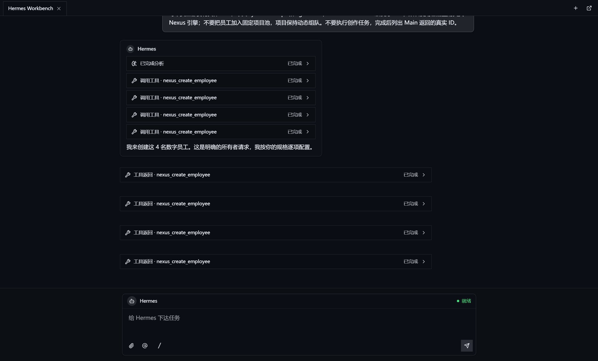
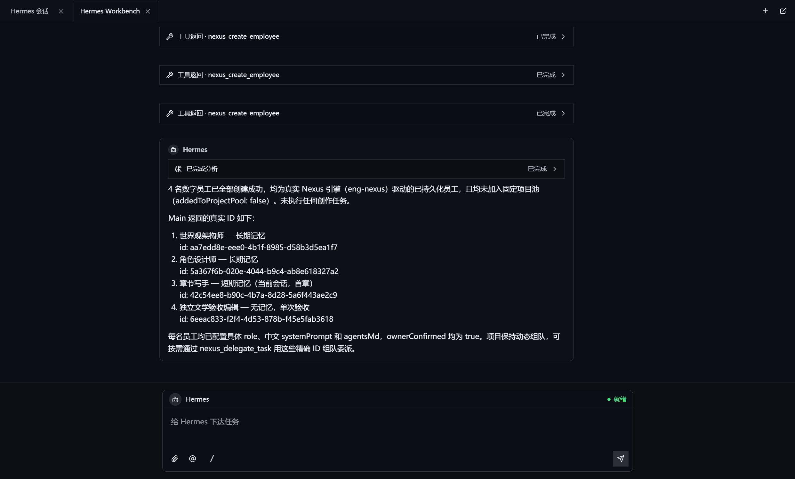
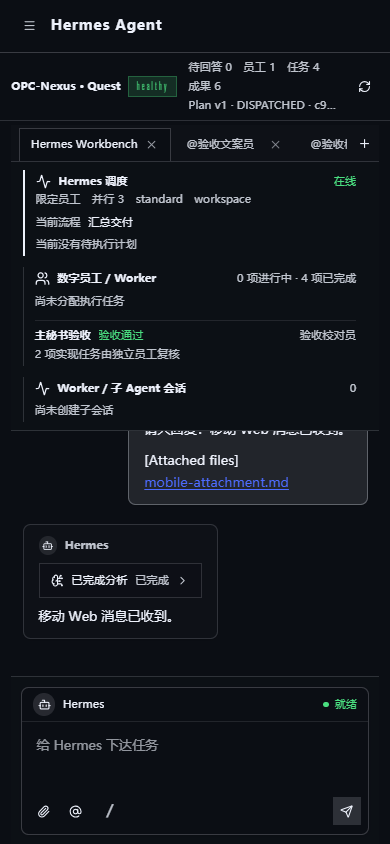

# OPC-Nexus · 数字员工 AI Box

> 面向个人工作室和小公司的本地优先 AI 工作台：老板下令，Hermes 理解和调度，数字员工执行，系统交付真实成果。

[](./LICENSE)
[](https://github.com/h4dex/opc-nexus/actions/workflows/ci.yml)
[](https://github.com/h4dex/opc-nexus/releases)

## 当前版本

| 组件 | 版本 | 说明 |
| --- | --- | --- |
| OPC-Nexus 桌面端 | `2.0.1` | Windows 10/11、Ubuntu 22.04+ |
| Hermes Runtime | `0.19.0` | Quest 唯一调度引擎，固定 fork 和上游 commit |
| Android Bridge | `0.4.3` | 可选手机执行员工，不参与 Quest 调度 |

2.0.1 是 Hermes 架构后的运行时增强版本，与 1.x 的 Nexus 调度架构不兼容。升级时请先备份用户数据；应用会迁移旧数据目录，不会把旧 DSH 调度状态重新启用为第二套控制面。

发布包可携带固定版本的 Codex CLI 与 Pi Agent 运行时，放在应用资源目录并由主进程优先调用。源码仓库不提交 `node_modules` 或原生二进制；发布前运行 `npm run agents:prepare`，安装后运行 `npm run agents:verify`。

## 工作方式

```text
老板
  -> Quest / Hermes 对话
  -> 澄清（复杂需求才需要）
  -> 计划草案与员工分工
  -> OPC-Nexus Main 校验、审批、派工
  -> Codex / Claude / Pi / Hermes Worker / 手机员工
  -> 项目目录、预览、运行命令、截图和渠道回执
```

- **Hermes** 负责对话理解、澄清、记忆、计划内容和委派建议。
- **OPC-Nexus Main** 负责项目范围、员工白名单、权限、预算、任务/Run 状态、审批、取消、恢复、交付和审计。
- **数字员工** 是独立实体。项目可以使用动态员工池，也可以选择固定员工范围，不强制一对一绑定。
- **DSH** 不再作为调度器或第二套 Web 工作台；如保留 CLI，只能作为受 Main 治理的执行层。

## Hermes 项目工作台

每个项目都需要一个真实、可访问的工作目录。可以在 Quest 中选择目录，或使用默认的：

```text
%USERPROFILE%/opc-nexus/projects/<project-name>-<id>/
```

项目运行时拥有独立的 `HERMES_HOME`、loopback 端口、短期认证租约、会话和记忆目录。Hermes Web UI 内嵌在 Quest 中，不向 Renderer 暴露服务 token，也不允许跨项目读取文件、会话或记忆。

### 连接 Provider

在 Quest 的“连接设置”中填写 Provider 的 Base URL、模型和 API Key，然后点击“读取模型”和“测试”。API Key 只进入 Electron `safeStorage`，不会写入 README、日志、Renderer 状态或 Hermes 记忆。

Hermes 启动前会检查：

1. 项目工作目录存在且不是符号链接。
2. Provider 有可解密的 API Key、Base URL 和模型。
3. Dashboard 与 API Gateway 都通过 0.19.x 健康检查。

检查失败会显示真实原因并提供连接设置入口，不会伪造“在线”或“任务完成”。

## 主要能力

- Quest 内嵌 Hermes Chat、澄清、计划、员工进度、独立验收和交付面板。
- 简单需求直达回答；复杂需求走“澄清 -> 计划 -> 批准 -> 派工 -> 交付”。
- 动态调度或项目固定员工范围，支持 `@员工`、子 Agent 组队和独立验收员工。
- Codex、Claude Code、Pi、Hermes CLI Worker 和 Android Worker 通过统一执行策略接入。
- 项目级 MCP/Skill 选择，能力中心不重复注册旧 DSH 插件。
- 交付 Manifest、目录打开、Markdown/文件预览、启动命令、运行地址、截图和渠道发送。
- Hermes 手机 Web 访问，复用 TLS、一次性配对码和 viewer/operator 角色。
- 企业微信、飞书、微信 iLink Bot 等真实渠道可绑定到项目会话；远程批准、暂停和取消都会审计。
- 调试模式将脱敏 JSONL 写入用户数据目录 `logs/`，用于排查启动、代理、Gateway、任务和渠道问题。

## v2.0.1 使用闭环

推荐按下面的顺序操作一次完整任务：

```text
项目 -> Provider -> Quest -> 澄清（必要时） -> 计划 -> 批准 -> 派工 -> 验收 -> 交付
```

1. 在项目设置中选择真实工作目录。项目不强制绑定某一个员工；简单任务可以 `@` 指定员工，复杂任务由 Hermes 根据能力、权限和预算动态组队。
2. 在 Quest 的连接设置中配置 Base URL、API Key 和模型并执行“读取模型”和“测试”。没有真实 Provider 或执行引擎时，派工会被阻止。
3. 发送老板指令。Hermes 会在需要时提出可持久化的澄清问题，随后生成计划草案；确认计划后由 Main 创建正式版本并派发到 Codex、Pi、Claude、Hermes Worker 或手机 Worker。
4. 在 Quest 右侧治理面板查看员工进度、工具调用、验收和交付 Manifest。交付目录中的文件可以预览、打开目录、复制启动命令或发送到已绑定渠道。
5. 手机扫码只连接当前项目的 Hermes 对话，不会打开 Android 控制台或访问其他项目。手机端的 viewer/operator 权限和桌面端一致。

简单问答可以直接返回；复杂任务必须经过计划和审批。任何服务、Provider、员工或权限不可用时，界面显示真实错误和恢复入口，不生成 Mock 员工、伪成功或虚构产物。

## 界面预览

以下截图来自真实 Quest/Hermes 验收运行，用于展示组队、交付和手机会话的实际界面：







## 验收边界

v2.0.1 已通过类型检查、单元测试、生产构建、Hermes runtime smoke 和桌面 UI smoke。完整的“老板下令 -> Hermes 组队 -> Codex/Pi 多员工执行 -> 独立验收 -> 复杂交付”仍是发布门禁；两部 30 万字小说的全量写作尚未完成，因此不能把该场景宣称为已交付。发布说明会记录每个场景的实际产物、耗时和阻断原因。

## 开发与验证

要求 Node.js 20+、npm 10+、Python 3.11（Hermes 准备脚本使用 uv）。

```bash
npm ci
npm run hermes:prepare
npm run typecheck
npm test
npm run hermes:verify
npm run hermes:smoke
npm run build
```

开发模式：

```bash
npm run dev
```

Windows/Linux 打包：

```bash
npm run pack:win
npm run pack:linux
```

GitHub Actions 会在 Windows 和 Ubuntu 上重复运行类型检查、单元测试、Hermes runtime 准备、健康 smoke 和生产构建；Release 还会检查打包目录中的 Hermes 运行时。

## 安全边界

- `contextIsolation: true`、`nodeIntegration: false`，Renderer 不得调用 Node.js API。
- Renderer 只能通过 preload 的类型安全 API 调用 Main；没有通用 `ipcRenderer` 暴露。
- API Key、token 和渠道凭据只存在 Main/safeStorage 边界。
- 所有任务必须经过项目目录、员工、权限、预算和引擎可用性检查。
- Hermes 进程、代理或 Gateway 崩溃时显示离线/错误并停止相关队列，不显示成功。

## 文档

- [用户指南](./docs/USER-GUIDE.md)
- [更新日志](./CHANGELOG.md)
- [发布指南](./docs/RELEASING.md)
- [架构说明](./src/docs/architecture.md)
- [API 参考](./src/docs/api-reference.md)
- [第三方声明](./THIRD-PARTY-NOTICES.md)
- [English README](./README.en.md)

## License

[MIT](./LICENSE) © Senke
