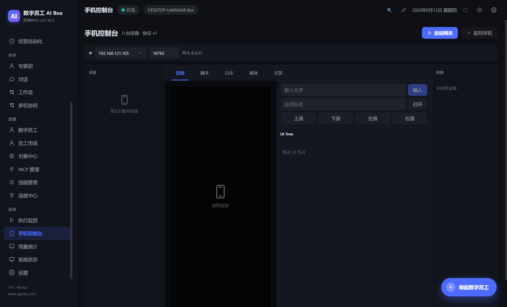
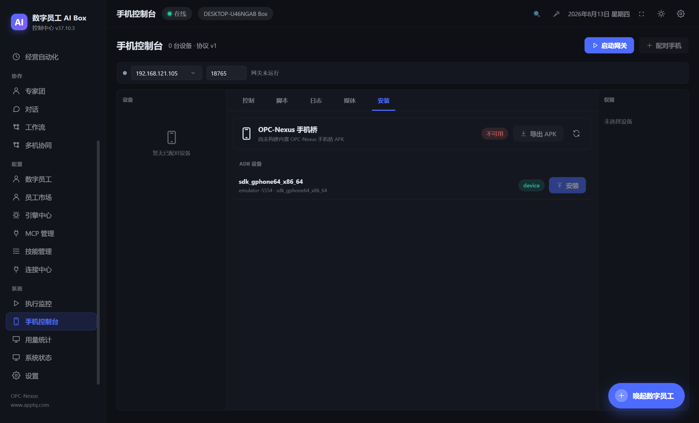
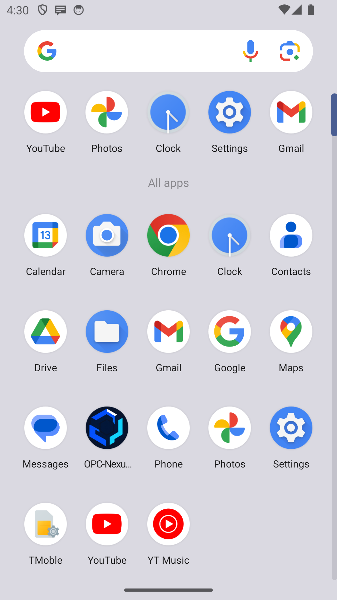
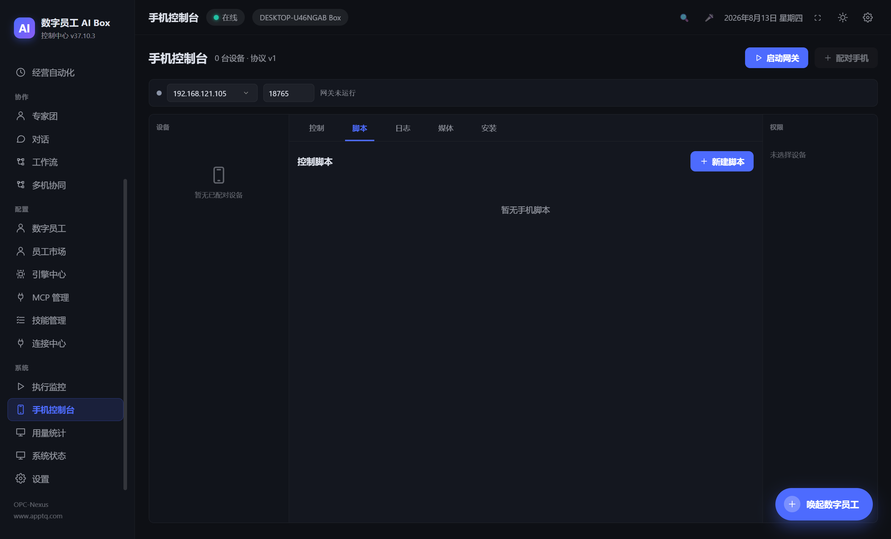
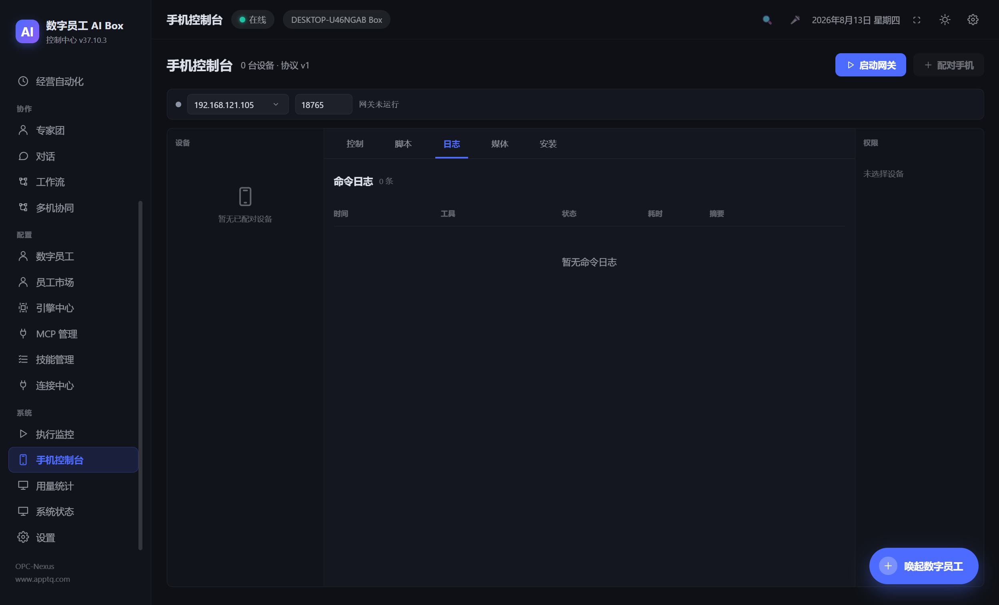

# Android 设备操作功能文档

> 本文档描述 OPC-Nexus `1.8.1` / Android Bridge `0.4.3` 当前已经实现的 Android 设备接入、控制、脚本、媒体采集和安全边界。文中的桌面截图来自「手机控制台」实际运行页面；空设备截图用于展示未连接状态，Android Launcher 图标已在 API 34 模拟器验证。

## 1. 功能范围

OPC-Nexus 通过 Android Bridge App 把 Android 设备接入桌面端 Mobile Gateway，再由 Android 操作员 Agent 或「手机控制台」调用受策略约束的 Android 工具。

自动化手机任务固定由 Hermes Agent 经 OPC Orchestrator 调度，并通过 Mobile Gateway 调用 `android_*` 工具。DeepSeek Harness（DSH）当前仅作为受限 ACP Worker/Advisor，没有 Android MCP 或手机工具桥；把手机任务直接交给 DSH、Codex、Claude 或 Pi 不会获得设备控制能力。

当前链路支持：

- ADB 发现设备、读取 APK 信息、安装 Bridge APK、导出 APK。
- 局域网 Gateway 启停、二维码配对、设备状态和连接心跳。
- 实时屏幕预览、Accessibility UI Tree 读取、节点点击和常用导航键。
- 文字输入、打开应用、点击、长按、拖拽、滑动、滚动、双指缩放和等待 UI。
- 已安装应用、当前前台应用、通知、联系人、剪贴板、位置和 Accessibility 事件读取。
- SMS、电话、Intent、Broadcast、媒体控制和手机 TTS 操作。
- 屏幕截图、短屏幕录制、麦克风 WAV 录音及媒体产物归档。
- 控制脚本保存、参数校验、按步骤执行、失败停止/继续和执行历史。
- 命令日志、敏感参数脱敏、媒体 SHA-256 校验和设备级紧急停止。

当前 Android Bridge 协议版本为 `1`，桌面端工具目录位于 [`mobile/tool-catalog.json`](../mobile/tool-catalog.json)，运行时会校验目录中的 42 个工具。

当前版本信息：

| 组件 | 版本 |
|---|---|
| OPC-Nexus 桌面端 | `1.8.1` |
| Android Bridge | `0.4.3`（`versionCode 5`） |
| Android 包名 | `com.senke.opcnexus.bridge` |

## 2. 页面入口

启动 OPC-Nexus 后，在左侧导航的「系统」分组进入「手机控制台」。页面分为：

| 区域 | 用途 |
|---|---|
| 网关栏 | 选择局域网 IPv4、设置端口、查看 WSS 地址和证书指纹 |
| 设备栏 | 查看已配对设备、Android 版本、API Level、Bridge 版本、在线状态和绑定员工 |
| 控制 | 预览屏幕、读取 UI Tree、输入文字、打开应用、导航和滑动 |
| 脚本 | 创建、编辑、运行和删除控制脚本 |
| 日志 | 查看工具名、状态、耗时、错误或脱敏结果摘要 |
| 媒体 | 预览/下载截图、MP4 屏幕录制和 WAV 音频 |
| 安装 | 查看 APK 校验信息、刷新 ADB 设备并安装/导出 APK |
| 权限 | 查看当前设备权限状态，并执行紧急停止 |



图 1：手机控制台总览。截图中的网关尚未启动，未配对设备时控制区保持禁用/空状态。

## 3. 安装 Android Bridge

### 3.1 使用桌面端安装页

1. 在桌面端进入「手机控制台」→「安装」。
2. 在 Android 手机上启用开发者选项和 USB 调试，并通过 USB 连接电脑。
3. 在安装页点击刷新，确认 ADB 设备状态为 `device`。
4. 点击对应设备的「安装」。
5. 首次安装后，在手机上打开 `OPC-Nexus Mobile Bridge`，按页面提示授权 Accessibility、通知访问、屏幕捕获和所需运行时权限。

安装页会展示 APK 是否可用、版本、APK SHA-256 和签名证书 SHA-256。APK 未构建或未被桌面端找到时会显示「不可用」，此时可先执行 Android APK 构建命令。



图 2：安装页。截图中 ADB 发现了一个模拟器，但当前工作区没有构建好的 APK，因此安装按钮不可用；真实设备安装时两项条件都满足即可安装。

Debug APK 使用 Android 调试证书签名。若设备上已安装由其他证书签名的旧试用版，Android 不允许直接覆盖，需先卸载旧版再安装并重新配对。生产包必须使用仓库外 keystore 签名。

### 3.2 从源码构建 APK

前置条件：

- Android SDK、Build Tools、Java 17。
- `ANDROID_SDK_ROOT` 或 `ANDROID_HOME` 指向 Android SDK。
- Android Gradle Wrapper 位于 `mobile/android-bridge/`。

```bash
# 从 build/icon.png 重新生成普通、圆形、自适应和单色图标
npm run mobile:icons

# 调试包，适合本地联调
npm run mobile:apk:debug

# 生产包，需要配置 OPCNEXUS_ANDROID_* 签名环境变量
npm run mobile:apk:release

# 校验 mobile/dist/apk-manifest.json、APK 摘要和签名
npm run mobile:apk:verify
npm run mobile:apk:verify-release
```

APK 包名为 `com.senke.opcnexus.bridge`，当前工程配置的最低 Android SDK 为 26、目标 SDK 为 34。生产打包要求非 Debuggable、生产签名的 APK；Electron 的 `pack:win` 和 `pack:linux` 会先执行 release APK 构建。



图 3：API 34 模拟器中的 OPC-Nexus 手机桥图标。Android 8+ 使用自适应图标，Android 13+ 另提供单色主题图标。

## 4. 配对和连接

### 4.1 桌面端启动 Gateway

1. 确保电脑和手机在同一个局域网。
2. 在「手机控制台」网关栏选择电脑的 RFC1918 局域网 IPv4 地址，例如 `192.168.x.x`、`10.x.x.x` 或 `172.16.x.x` 至 `172.31.x.x`。
3. 使用默认端口 `18765`，或选择未占用的 `1024-65535` 端口。
4. 点击「启动网关」。
5. 点击「配对手机」，生成一次性配对二维码。

Gateway 只绑定局域网 IPv4，不接受公网地址；设备通道为 `wss://<LAN-IP>:<port>/v1/device`。桌面端会生成并持久化 TLS 证书，私钥使用 Electron `safeStorage` 加密后存入本地数据库。

### 4.2 手机端配对

1. 打开 Android Bridge App。
2. 点击「扫描配对二维码」，扫描桌面端生成的二维码。
3. 如果手机无法使用摄像头，也可以在桌面配对窗口点击「复制完整配置」。桌面窗口会同时显示协议版本、WSS 地址、配对 ID、SPKI 指纹和过期时间，但不会把一次性密钥交给 Renderer；完整 JSON 由主进程安全地写入系统剪贴板。
4. 将完整 JSON 安全地传到手机，在 Bridge 的「完整配置 JSON」多行输入框中粘贴，点击「解析完整配置并配对」。解析成功后输入框会立即清空，避免一次性密钥留在界面上。
5. 仍可使用下方的逐项手动配对入口填写 Gateway URL、配对 ID、一次性密钥和 SPKI 指纹。
6. 在手机端确认连接开关处于开启状态。
7. 回到桌面端，设备栏出现设备并显示 `online` 后即可控制。

二维码有效期为 5 分钟且只能使用一次。配对成功后，Android Bridge 在本地生成/保存 ECDSA P-256 设备身份密钥；后续重连使用 Gateway challenge-response 签名，不重复发送配对密钥。Android 端只发起出站 WSS 连接，不在手机上开放本地监听端口。

### 4.3 重新配对

以下情况需要重新配对：

- 桌面端执行「重置证书」后。
- Gateway 绑定的局域网地址变化，导致原证书不再覆盖新地址。
- 手机端清除 Bridge 数据或清除绑定信息。
- 设备被卸载、恢复出厂或更换身份密钥。

重置证书会结束当前设备控制会话。重新启动 Gateway 并生成新的配对二维码即可恢复。

## 5. Android 权限

权限由 Android 系统和 Bridge App 双重控制。桌面端权限栏显示的是手机最近一次上报的状态；工具调用时主进程还会依据工具目录再次校验权限，未授权会返回 `permission_denied:<permission>`。

| 权限 | 用途 | 相关工具 |
|---|---|---|
| Accessibility | 读取 UI Tree、节点属性、点击和手势、前台应用、事件流 | `android_read_screen`、`android_tap`、`android_type`、`android_swipe`、`android_events` 等 |
| 屏幕捕获 | 获取当前屏幕 PNG | `android_screenshot` |
| MediaProjection | 录制短屏幕视频 | `android_screen_record` |
| 通知访问 | 读取近期通知 | `android_notifications` |
| 位置 | 读取 GPS 位置 | `android_location` |
| 联系人 | 搜索联系人 | `android_search_contacts` |
| SMS | 直接发送短信 | `android_send_sms` |
| 电话 | 发起电话呼叫 | `android_call` |
| 麦克风 | 开始、停止、获取 WAV 录音 | `android_mic_record`、`android_mic_stop`、`android_mic_fetch` |
| 剪贴板 | 读写当前剪贴板 | `android_clipboard_read`、`android_clipboard_write` |
| TTS | 手机扬声器朗读和停止朗读 | `android_speak`、`android_speak_stop` |

可选的运行时能力还包括通知发布、前台服务和悬浮状态提示。不同 Android 厂商可能会限制后台运行，请将 Bridge App 加入电池优化白名单，并保持通知权限可用，以提高长时间连接稳定性。

## 6. 实时控制

### 6.1 屏幕和 UI Tree

控制页会定时刷新屏幕预览和 UI Tree。优先使用 UI 节点 ID 操作，只有在界面为 Canvas、游戏或 Accessibility 不返回节点时才使用屏幕坐标。

推荐的观察-操作顺序：

1. 调用 `android_ping` 确认 Bridge 可达。
2. 调用 `android_read_screen` 获取节点、文本、类名和可交互状态。
3. 使用 `android_find_nodes` 或 `android_describe_node` 缩小目标。
4. 使用 `android_tap`、`android_type` 或其他手势工具执行动作。
5. 使用 `android_wait`、`android_screen_hash` 或 `android_diff_screen` 验证页面变化。

桌面控制页提供文字输入、包名启动应用、上/下/左/右滑动、返回、主页、最近任务和刷新按钮。点击屏幕预览会按图片原始尺寸换算坐标后调用 `android_tap`。

### 6.2 42 个 Android 工具

工具的参数 Schema 以 [`mobile/tool-catalog.json`](../mobile/tool-catalog.json) 为准，下面是按功能分组的当前目录：

| 分组 | 工具 |
|---|---|
| 管理/观察 | `android_ping`、`android_setup`、`android_read_screen`、`android_wait`、`android_get_apps`、`android_current_app`、`android_describe_node`、`android_screen_hash`、`android_find_nodes`、`android_diff_screen`、`android_read_widgets`、`android_mic_status` |
| 界面/手势 | `android_tap`、`android_tap_text`、`android_type`、`android_swipe`、`android_scroll`、`android_open_app`、`android_press_key`、`android_long_press`、`android_drag`、`android_pinch`、`android_macro` |
| 隐私/观察 | `android_clipboard_read`、`android_clipboard_write`、`android_notifications`、`android_location`、`android_events`、`android_event_stream`、`android_search_contacts` |
| 通信/系统 | `android_send_sms`、`android_call`、`android_media`、`android_send_intent`、`android_broadcast` |
| 媒体/语音 | `android_screenshot`、`android_screen_record`、`android_mic_record`、`android_mic_stop`、`android_mic_fetch`、`android_speak`、`android_speak_stop` |

其中 `android_setup` 由 OPC-Nexus 桌面端管理配对/绑定状态；`android_macro` 是 Agent 工具语义，桌面脚本编辑器使用受限的步骤列表，不允许脚本嵌套这两个工具。

### 6.3 非幂等操作

点击、输入、发送短信、拨号、Intent、Broadcast、媒体控制、录音和屏幕录制等可能产生外部副作用的工具会标记为 `nonIdempotent`。设备在命令发出后断开时，桌面端不会假设命令一定失败，而会记录 `unknown_after_disconnect`，避免自动重复发送短信、拨号或其他副作用动作。

## 7. 控制脚本

脚本页用于保存重复的 Android 操作序列。每个步骤包含：

- 一个工具名和 JSON 对象参数。
- 步骤后等待时间，范围 `0-30000 ms`。
- 失败策略：`stop`（失败即停止）或 `continue`（继续下一步）。

脚本限制：

- 每个脚本 `1-100` 步。
- 所有步骤的显式等待总预算不超过 5 分钟。
- 不允许使用 `android_setup` 和嵌套 `android_macro`。
- 每个步骤在保存和执行前都会依据同一份工具 Schema 校验。



图 4：控制脚本页。当前环境没有保存脚本，因此显示空列表。

建议把等待和状态验证写入脚本，例如：读取屏幕 → 点击节点 → 等待文本出现 → 截图。涉及短信、拨号、剪贴板写入等敏感动作时，应使用最小工具策略并要求人工确认。

## 8. 日志和媒体产物

### 8.1 命令日志

每次工具调用都会记录设备、Agent、任务、工具名、状态、开始/结束时间和脱敏后的摘要。命令状态包括：

`queued`、`running`、`completed`、`failed`、`restricted`、`not_available`、`permission_denied`、`unknown_after_disconnect`。



图 5：命令日志页。没有执行命令时显示空日志；设备接入后可按设备查看历史。

### 8.2 媒体产物

截图、MP4 屏幕录制和 WAV 音频会作为媒体产物保存，并展示文件名、大小、创建时间和下载入口。媒体流会校验声明大小、实际大小和 SHA-256；超出类型限制或校验失败的文件不会入库。


图 6：媒体产物页。没有采集媒体时显示空列表。

## 9. Android 操作员 Agent

创建或编辑数字员工时，将 Agent 类型设置为 `android_operator`，然后选择设备、工具策略并确认授权。桌面端会为该 Agent 创建独立 Hermes Profile，注入 `opcnexus-android` 插件和工具目录，并将设备绑定写入本地数据库。

绑定完成后，可直接在「数字员工」列表、卡片或更多菜单点击「安排任务」。自然语言任务会通过该员工的 Hermes Profile 执行，并且只暴露 `android` 工具集；普通员工看不到手机工具。未绑定设备时任务会被拒绝，设备离线或正被占用时任务保持排队。

Agent 能否使用 Android 工具由三层共同决定：

1. Agent 的 `capabilities.mobile` 必须开启。
2. Agent 的 Android `allowedTools` 必须包含目标工具。
3. 设备在线且该工具所需 Android 权限为 `granted`。

取消设备绑定、收紧工具策略或紧急停止都会在主进程执行，并留下审计/命令记录。Renderer 不能直接修改 Android 设备状态。

## 10. 安全设计

- Gateway 只允许绑定 RFC1918 局域网 IPv4，使用 TLS 1.2 以上的 WSS 通道。
- Android 端进行 SPKI 公钥指纹固定，避免接受未配对的网关证书。
- 配对二维码包含一次性密钥，5 分钟过期且成功后立即失效。
- 配对后的设备使用 ECDSA P-256 身份和 challenge-response 签名认证。
- 连续认证失败会按来源地址限流，达到阈值后临时封禁。
- 工具参数由 AJV Schema 校验，敏感字段和隐私结果进入日志前脱敏。
- 命令超时为 30 秒；设备断开会结束活跃会话并撤销任务令牌。
- 媒体文件限制大小、文件名和 SHA-256，协议层不接受任意路径作为下载目标。
- Android Bridge 不开放本地 HTTP/WebSocket 监听，仅保持到桌面 Gateway 的出站连接。
- 桌面端密钥和 Gateway TLS 私钥不进入 Renderer 或 localStorage。

### 10.1 第三方应用安装与登录

无 Root Bridge 不会绕过 Android 安装确认、锁屏、生物识别或应用登录。需要安装第三方应用时，Agent 可打开官方网站或应用商店并导航到安装入口，但系统安装确认、未知来源授权、账号密码、短信验证码和扫码登录必须由用户在手机上亲自完成。OPC-Nexus 自带的 ADB「安装」按钮只接受经过摘要和签名校验的 Bridge APK，不用于静默安装任意第三方 APK。

## 11. 紧急停止和断开

桌面端在设备权限栏点击「紧急停止」会终止该设备的控制会话并向 Android Bridge 发送停止事件。Android 端会停止麦克风录音、TTS 播放和活动的屏幕录制。

若需要彻底断开：

1. 在手机端关闭连接开关，或点击「紧急断开」。
2. 在桌面端停止 Mobile Gateway。
3. 必要时清除手机端绑定，或在桌面端重置 Gateway 证书并重新配对。

## 12. 故障排查

| 现象 | 检查项 |
|---|---|
| ADB 没有设备 | 开启 USB 调试、确认手机授权 RSA 调试提示、检查 `adb devices` 状态是否为 `device` |
| APK 显示不可用 | 先执行 `npm run mobile:apk:debug` 或 release 构建，确认 `mobile/dist/apk-manifest.json` 存在并通过 verify |
| 网关无法启动 | 检查选择的是局域网 IPv4、端口是否被占用、系统 `safeStorage` 是否可用 |
| 手机扫描后连接失败 | 确认手机和电脑同网段、Windows 防火墙允许该端口、二维码未过期、手机时间和证书指纹正确 |
| 设备反复离线 | 保持 Bridge 前台服务通知、电池白名单和通知访问授权，检查 Wi-Fi 是否切换网络 |
| UI Tree 为空 | 开启 Accessibility 服务；Canvas/游戏界面改用屏幕截图和坐标操作 |
| 截图失败 | 开启屏幕捕获；录屏另外需要 MediaProjection 授权 |
| 位置/联系人/SMS/电话失败 | 检查 Android 运行时权限和设备是否具备对应硬件/系统能力 |
| 工具被拒绝 | 查看权限栏、Agent `mobile` 能力和 `allowedTools` 策略，确认设备为 `online` |

## 13. 开发者参考

主要实现文件：

| 文件 | 职责 |
|---|---|
| `src/main/services/mobileGatewayService.ts` | WSS Gateway、配对、认证、会话、命令、媒体和审计 |
| `src/main/services/mobileAdbService.ts` | ADB 发现、APK 元数据、安装和导出 |
| `src/main/services/mobileCatalog.ts` | 工具目录加载、AJV 参数校验、路由映射、权限和脱敏 |
| `src/main/services/mobileProfileService.ts` | Android 操作员 Hermes Profile 和插件资源注入 |
| `src/main/services/mobileAgentProvisioning.ts` | Android Agent 创建、绑定和失败回滚 |
| `src/renderer/src/pages/Mobile.tsx` | 手机控制台页面、脚本、日志、媒体和安装视图 |
| `src/main/ipc.ts` / `src/preload/index.ts` | Mobile IPC 白名单和类型安全 Renderer API |
| `mobile/hermes-plugin/android_tool.py` | Hermes Android 工具适配器 |
| `mobile/android-bridge/app/src/main/kotlin/` | Android Bridge、Relay、权限、Accessibility 和媒体实现 |

桌面端 IPC 入口统一使用 `aibox:mobile:*`，Renderer 只能通过 `window.aibox` 调用：

| IPC | 用途 |
|---|---|
| `aibox:mobile:getStatus` / `startGateway` / `stopGateway` | Gateway 生命周期 |
| `aibox:mobile:createPairing` / `resetCertificate` | 配对和证书 |
| `aibox:mobile:listDevices` / `bindAgent` / `unbindAgent` / `updateToolPolicy` | 设备和 Agent 绑定 |
| `aibox:mobile:getToolCatalog` / `execute` | 目录和人工工具调用 |
| `aibox:mobile:refreshPreview` / `readUiTree` | 观察设备界面 |
| `aibox:mobile:listCommands` / `listArtifacts` | 日志和媒体 |
| `aibox:mobile:saveScript` / `deleteScript` / `runScript` | 脚本生命周期 |
| `aibox:mobile:getApkInfo` / `listAdbDevices` / `installApk` / `exportApk` | APK 和 ADB |
| `aibox:mobile:emergencyStop` | 设备级紧急停止 |
| `aibox:mobileEvent` | Main → Renderer 实时设备事件 |

验证 Android 相关改动：

```bash
npm run typecheck
npm test
npm run mobile:apk:verify
```

状态机、工具目录、权限、网关安全、Agent Provisioning 和 Profile 注入测试位于 `tests/mobile*.test.ts`；Android 原生单元测试位于 `mobile/android-bridge/app/src/test/`。
