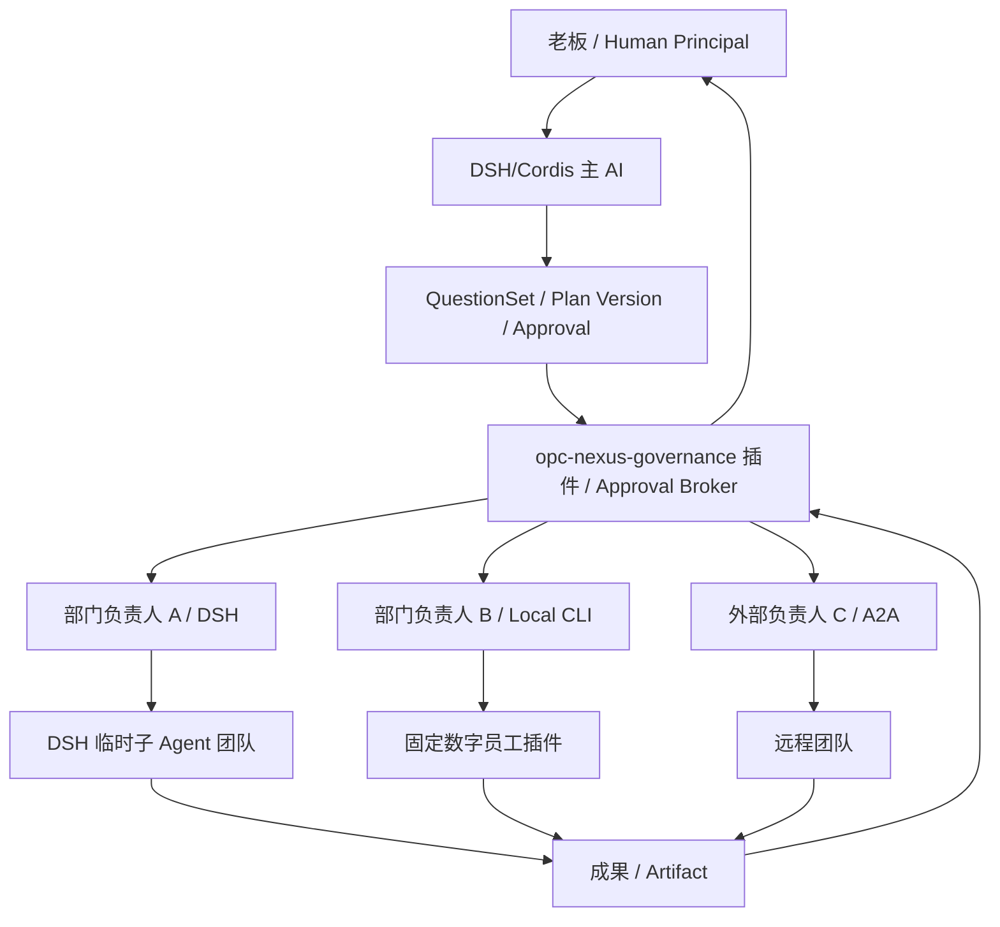
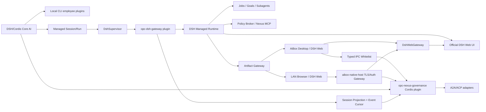
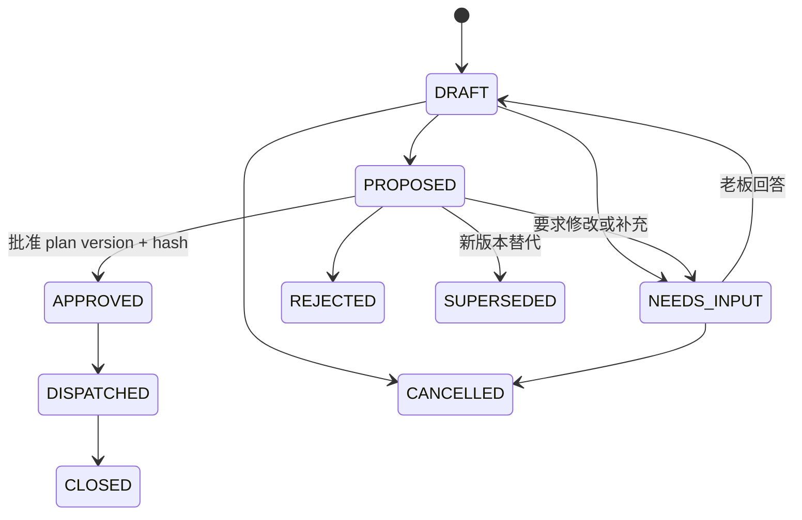

# OPC-Nexus × DeepSeek Harness 整体集成计划

> 状态：执行中（Phase 0-4 的 MVP/Beta 基础已落地；Quest 产品面、项目隔离、自动化与构建已有证据，同一构建双入口、真实手机和正式安装发布验收仍未完成）
> 评审日期：2026-08-16
> 实施更新：2026-08-17
> 适用版本：OPC-Nexus **v2.0.0**；当前内置 DSH `0.1.0-rc.6`
> 结论：**有条件推进（Go with gates）**，推荐方案综合评分 **7.4 / 10**

> **v2 角色决策（覆盖本文早期草案）**：自 `ADR-DSH-003` 起，DSH/Cordis 是唯一产品内核，也是用户面对的主 AI、Quest 规划者、会话与多 Agent 编排 owner。原 AiBox/Nexus 能力整体收敛为 Cordis 内置核心特色插件 `opc-nexus-governance`；Electron Main 只保留无业务智能的 `aibox-native-host` 特权边界。本文中“秘书”“Nexus Core”“Nexus Governance 平面”或“Nexus 编排”若出现在历史设计和兼容组件描述里，均不得解释为并列内核。v2 实施以 `docs/V2.0.0-DSH-CORDIS-PROJECT-QUEST-IMPLEMENTATION-PLAN.md` 和 ADR-DSH-003 为准。

> **v2 UI 决议**：保留原主控制台作为常规/default 桌面入口：`npm run dev`、`npm run start` 和不带 Quest 参数的打包应用必须打开带 Sidebar/Topbar 的主控制台，不能自动替换成 Quest。Quest 是绑定项目的独立窗口；用户从主控制台项目入口通过类型安全的 `openQuestWindow({ projectId })` 弹出。Quest-only 只是额外入口：`npm run dev:quest`、`npm run start:quest`、`--quest`、`--quest-only[=projectId]` 或 `--quest --quest-project=<projectId>` 才只创建 Quest 壳和官方 DSH Web UI，不创建主控制台窗口。Quest 不提供 Direct 执行模式，历史 `direct` 偏好只用于迁移并归一为 Cordis 规划调度。通用裸 DSH 窗口仅保留为数字员工诊断入口，不再冒充项目 Quest。

> **Quest 手机 Web 决议**：每个项目 Quest 左下固定手机按钮打开配对抽屉，复用安全 DSH LAN Gateway，展示无长期密钥的二维码 URL 和独立一次性验证码，并提供 `operator` / `viewer`、刷新和紧急关闭。当前已实现桌面入口与组件合同；真实手机的证书信任、窄屏、审批、断线续接和富媒体视觉 E2E 仍是发布 Gate，不能因二维码能生成就宣称手机端验收完成。

> **Quest 项目边界更新**：Quest 的 desktop grant 只在 Main 内存绑定当前项目 root Session。写操作仅允许该 root 及其已投影后代；跨 root、未投影 Session 和浏览器侧 Session/Workspace 创建默认拒绝。受支持的 rc.6 读取面已经按项目过滤：Session/Workspace/Subagent 查询只返回当前 root 树，跨项目 history/models 在到达上游前拒绝，SSE 和 scoped WebSocket 逐帧丢弃跨 root、未知或无归属事件，审批/问题响应还以已实际交付的 `rpcId` 做一次性校验。scope 不进入 URL、Cookie 或 Renderer。无 scope 的诊断 DSH 窗口继续保持原生透传；该结论只覆盖当前已识别并测试的 rc.6 HTTP/SSE/WebSocket 合同，不泛化为未来未知协议。

> **默认自主权限决议**：数字员工和专家团默认使用 `autonomous`。计划确认后，项目目录内的文件操作、委派和执行过程不再逐步审批，老板只处理关键边界问题与最终验收。项目任务必须具有 Main 选择的项目目录，DSH 按项目派生独立 Profile/Runtime；路径解析同时阻止 `..` 与符号链接逃逸。安装、发布/付款/外部删除、非 GET 外部请求、桌面控制，以及尚无可靠 OS 沙箱的任意 Shell 保留例外确认；未知 ACP 无法证明目录边界时直接拒绝自主提权。

### 当前实施边界

| 阶段 | 当前状态 | 已落地 / 剩余边界 |
|---|---|---|
| Phase 0 | 基础完成 | 已固定版本、integrity、许可证和依赖闭包，并加入 capability probe、Electron/managed smoke、ADR 和 CI；正式安装包及 clean-machine 验证仍是发布 Gate |
| Phase 1 | MVP 基础完成 | 已实现 managed bundle、Supervisor、持久 profile/session、隔离 Workbench、loopback Gateway、`本地 CLI \| DSH` 员工模式、项目级 Quest 独立窗口和额外的 Quest-only 启动面；常规启动仍保留主控制台，无项目、项目失效和 Provider 未配置均可在 Quest 壳内恢复 |
| Phase 2 | Beta 基础完成 | 已实现 Runtime/Session/Run/Event/Cursor/Revision/Lease/Receipt、凭据代理、崩溃对账和待核对状态；受管 preset 已启用 Goals、Jobs、Plan、Ask User 和深度 2 的内建 Subagents，Shell/文件/网络仍关闭。Jobs 为进程内状态，重启后必须显式恢复轮次 |
| Phase 3 | Beta 基础完成 | 已实现 TLS、无密钥配对页、双 Cookie/CSRF、角色、限流、审计及 HTTP/WS 白名单代理，Quest 左下手机配对入口已接入；Quest scoped HTTP/SSE/WebSocket 读写均受项目 root 约束，当前仅在恰好一个 READY managed runtime 时开放 LAN；真实手机 E2E 尚未完成 |
| Phase 4 | 基础完成 | 已实现确定性复杂度分类、1-3 道选择题、版本/hash 审批、预算、团队 DAG、幂等派工和真实依赖唤醒；计划 diff 与 checkpoint 汇报仍需增强 |
| Phase 5 | 部分完成 | DSH child Session 树投影、父子边界、深度/并发限制、事件游标同步和有界成果聚合已落地；正式 A2A Agent Card/Task/Context/Artifact Adapter 与跨团队互信仍未完成 |
| Phase 6 | 部分完成 | 治理插件已提供安全 Markdown/GFM、Mermaid、图片、音视频、有界图表和 `ArtifactRef` admission；DSH 原生交付物写入适配、Vega-Lite、Range/seek、SSRF importer、SBOM 和长稳验收仍未完成 |

因此当前交付口径是 **独立 Quest 产品面、managed DSH 桌面/LAN、项目级 Session 读写隔离、持久 Session/Run 对账恢复、凭据隔离、会话租约、DSH/Cordis Quest 规划与真实 DAG 的 MVP/Beta 基础**，不是完整 V1，也不是 v2.0.0 最终发布验收。Quest-only 当前仍复用应用的完整 preload 和后台服务：它是独立产品面/窗口和启动模式，不是独立 daemon 或第二个进程架构。当前 `@deepseek-ai/dsh-jobs-local` Job 仍是进程内状态，不能计入重启恢复能力；`DETACHED_DAEMON`、正式 A2A、完整多 Agent 投影和原生富媒体制品继续按 Phase 5-6 推进。

## 1. 执行摘要

本项目原有实现具备可复用的本地治理和桌面基础，但旧 DSH 接入只是一个受限的、每任务新建会话的 ACP Worker/Advisor，不是产品内核。v2 的目标不是继续“接入一个引擎”，而是把产品倒置到 DSH/Cordis 上：DSH 提供统一 Web、会话、长任务和多 Agent；原项目通过 `opc-nexus-governance` 插件和薄原生宿主提供项目、员工、渠道与本机能力。

推荐采用以下方案：

1. 用户侧只呈现两种数字员工运行模式：`本地 CLI` 与 `DSH`。
2. 内部保留当前 `ACP_COMPAT` 运行配置，新增 `MANAGED_WEB` 持久运行配置；前者用于兼容和回退，后者承载完整 DSH 体验。
3. DSH Web 始终只监听 loopback；桌面使用隔离的 `BrowserWindow` 或 `WebContentsView`，局域网访问只能经过 `aibox-native-host` 的认证反向代理。
4. DSH/Cordis 拥有主对话、Quest、计划版本、root/child Session、Run、Schedule、Goals、子 Agent 树和工具执行细节；`opc-nexus-governance` 提供组织/项目、员工 manifest、兼容任务投影、审批、审计、预算和 artifact admission；薄宿主持有密钥和系统权限。
5. ACP 负责标准化的单会话任务控制；DSH 专用 Gateway 负责持久会话、事件、子 Agent 和交互；A2A 负责部门负责人或远程团队边界；MCP 只负责受控工具调用。
6. 复杂任务先进入 DSH/Cordis Quest 规划，由主 AI 每轮提出 1 至 3 个高信息量选择题并生成带版本和哈希的团队 DAG 计划；治理插件负责权限/预算校验和老板批准，随后将 DSH 事实写入兼容 Task 投影与审计链。
7. Mermaid、图表、图片、音视频都作为类型化制品处理，不允许任意 HTML/JavaScript，也不直接修改 DSH 的 `node_modules`。

### 1.1 可行性结论

| 能力 | 可行性 | 结论 |
|---|---:|---|
| 桌面嵌入完整 DSH Web | 高 | 已打包官方完整 Web profile，并通过隔离窗口复用 |
| 桌面人与 Cordis 操作同一会话 | 中高 | 已增加持久输入租约和 revision；仍需长期并发操控验收 |
| 安全局域网访问 | 中高 | 必须经 Nexus TLS/Auth 代理，禁止直接暴露 DSH |
| 长任务和进程崩溃恢复 | 中 | 需要持久 Session、事件游标、checkpoint 和幂等命令 |
| DSH 多 Agent | 中 | 上游已有基础；治理插件仍需团队映射、预算与委派边界 |
| 真正脱离 Electron 独立运行 | 中 | 需要后续 `dshd` 用户服务，不应在 MVP 假装实现 |
| DSH/Cordis Quest 提问、计划审批和派工 | 中高 | DSH 负责业务规划；治理插件提供 Approval、权限和团队约束 |
| A2A 跨部门协作 | 中 | DSH 未发现原生 A2A，需要治理插件提供 Adapter |
| Mermaid/图表/音视频 | 高 | 适合用 DSH 客户端插件和统一制品网关实现 |
| 仅靠 ACP 完成全部需求 | 低 | ACP 不提供所需的完整会话、进度和 Web 状态面 |

### 1.2 推荐里程碑

- **MVP**：DSH 模式、持久 Runtime/Session、桌面完整 Web UI、人与 Cordis 可控移交。
- **Beta**：凭据代理、长任务恢复、安全 LAN、工具审批、Jobs/Goals。
- **V1**：DSH/Cordis QuestionSet、版本计划、团队 DAG、多 Agent、A2A、富媒体制品。

## 2. 范围与非目标

### 2.1 本计划覆盖

- 数字员工运行模式选择及迁移策略。
- DSH 完整 Web Runtime 的打包、监管、桌面嵌入和 LAN 代理。
- 长任务、恢复、取消、暂停、人工接管及事件同步。
- 老板、DSH/Cordis 主 AI、部门负责人、团队成员的组织编排模型。
- ACP、DSH Native Gateway、A2A、MCP 的协议分工。
- Markdown、Mermaid、图表、图片、音视频的安全展示。
- 数据模型、IPC/API 边界、测试、发布门禁与回退方案。

### 2.2 本计划不做

- 不把 DSH 前端源码复制到 Nexus Renderer。
- 不用 iframe 把 DSH 放进现有 Renderer 权限域。
- 不直接修改已安装 DSH 包或 `node_modules`。
- 不让 DSH、Hermes 或任何模型绕过治理投影适配器直接写兼容 Task 状态。
- 不做 Nexus SQLite 与 DSH 内部数据库的双向镜像。
- 不声称 DSH 原生支持 A2A。
- 不在第一版承诺应用退出或主机重启后仍继续执行；该能力属于 `dshd` 阶段。

## 3. 已核实的现状

### 3.1 v1 迁移基线

> 本节保留立项时的 v1 事实，用于解释迁移来源，不代表当前 v2 能力；当前实现状态以文首“当前实施边界”和 v2 实施计划为准。

| 事实 | 代码证据 | 对本计划的影响 |
|---|---|---|
| 内置 DSH 固定为 `0.1.0-rc.6` | `src/main/services/deepseekHarnessRuntime.ts:12` | 必须锁版本并做兼容性合同测试 |
| 当前 Runtime 包只有 ACP Demo、Boot 和 LLM Provider | `runtime/deepseek-harness/package.json` | 当前构建产物中没有完整 Web/UI 资产 |
| 每个任务 spawn 一个 ACP 子进程 | `src/main/services/executor/acpExecutor.ts:182` | 不能形成持久 Web Runtime |
| 每次任务创建随机 Session 根 | `src/main/services/deepseekHarnessRuntime.ts:306` | 当前无法跨任务续接同一会话 |
| 退出后删除任务 Session 根 | `src/main/services/executor/acpExecutor.ts:569` | 当前无法重启恢复 |
| ACP 仅调用 `session/new`、`session/prompt`、`session/cancel` | `src/main/services/executor/acpExecutor.ts:582` | 没有 list/resume/fork/delete 和完整事件面 |
| 单任务硬超时 15 分钟，最终结果截断为 16K | `src/main/services/executor/acpExecutor.ts:34,348,614` | 不满足长任务 |
| 当前 Cordis 配置关闭 Bash、Jobs、Goals、MCP 和工作区上下文 | `runtime/deepseek-harness/config/cordis.yml` | 当前只是安全的文本型 Worker |
| 历史实现中 Hermes 是首选控制核、Nexus 是确定性回退，DSH 是 Advisor/Reviewer/Worker | `src/main/services/kernel/kernelRouter.ts`、`src/docs/architecture.md` | 作为迁移基线保留；v2 将主 AI/规划 owner 迁移到 DSH/Cordis，Nexus 只保留治理与适配职责 |
| Orchestrator 是旧 Task 和状态转换唯一写入者 | `src/main/services/orchestrator.ts` | 迁移期只承接 DSH 事实的兼容投影，不能成为第二个规划/执行权威 |
| 已有 TeamEngine、WorkflowEngine、ApprovalBroker、Memory 和 Deliverable | `src/main/services/` | 可复用，但当前 Team 不是完整跨部门 DAG |
| 当前 Chat 是 `marked + DOMPurify` | `src/renderer/src/pages/Chat.tsx`、`components/MarkdownView.tsx` | 没有 Mermaid 和结构化图表契约 |
| 当前 WebServer 是 HTTP + Bearer Token，并可绑定 LAN | `src/main/services/webServer.ts` | 不能直接作为完整 DSH 安全代理；还缺 TLS、WS、Cookie/CSRF 和 RPC 白名单 |
| 浏览器加载的 React SPA 仍直接依赖 `window.aibox` | `src/renderer/src/store.ts` | 当前 WebServer 静态页面不是完整可用的纯浏览器客户端 |

上述基线在立项时的成熟度约为目标的 **20% 至 30%**。v2 已补齐 managed Runtime、Web UI、会话恢复、LAN、安全凭据代理和受限内建多 Agent 基础；正式 A2A、原生交付物写入和主机重启后的无人值守恢复仍是缺口。

### 3.2 DSH 上游事实

本次评估核对了官方仓库提交 [`47f943859bef60e4160492346772ded9b24f765a`](https://github.com/deepseek-ai/deepseek-harness/tree/47f943859bef60e4160492346772ded9b24f765a) 以及 npm `0.1.0-rc.6` 元数据。

| 事实 | 来源 | 计划约束 |
|---|---|---|
| DSH 仍是 developer preview，明确会有破坏性变更 | [README](https://github.com/deepseek-ai/deepseek-harness/blob/47f943859bef60e4160492346772ded9b24f765a/README.md) | 不允许直接依赖未封装的内部 API |
| 正式完整入口是 `npx @deepseek-ai/dsh web`，默认 `127.0.0.1:3080` | 同上 | 新增独立 managed runtime 包 |
| 完整 CLI 依赖 `@deepseek-ai/dsh-web-app` | [apps/cli/package.json](https://github.com/deepseek-ai/deepseek-harness/blob/47f943859bef60e4160492346772ded9b24f765a/apps/cli/package.json) | 当前最小 Runtime 不能直接打开 Web |
| npm `rc.6` tarball 的 Web CLI 明确拒绝 `--host 0.0.0.0`；底层 carrier 文档虽描述该绑定能力，但同样没有认证或 TLS | [startup.ts](https://github.com/deepseek-ai/deepseek-harness/blob/47f943859bef60e4160492346772ded9b24f765a/packages/bundle/web-app/src/startup.ts)、[webserver README](https://github.com/deepseek-ai/deepseek-harness/blob/47f943859bef60e4160492346772ded9b24f765a/packages/host/webserver/README.md) | 以发布 tarball 的 loopback 行为为准，LAN 经 Nexus Gateway |
| Web server carrier 没有 TLS 或认证 | [webserver README](https://github.com/deepseek-ai/deepseek-harness/blob/47f943859bef60e4160492346772ded9b24f765a/packages/host/webserver/README.md) | LAN 必须由 Nexus 前置代理 |
| Connection 插件有 Host/Origin/DNS rebinding 信任栅栏，但它不是认证层 | [api-request-trust.ts](https://github.com/deepseek-ai/deepseek-harness/blob/47f943859bef60e4160492346772ded9b24f765a/packages/client/connection/src/api-request-trust.ts) | 代理必须保留正确 Host/Origin，并配置 trusted host |
| 浏览器 transport 使用 HTTP POST 和两个 WebSocket downlink | `packages/client/connection/` | 反向代理必须覆盖 HTTP 与 Upgrade，不能只转 REST |
| 完整 Web profile 包含 Jobs、Goals、Question、Plan、Subagent 和 Deliverable UI | `packages/bundle/web-app/cordis.patch.yml` | 可复用官方体验，避免重写全部 UI |
| `@deepseek-ai/dsh-jobs-local` 的 Job 存储在进程内，重启会丢失 | 官方 package README 与 rc.6 行为审计 | 只承诺持久 Session 日志、Schedule 及 receipt/cursor 对账恢复，不把本地 Job 实例宣传为可恢复 |
| 固定源码树中未发现原生 A2A Adapter | 仓库树审计 | A2A 应由 Nexus Gateway 提供 |

注意：审计时 GitHub HEAD 的部分 package manifest 仍标记 rc.5，而 npm 最新版本为 rc.6；Web README 对非 loopback 的描述也与 `rc.6` tarball 的实际启动检查不完全一致。发布时必须同时固定 npm tarball integrity、lockfile 和合同测试，不能假设仓库文档、GitHub HEAD 与已发布 tarball 完全一致。

## 4. 产品运行模式

### 4.1 用户可见模式

数字员工创建/编辑页使用分段控件选择：

| 模式 | 用户含义 | 内部路由 |
|---|---|---|
| `本地 CLI` | Codex、Claude、Pi、Hermes 等现有本地 CLI 员工 | 现有 CLI Executor |
| `DSH` | 持久 DSH 工作台、长任务和多 Agent 员工 | 新增 `DshManagedExecutor` + `DshSupervisor` |

运行模式是员工的执行配置，不是新的 AgentLifecycle、TaskStatus、EngineStatus 或 ChannelStatus。数据库中仍以批准的 `engine_id` 为执行权威；UI 可按 Executor 类型派生模式，避免再存一份可能与 `engine_id` 冲突的布尔值。

### 4.2 内部 DSH 配置

| 配置 | 用途 | 是否用户主入口 |
|---|---|---|
| `ACP_COMPAT` | 当前受限、一次性、文本型执行；兼容和紧急回退 | 否 |
| `MANAGED_WEB` | 常驻 Runtime、持久 Session、官方 Web UI、Jobs/Goals/Subagents | 是 |
| `DETACHED_DAEMON` | Nexus 退出后仍运行的用户级服务 | V1 后评估 |

不建议直接替换现有 `eng-deepseek-harness`。先新增 managed engine/profile，完成等价验证后再决定是否迁移默认值。

### 4.3 会话控制模式

| 控制模式 | 输入权 | 典型场景 |
|---|---|---|
| `STANDALONE` | 人类 | 用户直接在 DSH Workbench 工作，Nexus 观察状态和成果 |
| `DELEGATED` | DSH/Cordis 主 AI | Nexus 通过受控 Gateway/Policy Broker 交付治理约束，DSH 负责人自行组织团队执行 |
| `NEXUS_MANAGED`（迁移期旧名） | 治理插件投影适配器 | DSH 仍是执行 owner；每个高风险 DAG 节点都需治理批准和跟踪 |
| `TAKEOVER` | 临时移交 | 人类从 DSH/Cordis 或 Nexus 控制面接管，或把会话交还当前 owner |

关掉 Workbench 窗口不应停止任务。`STANDALONE` 只表示人类拥有输入权，不表示绕过审计、权限或制品管理。

## 5. 目标架构

### 5.1 组织模型



角色约束：

- **老板**：决定目标、预算、关键取舍、动态建队和高风险授权。
- **DSH/Cordis 主 AI**：澄清需求、提出选择题、形成计划、推荐团队、监控和汇报；不能绕过治理插件和 Host Contract 取得系统权限。
- **`opc-nexus-governance` 插件**：执行组织、项目、员工、权限、预算、审批、审计和 artifact admission；不复制 DSH 的对话/规划 UI，不拥有第二套调度器。
- **`aibox-native-host`**：执行凭据、文件、进程、网络、数据库和原生能力；没有业务智能。
- **部门负责人**：接收 WorkOrder，可在批准的预算、权限和深度内建立临时子团队。
- **团队成员**：执行具体节点。DSH 内部临时子 Agent 默认不是 Nexus 持久数字员工。
- **跨团队协作**：通过 DSH 计划与治理插件审计的消息/制品交接，不允许插件私下形成不可审计的跨部门调用。

### 5.2 技术架构



### 5.3 权威数据所有权

| 领域 | 唯一权威 | DSH/Nexus 的另一侧如何使用 |
|---|---|---|
| 组织、项目、员工目录、角色、预算策略 | `opc-nexus-governance` | DSH 通过 Cordis 插件合同使用 |
| Conversation、老板消息、计划版本、问题、DAG | DSH/Cordis | 治理插件保存租约、批准、审计和必要投影 |
| Session、Run、Schedule、Goal、子 Agent 树、工具细节 | DSH/Cordis | 治理插件按游标保存有界摘要与引用 |
| 兼容 TaskStatus 和 AgentLifecycle | 治理插件投影适配器 | 只反映 DSH/员工事件，不反向覆盖执行事实 |
| 密钥和 Provider 凭据 | `aibox-native-host` + safeStorage | DSH 和插件只拿短期受限代理 Token |
| 最终成果和验收策略 | 治理插件 Artifact 能力 | DSH 通过内容寻址上传，宿主执行安全检查 |
| 审计 | 治理插件领域记录 + 薄宿主安全记录 | 所有跨边界命令和租约都关联同一 trace |

原则是事件投影，不是数据库双向复制。Nexus 不直接读取或修改 DSH 内部 SQLite/JSONL 文件。

## 6. 核心模块设计

### 6.1 Runtime 打包策略

保留当前 `runtime/deepseek-harness/` 最小 ACP 闭包，新增独立 managed 闭包，例如：

```text
runtime/
├── deepseek-harness/          # 现有 ACP_COMPAT，不扩大能力面
└── deepseek-harness-managed/  # 完整 @deepseek-ai/dsh Web profile + OPC plugins
```

这样可以：

- 保持当前 Advisor/Reviewer 和受限 Worker 的回退路径；它们属于 DSH/Cordis 核心 AI 的兼容执行面，不改变 v2 owner。
- 避免为了 Web UI 把 Shell、Jobs 和完整插件依赖注入所有 ACP 任务。
- 对两个闭包分别生成 lockfile、SBOM、许可证清单、完整性哈希和 packaged smoke test。

managed 包必须固定确切版本与 integrity，不使用 `^` 漂移。升级只经显式兼容性流程。

managed profile 默认只加载 OPC 审核并锁定的插件，关闭浏览器动态 Cordis 代码和远程插件安装。需要完整第三方插件自由度的 standalone profile 使用独立 `DSH_HOME`、storage partition 和凭据边界，不能继承 Nexus 管理 Token 或长期 Provider Key。

### 6.2 `DshSupervisor`

主进程服务，负责：

- 按 DSH 数字员工/安全 profile 懒启动常驻 Runtime。
- 动态分配 loopback 端口，不使用固定 3080 作为唯一端口。
- 启动握手、capability negotiation、心跳、资源统计和日志脱敏。
- 指数退避重启、崩溃熔断、优雅 checkpoint、退出升级。
- 并发、CPU、内存、Session、子 Agent 深度和预算限制。
- 应用启动时恢复映射，应用退出时完成可验证的停机协议。

MVP 建议一个持久 DSH 部门负责人对应一个 Runtime。后续可按 `(organization, provider profile, policy profile)` 池化，但在证明跨员工隔离前不要过早共享进程。

### 6.3 `opc-dsh-gateway` 与 `DshControlClient`

不要让 Nexus 抓取 Web DOM，也不要让主进程直接绑定 DSH 未稳定的内部类。新增与固定 DSH 版本一起打包的 Cordis plugin，将内部能力收敛为版本化合同：

```text
runtime.getStatus
session.create / resume / list / fork / close
run.start / pause / resume / cancel
events.subscribe(cursor)
approval.resolve
question.answer
artifact.describe
```

每条写命令至少包含：

- `commandId`：幂等键。
- `expectedRevision`：乐观并发控制。
- `principal`：操作者身份。
- `nexusTaskId` / `conversationId`：追踪关联。
- `policyContext`：批准的权限、预算和 workspace。

本地控制通道优先使用 Windows Named Pipe / Linux Unix Socket，并限制为当前用户 ACL。若合同 spike 先使用 loopback，也必须采用一次性随机凭证且不写日志；不能把长期控制密钥作为 Shell 可读取的环境变量。

### 6.4 `DshSessionService` 与事件投影

- DSH 事件是原生执行细节的事实源。
- Nexus 按 `(session_id, seq)` 保存不可变投影，重复事件无副作用。
- 每个订阅维护 `last_event_cursor`，重连时从游标续传。
- 事件先落库，再更新 UI/状态，避免应用崩溃后出现“看见但未持久化”。
- 未知事件保留原始 payload 并标记协议版本，不能静默丢弃。
- 投影失败不应停止 DSH 执行，但必须把 Runtime 标记为 degraded 并告警。

### 6.5 `DshWindowManager`

通用纯 DSH 诊断 Workbench 使用独立 `BrowserWindow`，或在需要停靠布局时使用 `WebContentsView`：

- `nodeIntegration: false`、`contextIsolation: true`、新窗口使用 `sandbox: true`。
- 不挂载 Nexus 通用 preload，不获得 `window.aibox`。
- 独立持久 partition；按用户决定是否跨重启保留普通 Web 偏好。
- 只允许加载 Nexus DSH Gateway authority。
- `will-navigate`、`setWindowOpenHandler` 和下载都走白名单。
- 外部链接交给 `shell.openExternal`。
- 窗口关闭仅释放视图，不停止 Runtime/Run。

该诊断入口采用独立 Workbench 窗口，保持 DSH CSS/React/路由隔离，也避免纯 DSH 页面获得主 Renderer 的 IPC 能力。

v2 当前实现进一步区分了三类窗口生命周期：常规启动创建原主控制台；项目通过白名单 `aibox:openQuestWindow` 调用 `QuestWindowManager` 创建带类型安全 preload 的独立 Quest 产品壳；无项目参数的 Quest-only 额外入口也复用该 Quest 壳，但不创建主控制台。官方 DSH Web UI 由 `DshEmbeddedWorkbench`/`DshWebGateway` 作为隔离页面挂载；原通用 DSH 窗口只保留为无项目 scope、无主 Renderer preload 的诊断入口。Quest-only 可在没有项目时启动并现场创建项目，也能在目标项目缺失/归档、Provider 未配置或 DSH 连接失败时留在 Quest 壳内完成恢复。Quest 左下手机按钮属于项目 Quest 壳，不替代主控制台导航，也不要求用户先进入 Quest-only 模式。

### 6.6 `DshWebGateway`

桌面和 LAN 都通过该网关访问同一个 DSH Runtime：

- 代理静态资源、HTTP RPC 和两个 WebSocket Upgrade。
- 本地桌面使用短期窗口会话；LAN 使用完整 TLS/Auth 会话。
- Quest 左下手机按钮打开 `QuestMobileAccess` 配对抽屉；二维码只携带无长期密钥的配对 URL，验证码独立显示并限时使用。
- 保留外部 `Host` 和 `Origin`，同时将公开 authority 写入 DSH `trustedHosts`。
- 对远程 RPC 做方法白名单和字段级校验。
- 管理多个 Runtime 前，先做 DSH base-path 合同测试；若官方 UI 不支持子路径，使用独立受认证 authority/端口，不能用脆弱 HTML 字符串改写。

### 6.7 `ProviderCredentialProxy`

这是启用完整 DSH Shell/Jobs 的 **P0 安全门槛**。

当前最小 Runtime 把真实 Provider Key 注入子进程环境，因为 Shell 被关闭，风险尚可控。完整 DSH 若继续这样做，模型可通过命令读取环境并泄露密钥。

改造方案：

1. 真正 Provider Key 只留在 Nexus Main 的 safeStorage/内存。
2. DSH 连接本机 Provider Proxy，使用短期、可撤销、范围受限的 opaque token。
3. Token 固定 organization、agent、provider、model、最大费用、QPS 和过期时间。
4. Proxy 做请求大小、模型、域名、费用、并发和日志脱敏限制。
5. DSH Shell sandbox 禁止访问 Nexus userData、凭据文件、控制 pipe 和其他员工 Runtime。

短期 Token 即使被任务读到，也只能在很小权限窗口内使用；它不能成为另一把长期主密钥。

### 6.8 `DshPolicyBroker`

把现有粗粒度权限扩展为 DSH 运行期能力：

```text
fs.read
fs.write
process.exec
network.fetch
package.install
secret.use
destructive
delegate
external_message
artifact.publish
```

权限决策仍由 Nexus ApprovalBroker/策略层持久化。DSH 的原生 permission UI 可以作为展示面，但最终结果必须回到 Nexus 审计和 Task 状态机。

### 6.9 Quest 社区插件真实状态

Quest 插件抽屉中的 10 项默认能力是治理目录，不是“已加载插件包”。目录可见、安装、
启用和运行时 `live` 必须分别展示；兼容性 smoke 不能自动点亮运行状态。当前需要特别固定
以下三项事实：

| 插件 | 固定来源 | 已验证事实 | Quest 当前边界 |
|---|---|---|---|
| dsh-web-ui | `@linxin666/dsh-web-ui-all@0.1.19` | rc.6 bundle composition 已核验 | 官方 Web UI 已内置；社区聚合增强包因权限面过大继续 `blocked`，未挂载 |
| dsh-chat-import | `dsh-chat-import@0.5.1` | 固定版本兼容性元数据已核验 | 需要显式历史目录与 Session 写权限，未授权前不加载 |
| dsh-find-plugin | `dsh-find-plugin@0.3.6` | rc.6 启动 smoke 已通过 | 仍需 Host 网络代理与供应链适配；发现结果中的第三方安装命令不得直接执行，当前不是 `live` |

完整 10 项矩阵和状态语义见 `docs/QUEST-DEFAULT-PLUGIN-PACK.md`。只有目标 Profile 已实际
挂载、handler 已 attach、健康探针与逐次策略检查均通过时，UI 才能报告 `live`；当前默认
第三方运行时 `live` 数为 0。

## 7. 协议边界

| 协议 | 正确职责 | 不承担的职责 |
|---|---|---|
| ACP | 自动创建一次会话、提交 prompt、取消、基础 permission；兼容外部 Agent | 完整 Web 状态、持久恢复、子 Agent 图、组织编排 |
| DSH Native Gateway | Session/Run、事件游标、原生问题、审批、Jobs、Goals、Subagents、Artifact metadata | Nexus 组织权威和 Task 状态写入 |
| A2A | 部门负责人/远程团队的 durable task、status、message、artifact、cancel | DSH 内部每个临时子 Agent 的实现细节 |
| MCP | 向 DSH 暴露 Nexus 工具、资源和受控能力 | 员工生命周期、任务权威、跨团队身份 |

推荐控制路径：

- 简单兼容任务：Nexus → ACP → Worker。
- 完整 DSH 任务：Nexus → DshControlGateway → DSH Session/Run。
- DSH 使用 Nexus 工具：DSH → MCP/Policy Broker → Nexus Service。
- 跨部门：Nexus A2A Gateway ↔ Department Lead。

A2A 第一版采用 Nexus 中介星型拓扑。不要一开始允许部门之间任意点对点连接，否则权限、预算、取消和审计会失去统一边界。

## 8. 状态模型与映射

### 8.1 保持现有四层模型

不修改四层状态的语义：

- Agent 生命周期仍是 `AgentLifecycle`。
- 任务状态仍由 `TaskStatus` 表示，并且只能由 Orchestrator 写入。
- DSH 安装/健康映射到 `EngineStatus`。
- 渠道状态不参与 DSH Runtime 状态。

DSH 进程和 Session 的细节状态是内部运行事实，不应塞进上述枚举。UI 可通过 Task event 的 `reason` 派生“恢复中”“等待输入”“后台作业中”等标签。

### 8.2 DSH 到 Task 的投影

| DSH 事实 | Nexus TaskStatus | 说明 |
|---|---|---|
| Run 已接受、未开始 | `QUEUED` | 等待 Runtime/预算/依赖 |
| Agent turn、Job 或 Subagent 活跃 | `RUNNING` | 后台执行仍是 RUNNING |
| 等待危险工具授权 | `WAITING_APPROVAL` | 使用现有 ApprovalBroker |
| 等待普通业务输入 | `PAUSED` | 记录 `reason=waiting_input`，不是审批 |
| Runtime 正在可恢复重启 | `PAUSED` | 记录 `reason=runtime_recovering` |
| 正常完成并验收输出 | `COMPLETED` | 由 Orchestrator 提交 |
| 明确执行失败 | `FAILED` | 保留 DSH 原始原因引用 |
| 已确认取消 | `CANCELLED` | 不能在只发送 cancel 后立即宣称完成 |
| 无法恢复或失去会话 | `INTERRUPTED` | 允许用户选择重建/核对 |

### 8.3 规划状态机

澄清问题发生在正式 Task 创建前，不能复用 `WAITING_APPROVAL`：



`APPROVED` 只批准明确计划版本。任何改变目标、预算、团队、权限、关键依赖或验收标准的修改都必须生成新版本并使旧版本 `SUPERSEDED`。

## 9. 数据模型

建议采用增量迁移，不破坏现有表。

| 表 | 关键字段 | 用途 |
|---|---|---|
| `dsh_profiles` | `id, engine_id, provider_profile, policy_json, version` | managed runtime 配置和版本 |
| `dsh_runtime_instances` | `id, agent_id, profile_id, process_state, endpoint, protocol_version, capabilities_json, heartbeat_at, crash_count` | Supervisor 实例 |
| `dsh_sessions` | `id, upstream_session_id, agent_id, conversation_id, parent_session_id, delegation_depth, workspace, control_mode, revision` | Nexus/DSH 会话映射 |
| `dsh_runs` | `id, session_id, nexus_task_id, team_run_id, dag_node_id, command_id, upstream_state, event_cursor, checkpoint_ref` | 一次执行/turn |
| `dsh_events` | `session_id, seq, run_id, type, payload_json, created_at` | 不可变事件投影；唯一键 `(session_id, seq)` |
| `dsh_artifacts` | `id, run_id, sha256, kind, mime, bytes, storage_ref, metadata_json` | 内容寻址制品 |
| `dsh_control_leases` | `session_id, controller, surface, token_hash, expires_at, revision` | 防止多写者 |
| `planning_sessions` | `id, conversation_id, status, current_plan_version, complexity, risk` | DSH/Cordis Quest 规划会话（Nexus 兼容投影） |
| `planning_question_sets` | `id, planning_session_id, version, questions_json, status, expires_at` | 持久选择题 |
| `plan_versions` | `id, planning_session_id, version, plan_json, plan_hash, status, approved_by, approved_at` | 可审计计划版本 |
| `plan_nodes` | `id, plan_version_id, owner_agent_id, dependencies_json, budget_json, acceptance_json` | 可执行 DAG 节点 |
| `a2a_bindings` | `nexus_task_id, context_id, remote_task_id, agent_card_ref, last_cursor` | A2A 映射 |

核心 ID 关系：

```text
Nexus Conversation 1 -> 1 DSH root Session
Nexus Task         1 -> 0..n DSH Run/Turn
DSH Subagent       1 -> 1 child Session(parentSessionId, delegationDepth)
Plan DAG Node      1 -> 1 Nexus Task -> 0..1 DSH Run or A2A Task
```

不要把 DSH 内部临时 Subagent 自动写入 `agents`。只有老板批准的持久团队提案才创建正式数字员工。

## 10. 输入租约与宿主同步

桌面、LAN、Nexus 和部门负责人可能同时向同一 DSH Session 输入，这是必须优先解决的并发问题。

### 10.1 租约规则

- Controller：`HUMAN | NEXUS | TEAM_LEAD`。
- Surface：`DESKTOP | LAN | INTERNAL | A2A`。
- 同一 Session 同时只能有一个写租约；其他连接为只读观察者。
- 每次写命令携带 `leaseToken + expectedRevision + commandId`。
- 租约短期有效，需心跳续期；Token 只保存 hash。
- 接管不是静默覆盖：先暂停输入队列，确认当前 turn 边界，再原子转移 revision。
- DSH 提问时，当前 Controller 有优先回答权；需要老板决策时 DSH/Cordis 创建持久 QuestionSet，Nexus 只执行权限与审计闸门。

### 10.2 UI 行为

- Composer 清楚显示当前控制者。
- 只读观察者看到“请求接管”，而不是仍可输入的假文本框。
- Nexus 持有租约时，人类可追加“下一轮指示”，但不直接插入正在执行的 turn。
- 接管、归还、租约过期和拒绝都写 AuditLog。

### 10.3 同步语义

- 所有端消费同一事件序列，不各自维护独立聊天历史。
- UI 断线后按 cursor 补齐，不以整页快照猜测缺失事件。
- Nexus Task 只保存摘要、状态和 DSH 引用；完整轨迹仍由 DSH Session 保存。
- 最终成果经 Artifact Gateway 登记到 Nexus，不能只存在于 Web UI 对话气泡。

## 11. DSH/Cordis Quest 复杂任务规划

### 11.1 触发条件

以下任一情况进入 DSH/Cordis Quest 规划，而不是立即创建宿主 Task：

- 涉及两个及以上部门或存在跨团队依赖。
- 目标、边界或验收标准不明确。
- 预计长任务、较高费用或需要创建新团队。
- 涉及写文件、安装、外发消息、生产系统、付款或其他不可逆操作。
- 用户明确要求方案比较、分阶段执行或先确认后执行。
- Hermes/Nexus 的确定性复杂度/风险评分超过配置阈值。

模型可以建议分数和问题，但是否触发门禁由确定性策略决定。

### 11.2 QuestionSet 规则

- 每轮优先提出 1 至 3 个最高信息增益问题；信息不足时可在老板回答后开启下一轮。
- 每题提供 2 至 4 个互斥选项，可标记推荐项和推荐理由。
- 支持单选、多选和自由输入；永远允许老板补充其他答案。
- 每个选项展示范围、成本、时间或风险影响，而不是只换一种措辞。
- 答案与 QuestionSet 版本一起持久化；过期问题不能覆盖新计划。
- 普通澄清不使用 ApprovalBroker；危险工具授权继续使用 ApprovalBroker。

### 11.3 计划最小结构

```ts
interface CompanyExecutionPlan {
  objective: string
  assumptions: string[]
  scope: { included: string[]; excluded: string[] }
  team: Array<{
    leadAgentId: string
    memberAgentIds: string[]
    proposedEphemeralRoles: string[]
  }>
  dag: Array<{
    nodeId: string
    ownerAgentId: string
    dependencies: string[]
    workOrder: string
    expectedArtifacts: string[]
    acceptanceCriteria: string[]
    permissionProfile: string
    budget: { timeMinutes: number; tokenLimit: number; costLimit: number }
    retryPolicy: { maxAttempts: number; backoff: string }
  }>
  risks: Array<{ risk: string; mitigation: string; ownerAgentId: string }>
  checkpoints: Array<{ afterNodeId: string; requiresOwnerReview: boolean }>
  rollback: string[]
  completionCriteria: string[]
}
```

老板批准的是规范化 JSON 的 hash。前端展示可以更友好，但提交给 Orchestrator 的对象必须经过 shared schema 校验。

### 11.4 派工和汇报

1. DSH/Cordis 将老板请求落为 `PlanningSession(DRAFT)`。
2. 触发门禁时生成 QuestionSet，状态变为 `NEEDS_INPUT`。
3. 答案齐备后 DSH/Cordis 生成计划并提出派工建议。
4. 治理插件校验团队、DAG、预算、权限、循环依赖和组织边界，并写入兼容 Task 投影。
5. 老板批准明确 plan version/hash。
6. DSH 为可运行 DAG 节点派工；治理插件为需要宿主跟踪的节点建立 Task/WorkOrder 投影。
7. 每个团队只上报里程碑、风险、问题和 Artifact，不把全部内部 token 流塞给老板。
8. DSH/Cordis 在 checkpoint 汇总状态，需要决策时再向老板提问；治理插件记录审计和宿主状态投影。

## 12. 长任务、恢复与独立执行

### 12.1 长任务基础

- managed Run 不使用现有 15 分钟进程硬超时；改为策略化 wall-clock、idle、预算和无进展超时。
- 窗口、浏览器和 IPC 连接都不是任务生命周期所有者。
- Runtime 心跳、Session checkpoint、event cursor 和 command receipt 都持久化。
- 父任务取消应级联请求子 Agent/Job 取消，并等待确认或明确标记超时。

### 12.2 恢复协议

1. 薄宿主发现 Runtime 失联；治理插件将兼容 Task 投影为 `PAUSED(reason=runtime_recovering)`，DSH Session/Run 仍是权威事实。
2. Supervisor 退避重启并以 `upstream_session_id + checkpoint_ref` 重新附着。
3. 从 `last_event_cursor` 拉取缺失事件。
4. 逐条核对已发送 `commandId` 的 receipt，禁止盲目重发。
5. 无法确认是否已经产生外部副作用的命令进入 `needs_reconciliation`，由人核对。
6. 恢复成功并由 DSH 事件确认后，治理插件把兼容投影返回 `RUNNING`；超过恢复预算则投影为 `INTERRUPTED`。

Checkpoint 只能恢复推理/会话，不天然保证文件写入、网络请求、付款或消息外发不会重复。所有有副作用的治理插件或 Host 工具必须支持幂等键，或在恢复时要求人工核对。`dsh-jobs-local` 的进程内 Job 不在此恢复承诺内。

### 12.3 “独立执行”的两级定义

- **Managed background（MVP）**：关闭 DSH 窗口后任务继续；Nexus 应用仍是进程监管者。
- **Detached daemon（后续）**：Electron 退出后 `dshd` 仍运行；使用 Windows 用户服务/计划任务或 Linux systemd user service，Nexus 通过本地 pipe 重连。

不要让普通 Electron child 脱离父进程后就宣称实现了可靠 daemon。真正独立模式还需要升级、日志轮换、自动启动、用户退出、锁文件和数据库单写者策略。

## 13. LAN 安全模型

### 13.1 网络拓扑

```text
LAN Browser --HTTPS/WSS--> Nexus DshLanGateway --HTTP/WS loopback--> DSH Web
                                             \--> Nexus Control/Artifact API
```

DSH 进程始终绑定 `127.0.0.1`。不得修改上游来直接监听 `0.0.0.0`，也不得把没有认证的 3080 暴露到 LAN。

### 13.2 必须实现的控制

- TLS：复用/抽取现有 Mobile Gateway 的证书生命周期能力，私钥经 safeStorage 保存。
- 配对：管理员在桌面显示一次性短码/二维码；浏览器换取会话。
- 会话：`HttpOnly + Secure + SameSite=Strict` Cookie，不把长期 Bearer 放入 localStorage。
- CSRF：写操作验证 Origin、Fetch Metadata 和 CSRF token。
- WebSocket：Upgrade 时重复验证 Cookie、Origin、Host、runtime scope 和角色。
- Host：代理保留浏览器访问的 authority；DSH 配置相同 `trustedHosts`，防 DNS rebinding。
- RPC 白名单：远程默认只有 session read、prompt（持有租约时）、cancel、answer、artifact read。
- 本地专属：Provider/凭据、插件安装、任意目录选择、Runtime 配置和危险设置不得远程调用。
- 限流：登录、prompt、artifact、stream 分别限流；限制并发连接和请求体。
- 审计：登录、租约、输入、审批、取消、下载、权限拒绝和代理错误全部可追踪。
- 暴露：默认关闭 LAN；开启时明确显示网卡、地址、证书指纹、会话数和紧急关闭按钮。

### 13.3 代理兼容性注意事项

DSH Connection 插件会比较 `Host` 和 `Origin`。若反向代理把 Host 改为 `127.0.0.1`，却保留 LAN Origin，请求会被正确拒绝。因此代理层不能套用默认的 Host rewrite，必须在合同测试中覆盖：

- LAN hostname、IPv4、显式端口。
- HTTP RPC、两个 WebSocket downlink。
- DNS rebinding、跨站 Origin、`Origin: null`。
- 断线重连和大附件上传。

## 14. 多 Agent、团队和 A2A

### 14.1 DSH 内部团队

- 一个 DSH 部门负责人拥有根 Session。
- 它在批准的 `delegationDepth`、`maxChildren`、并发、费用和工具策略内创建 child Session。
- Child Session 在 Nexus 中显示为临时团队节点，可查看状态和成果，但不自动进入员工花名册。
- 部门负责人对内部成果做第一次整合，DSH/Cordis 对跨团队依赖和最终交付对话负责；Nexus 负责最终 artifact admission 与宿主审计。

### 14.2 Nexus 持久团队

现有 TeamEngine 可复用成员、协调者、分解、执行和复核能力，但 V1 需要补齐：

- 真正 DAG 依赖，而不是主要按成员均分。
- 节点级预算、权限、重试、取消和验收。
- 跨团队制品合同与版本。
- 部门负责人和临时 DSH 子 Agent 的统一投影视图。
- 动态建队提案；只有老板批准后才创建持久 Agent/Team。

### 14.3 A2A Gateway

A2A 作为组织边界，不作为 DSH 内部实现：

- 为部门负责人发布最小 Agent Card 和能力声明。
- 映射 `Nexus Task ↔ A2A context/task ↔ DSH Run`。
- 支持 durable status、message、artifact、cancel 和断线游标恢复。
- 远程 Agent 不得直接调用 Orchestrator；所有状态经过 A2A Adapter 校验。
- 第一版只做 Nexus 中介的跨团队协作，后续再评估直接团队互信。

## 15. 富媒体与制品

完整 DSH Web 已有 GFM、代码高亮、数学公式和图片基础，但本次核查未发现产品级 Mermaid、音视频和结构化图表契约。推荐新增 Host/Client 插件，而不是 fork 官方 UI。

### 15.1 统一制品信封

```ts
type ArtifactKind =
  | 'markdown'
  | 'image'
  | 'audio'
  | 'video'
  | 'mermaid'
  | 'vega-lite'
  | 'file'

interface ArtifactEnvelope {
  id: string
  kind: ArtifactKind
  mime: string
  sha256: string
  bytes: number
  title: string
  sourceRunId: string
  metadata: Record<string, unknown>
}
```

### 15.2 渲染策略

| 类型 | 策略 |
|---|---|
| Markdown | GFM + allowlist sanitizer；不允许原始脚本、事件属性和任意 iframe |
| Mermaid | 只接收源码；`securityLevel=strict`，禁 HTML label；渲染后再次清理 SVG |
| 图表 | 使用 schema 校验的 Vega-Lite JSON；限制 mark、transform、dataset 大小和外部 URL |
| 图片 | 内容嗅探、像素/尺寸上限、缩略图；远程图片先经 SSRF-safe importer |
| 视频/音频 | 认证内容端点、正确 MIME、Range 支持、大小/时长限制；不自动播放 |
| 文件 | 内容寻址下载，使用短期授权；禁止裸 `file://` 和任意本地路径 |

推荐插件：

```text
@opc-nexus/dsh-artifact-host
@opc-nexus/dsh-client-ui-artifacts
```

Host plugin 注册 Artifact Remote；Client plugin 在官方会话节点中增加类型化预览。Nexus 自己的 Chat/Deliverables 也复用同一 `ArtifactEnvelope`，避免两套不兼容的 Markdown 附件语义。

### 15.3 CSP 基线

- `default-src 'self'`。
- managed profile 禁止 `unsafe-eval` 并关闭依赖动态代码求值的浏览器插件；standalone profile 如确需该能力，必须留在独立 Origin 和权限域内。
- `object-src 'none'`、`frame-src 'none'`。
- `img-src/media-src` 仅允许网关和显式 data/blob 场景。
- 外部资源必须先入 Artifact Gateway，不能让模型任意指定浏览器直连地址。

## 16. IPC 与 API 边界

所有桌面调用遵循既有三步白名单：`ipc.ts` 注册 → preload 封装 → Renderer 调用。禁止新增通用 `invoke(channel, payload)`。

建议 IPC：

```text
aibox:getDshRuntimeStatus
aibox:startDshRuntime
aibox:stopDshRuntime
aibox:openDshWorkbench
aibox:requestDshTakeover
aibox:releaseDshControl
aibox:getPlanningSession
aibox:answerPlanningQuestions
aibox:approvePlanVersion
aibox:rejectPlanVersion
```

建议 LAN API：

```text
POST /api/v1/auth/pair
POST /api/v1/auth/logout
GET  /api/v1/dsh/runtimes
POST /api/v1/dsh/:runtimeId/lease
POST /api/v1/dsh/:runtimeId/takeover
GET  /api/v1/planning/:id
POST /api/v1/planning/:id/answers
POST /api/v1/planning/:id/approve
GET  /api/v1/artifacts/:id
```

DSH 官方 `/api` 和 WebSocket 路径通过专用代理，不直接复用 Nexus 业务 API 的任意转发。代理需要解析并限制 RPC method，不能只依据 URL 放行全部 payload。

## 17. 分阶段实施计划

工期为单名熟悉 Electron/TypeScript 的高级工程师的工程日粗估，不含上游等待时间。

### Phase 0：ADR 与合同 Spike（3 至 5 天）

任务：

- 冻结 `@deepseek-ai/dsh@0.1.0-rc.6` tarball integrity、许可证和完整依赖闭包。
- 在开发与 Windows/Linux packaged 环境运行 `dsh web` smoke。
- 记录 Web RPC、WebSocket、Session、Subagent、Question、Job、Goal 能力矩阵。
- 先修复主窗口 `will-navigate` 拦截、外部链接协议白名单，并让 Chat 复用统一的安全 Markdown 组件；在此之前不加载任何 DSH 页面。
- 验证 `opc-dsh-gateway` plugin 能否在不读内部数据库、不抓 DOM 的前提下提供所需合同。
- 输出 ADR：所有权、协议边界、ID 映射、版本升级和回退。

验收：

- 有可自动执行的 contract probe 和保存的 capability fixture。
- 证明完整 Web 包可合法打包并在 Electron Node 环境工作。
- 如果无法稳定提供 Session/Event 合同，停止后续 managed 集成，保留 ACP。

### Phase 1：持久 Supervisor 与桌面 Workbench（7 至 10 天）

任务：

- 新增 managed runtime bundle、`DshSupervisor`、健康检查和资源限制。
- 新增持久 profile/session 目录，不再按任务删除。
- 新增隔离 BrowserWindow 和本地 DshWebGateway。
- 数字员工向导增加 `本地 CLI | DSH` 选择。
- 保留 ACP_COMPAT feature flag 和回退入口。

验收：

- 连续多轮使用同一 DSH Session。
- 关闭/重开 Workbench，历史和正在运行的任务不丢失。
- 主 Renderer 与 DSH 窗口的 Cookie、storage、preload 和导航权限隔离。
- 当前 ACP 测试与现有任务行为不回归。

### Phase 2：耐久任务、凭据和恢复（10 至 15 天）

任务：

- 实现 DshControlGateway、Session/Run/Event tables、cursor 和 command receipt。
- 实现输入租约、revision、接管/归还。
- 实现 ProviderCredentialProxy 和细粒度 PolicyBroker。
- 开启受控 Shell/Jobs/Goals；增加副作用幂等/核对状态。
- 实现进程 kill、应用重启和 Session resume。

验收：

- 运行超过 15 分钟的任务不会被旧 timeout 终止。
- kill DSH 后自动恢复，事件无缺失、无重复命令。
- 应用重启能重新附着可恢复 Session。
- Shell 无法读取真实 Provider Key、Nexus userData 或其他 Runtime 数据。
- 无法确定的副作用不会自动重放。

### Phase 3：安全 LAN Beta（7 至 10 天）

任务：

- TLS、配对、HttpOnly Cookie、CSRF、角色、限流和审计。
- HTTP/WebSocket reverse proxy。
- Host/Origin/trustedHosts 正确传递。
- 远程 RPC 方法白名单、本地专属设置隔离和紧急关闭。

验收：

- 桌面和 LAN 看到同一事件 seq 和 Session。
- 并发输入只有租约持有者成功。
- 未配对、跨站 Origin、DNS rebinding、伪造 Host 和未授权 WS 都被拒绝。
- LAN 默认关闭；Token/Key 不进入 URL、日志或 localStorage。

### Phase 4：DSH/Cordis Quest 规划与团队 DAG（10 至 15 天）

任务：

- PlanningSession、QuestionSet、PlanVersion、hash、审批和 supersede。
- 复杂度/风险确定性门禁。
- 团队推荐、动态团队提案、DAG 校验和预算。
- 老板视图：问题、方案比较、计划 diff、批准、checkpoint 汇报。

验收：

- 复杂任务在批准前不会创建可执行 Task。
- 老板批准的是不可歧义的 plan version/hash。
- DAG 循环、无权限员工、超预算和组织越界都会 fail-closed。
- 计划变更自动生成新版本，不篡改已批准记录。

### Phase 5：多 Agent 与 A2A（15 至 20 天）

任务：

- DSH child Session 树投影、委派深度/并发/费用限制。
- 父取消级联、子成果聚合、跨团队 Artifact 合同。
- Nexus A2A Agent Card、Task/Context/Artifact Adapter 和游标恢复。
- 星型跨团队协作和失败补偿。

验收：

- DSH 临时子 Agent 可观察但不会污染员工花名册。
- 跨团队调用必须对应已批准 DAG edge。
- 父任务取消能得到所有子节点的确认或明确超时状态。
- A2A 重连不会重复创建远端任务或制品。

### Phase 6：富媒体与生产加固（10 至 15 天）

任务：

- Artifact Host/Client plugin、Mermaid、Vega-Lite、图片和音视频。
- CSP、SVG/Markdown sanitizer、Range、配额、SSRF 防护。
- SBOM、THIRD-PARTY-NOTICES、签名/哈希、升级/降级测试。
- Windows/Linux pack、长稳、崩溃、磁盘占满和大附件测试。

验收：

- 恶意 Markdown/Mermaid/SVG/Chart 不能执行脚本或越权读取。
- 视频可 seek，断点/Range 正确，不将整个大文件载入内存。
- packaged 安装程序包含且只包含批准的 DSH 依赖闭包。
- managed 失败时可禁用并回退 ACP/Local CLI。

### 17.1 粗略总工期

| 交付 | 累计工程日 | 说明 |
|---|---:|---|
| MVP（Phase 0-1） | 10-15 | 桌面完整 Web + 持久会话，不开放危险工具和 LAN |
| Beta（Phase 0-3） | 27-40 | 长任务恢复、凭据安全、安全 LAN |
| V1（Phase 0-6） | 62-90 | 组织编排、A2A、富媒体和生产加固 |

对单人实施，V1 是约 3 至 4.5 个月的真实工程量。最不应压缩的是凭据代理、恢复幂等和 LAN 安全测试。

## 18. 测试与发布门禁

### 18.1 测试层次

| 层 | 必测内容 |
|---|---|
| Unit | 状态投影、租约 revision、计划 hash、DAG、RPC 白名单、权限策略 |
| Contract | 固定 DSH 版本的 capability、RPC schema、Web 路径和事件 fixture |
| Integration | Supervisor、Session resume、cursor、cancel、approval、artifact |
| Fault injection | kill -9、Nexus 重启、断网、乱序/重复事件、磁盘满、端口冲突 |
| Security | XSS、CSRF、DNS rebinding、Host/Origin、WS、SSRF、路径穿越、凭据泄露 |
| E2E | 桌面/LAN 同会话、接管、复杂任务问答、计划批准、团队执行、成果验收 |
| Packaging | Windows/Linux 完整 Runtime、许可证、哈希、Node 兼容和卸载清理 |

### 18.2 每阶段最低验证

```bash
npm run typecheck
npm test
npm run build
npm run harness:verify
npm run harness:verify:electron
```

涉及打包时还需执行对应 `pack:win` / `pack:linux` 和 packaged smoke。状态机、恢复、审批和安全边界变更必须有测试，不能只依赖手工点击。

### 18.3 发布 Gate

| Gate | 通过条件 | 未通过时 |
|---|---|---|
| G0 上游合同 | managed Web 和 Gateway 合同可自动验证 | 保留 ACP，不承诺完整 Web |
| G1 密钥隔离 | Shell 无法取得真实 Provider Key | 禁止开启 Shell/Jobs |
| G2 恢复幂等 | 崩溃恢复不重复副作用 | 长任务标 Beta，不允许无人值守 |
| G3 LAN 安全 | TLS/Auth/CSRF/Host/Origin/WS 测试全通过 | LAN 功能保持关闭 |
| G4 状态权威 | 所有 Task 变化都经过 Orchestrator | 阻止发布 |
| G5 供应链 | SBOM、license、integrity、packaged smoke 通过 | 不进入安装包 |

### 18.4 当前 Quest 增量验收证据（2026-08-17）

双入口发布验收必须分别执行，任一分支的结果都不能代替另一分支：

1. `npm run dev`：只按常规生命周期打开原主控制台，Sidebar/Topbar 可见，不自动进入 Quest-only；从具体项目触发 `window.aibox.openQuestWindow({ projectId })` 后弹出绑定该项目的独立 Quest 窗口。
2. `npm run dev:quest`：不创建主控制台，只打开 Quest 壳和官方 DSH Web UI；`npm run start` / `npm run start:quest` 及打包应用参数必须保持同样的分流语义。
3. Quest-only 主实例运行时再次执行普通主程序，必须创建/恢复主控制台，而不是只聚焦 Quest；该二次启动路径属于双入口运行时验收的一部分。

| 证据 | 结果 | 覆盖范围 |
|---|---|---|
| Quest/恢复/Provider/项目隔离 focused tests | `68/68` 通过 | Quest-only 启动与窗口、无项目/失效项目恢复、Provider safeStorage 设置、环境重检、Cordis 修复、HTTP/SSE/WebSocket 项目读写隔离、审批/问题 `rpcId` 防伪与防重放 |
| 全量自动化 | `1,492 passed / 2 skipped` | 最近一次全量 Vitest 记录；skip 为环境条件项，不作为产品 E2E 通过依据 |
| TypeScript / 构建 | 通过 | `npm run typecheck` 与 `npm run build` exit 0 |
| Quest-only 真实 Electron CDP | 已通过该分支 | `npm run dev:quest` 对应表面仅出现 1 个 Quest 壳与 1 个官方 DSH 页面目标；Sidebar/Topbar 均为 0，DSH 已连接，Direct 不存在；10 项只证明治理目录显示，第三方运行时 `live` 数为 0 |
| 常规主控制台 + 项目弹窗 CDP | 需按修正后的双入口契约复测 | 必须证明 `npm run dev` 保留主控制台，且项目触发 `openQuestWindow` 后主控制台与独立 Quest 窗口并存；不得用 Quest-only 截图替代 |
| 安装入口合同 | 通过源配置与单测 | Windows 安装脚本声明 Start Menu `Quest.lnk --quest-only`，Linux 声明 `Quest` Desktop Action；`tests/questPackagedLauncher.test.ts` 验证创建/卸载合同 |
| Quest 左下手机入口组件合同 | 已实现，运行时待验收 | 手机按钮、二维码/一次性验证码、角色、刷新和关闭流程已接入安全 LAN Gateway；不等同于真实手机/证书/视觉 E2E |

以上证据证明当前 Quest 产品面和已测试的项目隔离合同，不等同于正式安装包、真实手机或完整 v2.0.0 发布验收。

### 18.5 尚未完成的发布项

- Windows 10/11 与 Ubuntu 22.04+ clean-machine 安装、启动、fallback、升级/卸载和签名产物验证；安装入口目前只有配置/合同证据。
- 真实手机/LAN 浏览器的窄屏、配对、审批、断线续接及图片/视频/Mermaid/Markdown/图表视觉 E2E。
- 权限、沙箱、插件和 native adapter 对每个 DSH runtime/tool 动作的生产强制与审计闭环。
- 正式 A2A Agent Card/Task/Context/Artifact transport、跨团队互信和跨主机恢复。
- 完整崩溃恢复 E2E，包括等待审批、运行中工作、瞬时状态和副作用幂等；不能以进程内 `dsh-jobs-local` 代替。
- Quest-only 的独立 daemon/第二进程拆分；当前独立的是产品面和启动生命周期，仍复用完整 preload 与后台服务。
- 小说创作、自媒体影视、股票分析、闲鱼回收营销四类场景的真实 DSH Web/Quest 产品级 E2E 和最终视觉验收。
- 常规主控制台启动、项目 `openQuestWindow` 弹窗与 Quest-only 启动的同一构建双入口 CDP/打包验收。

## 19. 方案比较与评分

评分 1 至 10，越高越好。

| 方案 | 功能匹配 | 安全 | 可维护性 | 上游兼容 | 交付速度 | 结论 |
|---|---:|---:|---:|---:|---:|---|
| A. 只扩展当前 ACP | 3 | 8 | 7 | 7 | 8 | 无法满足 Web、持久状态和完整多 Agent |
| B. 把 DSH React 源码复制进 Nexus Renderer | 8 | 3 | 2 | 2 | 4 | 拒绝；升级冲突和权限域风险过大 |
| C. iframe 直接加载 DSH | 6 | 4 | 5 | 5 | 7 | 拒绝；CSP、Origin、导航和权限隔离脆弱 |
| D. 独立持久 DSH + 隔离 Web + Nexus Gateway | 9 | 8 | 8 | 7 | 6 | **推荐** |
| E. 只用 A2A 连接 DSH | 5 | 7 | 7 | 4 | 4 | DSH 无原生 A2A，也无法还原官方 Web 体验 |

推荐方案 D 的综合评价：

| 维度 | 权重 | 分数 | 说明 |
|---|---:|---:|---|
| 需求覆盖 | 25% | 9.0 | 覆盖桌面、LAN、长任务、多 Agent 和人工接管 |
| 安全边界 | 20% | 8.0 | 前提是凭据代理和 LAN Gateway 真正完成 |
| 架构一致性 | 20% | 8.5 | 保持 Orchestrator 单权威与 IPC 白名单 |
| 可维护性 | 15% | 7.5 | 适配层能隔离上游变化，但 DSH 仍是 preview |
| 交付风险 | 10% | 5.5 | 恢复、代理和多 Agent 仍有较大工程量 |
| 上游稳定性 | 10% | 4.5 | rc 版本和源码/发布包版本差异是主要扣分项 |
| **加权总分** | 100% | **7.4** | 有条件推进 |

## 20. 风险登记

| 等级 | 风险 | 可能性 | 影响 | 缓解与回退 |
|---|---|---:|---:|---|
| P0 | 完整 DSH Shell 读取真实 Provider Key | 高 | 严重 | 先完成 Provider Proxy；否则禁用 Shell/Jobs |
| P0 | 崩溃重放导致重复写文件/外发/付款 | 中 | 严重 | commandId、工具幂等键、receipt、人工 reconciliation |
| P0 | DSH Web 与主 Renderer 同权限域导致 XSS 扩权 | 中 | 严重 | 隔离窗口、无 Nexus preload、CSP、导航白名单 |
| P0 | 人、Nexus、LAN 同时输入造成会话分叉 | 高 | 高 | 持久租约、revision、原子接管 |
| P1 | DSH rc 升级破坏内部合同 | 高 | 高 | 固定 tarball、Gateway Adapter、contract fixtures、ACP 回退 |
| P1 | 反向代理破坏 Host/Origin 或 WebSocket | 中 | 高 | 保留 header、trustedHosts、协议 E2E |
| P1 | 多 Agent 无限制消耗 CPU、token 和费用 | 中 | 高 | 深度/并发/时间/费用硬预算和熔断 |
| P1 | DSH/Nexus 双方争夺 Task 权威 | 中 | 高 | DSH 只发事件；Orchestrator 唯一写状态 |
| P1 | 完整依赖闭包扩大安装包和供应链面 | 高 | 中 | 独立 bundle、SBOM、license、integrity、按需启动 |
| P2 | 富媒体导致 XSS、SSRF 或内存耗尽 | 中 | 高 | 类型化制品、schema、sanitizer、Range、配额、导入代理 |
| P2 | 真正 daemon 与 sql.js 单实例策略冲突 | 中 | 高 | daemon 不写 Nexus DB；通过 pipe 和单写者服务同步 |
| P2 | LAN 自签证书影响易用性 | 高 | 中 | 配对页展示指纹、可选安装本地 CA、明确设备信任流程 |

## 21. 回退策略

- 使用 feature flag：`dshManagedRuntime`、`dshLanGateway`、`secretaryPlanningV2`、`a2aGateway`、`richArtifacts`。
- schema 只做增量迁移；managed 表停用后不影响现有 Agent/Task。
- 当前 ACP_COMPAT 和 Local CLI 始终保留。
- DSH 升级失败时，禁止新建 managed Run；已有 Session 保持只读导出。
- Gateway 协议不兼容时，不自动改用未审计的 Web RPC；退回 ACP 或要求升级适配器。
- LAN 安全 Gate 未通过时只允许 loopback 桌面窗口。
- 富媒体插件失败时回退为安全文本链接/下载，不回退为任意 HTML。

## 22. 建议的首个 Sprint

1. `ADR-DSH-001`：确定双 Runtime、权威所有权、协议和版本策略。
2. `DSH-CONTRACT-001`：把 npm rc.6 完整 Web 包加入临时独立 probe，记录 integrity。
3. `DSH-CONTRACT-002`：捕获 Session/Question/Subagent/Job/Goal/Artifact capability fixture。
4. `DSH-GATEWAY-001`：实现最小 `runtime.status + session.list/resume + events.subscribe` prototype。
5. `DSH-PACK-001`：Windows/Linux Electron Node 与 packaged smoke。
6. `SEC-DSH-001`：验证完整 profile 的 Shell、环境和文件可见范围，形成凭据威胁模型。
7. `UI-DSH-001`：只读隔离 BrowserWindow prototype，验证导航、storage 和关闭行为。
8. `TEST-DSH-001`：建立 managed contract/fault/security 测试目录和 CI lane。

首个 Sprint 的退出条件不是“页面能打开”，而是确认 DSH 的可分发 Web 包、稳定控制合同和凭据隔离路线都成立。三项任何一项失败，都应先停在 spike 阶段重新选型。

## 23. 最终建议

该方向值得推进，并且与 v2“老板 → DSH/Cordis 主 AI → 部门负责人 → 团队”的产品定位一致。正确实现不是在 Nexus 中再造一套秘书，而是让 DSH/Cordis 成为唯一产品内核，并把原项目沉淀为它的核心特色插件：

- DSH/Cordis 负责理解、提问、计划、持久 Session/Run/Schedule、长任务、原生 Web 交互、子 Agent、跨团队协调和最终汇报。
- `opc-nexus-governance` 负责项目、员工、渠道、预算、审批、权限、兼容 Task 投影、审计、artifact admission，以及 Local CLI/ACP/A2A/MCP/Skill/Vision 能力注册。
- `aibox-native-host` 只负责凭据、文件、网络、进程、数据库和原生扩展的安全执行。
- 旧 Orchestrator 只保持兼容 Task 投影的单写约束，不再是产品任务内核。
- ACP、Native Gateway、A2A、MCP 各守自己的协议边界。
- 人与 AI 对同一会话的控制通过租约明确移交。

建议按 Phase 0 → Phase 1 先交付桌面 MVP，再以凭据代理和恢复幂等为前置进入 LAN/长任务 Beta。不要先做 LAN 或先开 Shell；这两条捷径都会把最难修的安全和一致性问题带进产品核心。
