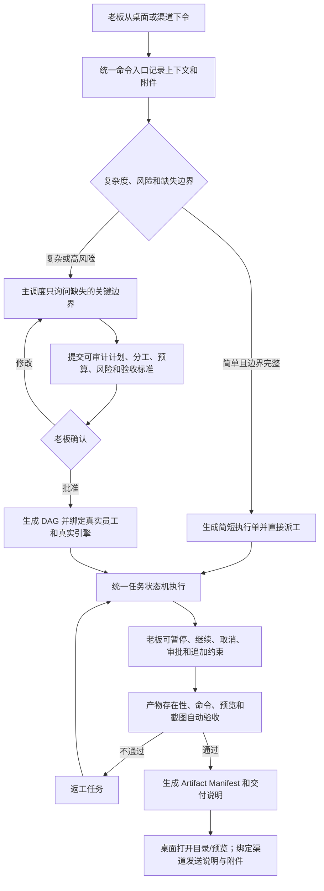

# OPC-Nexus 功能、业务闭环与 UX 审计报告

> 审计日期：2026-08-18  
> 审计对象：当前工作区构建（`package.json` 版本 `2.0.0`）  
> 审计目标：验证“老板下令 -> 主调度澄清/确认 -> 自动分工执行 -> 真实成果交付 -> 渠道监管”是否形成自洽闭环  
> 总体结论：**不通过，当前版本不具备按核心目标交付或发布的条件。**

## 1. 执行摘要

工程质量门禁表面正常：TypeScript 类型检查、1519 条单元测试和生产构建均通过；但真实 Electron 运行验证发现，复杂任务的规划主链存在两个确定性 P0 Bug，用户回答边界后既不能可靠提交补充文本，也不能生成第一版计划，因此“确认后自动分工执行”在公开 API 上不可达。

当前产品的主要问题不是功能数量不足，而是主流程被过多入口、兼容控制面、演示能力和高级模块包围：侧栏可见 22 个一级入口，同一条老板指令可从 Quest、项目派发、员工派发、对话、兼容规划、Dashboard 或语音进入不同逻辑。系统还同时出现“在线”“模型全部正常”“Cordis 就绪”和“没有可用执行引擎/模型不可用”等互相冲突的状态。

对照本次目标，当前版本有四项发布阻断：

1. **规划链路不可达**：补充文本校验区间写反，生成计划又复用了错误的校验器。
2. **生产包仍保留假执行能力**：模拟执行器、演示自动派单、演示种子和“未就绪引擎以演示模式执行”仍在产品路径中。即使默认配置已是 `production`，仍违反“禁止 Mock、禁止假成功”的产品边界。
3. **交付不是实际文件闭环**：成果库主要把任务 `result` 文本包装为 Markdown；成果包不会收集、校验或运行实际源码、表格、图片、截图和可执行文件。
4. **没有唯一老板入口和统一任务真相源**：入口、规划器、Quest、直接派发和渠道命令未收敛成同一状态机，用户无法形成稳定心智模型。

建议立即冻结新模块，以“唯一老板入口 + 一条状态机 + 真实产物协议 + 六个一级模块”为 MVP 收敛范围。先跑通一条真实场景，再恢复高级功能。

## 2. 测试范围与方法

### 2.1 环境

- Windows 11（`10.0.26200`），Electron 桌面应用。
- 当前生产构建 `out/main`、`out/preload`、`out/renderer`。
- Playwright 连接 Electron，使用隔离的临时 `userData`，避免现有用户数据污染结果。
- 未配置付费模型 Provider，也未使用真实飞书、企业微信、微信凭据。这个条件用于验证新装用户的诚实空状态与恢复路径，不作为模型能力本身的失败依据。
- 本机 Git 实际存在：`git version 2.55.0.windows.2`。

### 2.2 质量门禁

| 检查 | 结果 | 说明 |
|---|---:|---|
| `npm run typecheck` | 通过 | TypeScript 零错误 |
| `npm test -- --reporter=verbose` | 通过 | 141 个测试文件通过、1 个跳过；1519 条测试通过、2 条跳过 |
| `npm run build` | 通过 | 主进程、preload、renderer 均构建成功 |
| Electron 页面巡检 | 部分通过 | 巡检 21 个主控制台页面；Quest 另走独立窗口场景验证 |
| 核心业务 E2E | 失败 | 复杂任务停在规划 DRAFT；直接派发因无健康引擎失败；没有成果产生 |

结论：现有单元测试主要验证模块内部行为，没有守住“老板命令到可打开成果”的跨模块契约。门禁全绿不代表产品闭环可用。

### 2.3 仿真场景

| 场景 | 指令类型 | 分类结果 | 实际结果 |
|---|---|---|---|
| 个人咨询工作室：润色一句文案 | 简单任务 | `DIRECT_DISPATCH` | 分类合理；无健康引擎时无法真实交付，缺少一步式恢复入口 |
| 独立开发工作室：从零交付可本地预览官网 | 复杂、多角色、分阶段 | `PLANNING_REQUIRED` | 能进入澄清，但问题过于泛化；补充文本报错，生成计划报错，未派工、无成果 |
| 小型电商：三家竞品研究和两周运营计划 | 跨角色、需可复核数据 | `PLANNING_REQUIRED` | 只问组织方式和预算，未询问目标客群、竞品范围、数据源、截止时间和表格格式 |
| 内容工作室：30 条短视频选题与脚本排期 | 批量内容生产 | `PLANNING_REQUIRED` | 只问组织方式和预算，未询问平台、受众、品牌禁区、视频时长和发布节奏 |
| 本地工作室：删除/覆盖文件并向客户外发 | 不可逆、高风险 | `PLANNING_REQUIRED` | 询问风险策略和预算，但未锁定操作目录、备份规则、收件人、附件和逐项审批点 |

复杂度分类本身基本符合预期；失败点在于澄清问题不是针对任务语义动态生成，且后续状态机不可达。测试详情见 [`scenarios.json`](../tmp/ux-audit/scenario-artifacts/scenarios.json) 和 [`planning-flow.json`](../tmp/ux-audit/scenario-artifacts/planning-flow.json)。

## 3. 发布阻断问题（P0）

### P0-01 规划补充文本永远无法通过合法长度校验

**复现**：对官网场景回答选择题，并提交 15 字补充约束。  
**实际结果**：`参数 answers[0].text 无效（需 4000-500 字符）`。  
**根因**：`src/main/ipc.ts:372` 和 `:441` 调用 `decodeUtf8Text(..., 4_000)` 时把 `4000` 传为最小长度，而该函数默认最大长度为 `500`，形成不可能区间。兼容规划和 DSH Quest 两条路径同时受影响。  
**影响**：老板无法补充“目标受众、目录、交付格式、禁区”等边界；多轮澄清名义存在，实际不可用。  
**修复要求**：明确传入 `min=0/1, max=4000`；为中文短文本、空文本、4000 字节边界、超限和 DSH Quest 同路径增加 IPC E2E 测试。

### P0-02 第一版计划无法生成

**复现**：回答问题后 Session 进入 `DRAFT`，调用 UI 暴露的 `proposePlanningPlan({ sessionId, expectedRevision })`。  
**实际结果**：`参数 规划提案.hash 必须是文本`。  
**根因**：`src/main/ipc.ts:1676-1678` 错误复用 `assertPlanningDecisionInput`，要求只在计划生成后才存在的 `version + hash`。但 `ProposePlanningPlanInput` 及 `SecretaryPlanning.tsx:247` 只包含 `sessionId + expectedRevision`。  
**影响**：`DRAFT -> PROPOSED -> APPROVED -> DISPATCHED` 的第一跳不可达，自动分工、执行和交付全部被阻断。  
**修复要求**：为 proposal 建立独立校验器；新增公开 preload API 的完整状态机测试，禁止仅在 service 层绕开 IPC 验证。

### P0-03 发布构建仍可进入模拟执行和虚构数据路径

**证据**：

- `src/main/services/executor/simulatedExecutor.ts:11-31` 会返回“演示模式产物”。
- `src/main/services/executor/index.ts:160,168` 仍可根据 `executionMode` 选择 `simulated`。
- `user/config.yaml:16` 仍公开 `demo` 值。
- `Settings.tsx:86-88` 暴露“演示自动派单（自动创建虚构任务）”。
- `seed.ts:265-297` 仍可写入虚构项目、员工和任务。
- `CreateAgentWizard.tsx:220-234`、`AgentEditor.tsx:389` 允许把未就绪引擎描述成“演示模式”。
- `Channels.tsx:49` 暴露 QQ“演示”渠道。

当前默认 `executionMode=production` 且 `seedDemoData=false`，这是缓解措施，不等于满足要求。只要发布包仍能通过设置或配置进入假完成状态，用户就可能把虚构结果当成公司真实执行记录。

**修复要求**：生产源码、UI、配置 schema 和文档彻底移除模拟执行、演示派单、演示渠道与演示种子。测试替身只能放在 `tests/`，且不得编译进生产包。引擎不可用必须保持 `SETUP_REQUIRED/FAILED`，绝不能生成 `COMPLETED`。

### P0-04 成果交付只包装文本，不交付和验证真实产物

`deliverableManager.ts:230-240` 把已完成任务的 `result` 字符串同步为成果；`ipc.ts:1079-1101` 导出的项目成果包只生成 `README.md`、`manifest.json` 和若干 Markdown 包装文件。当前实现不会：

- 收集任务工作区里的源码、表格、图片、视频、PDF 或可执行文件；
- 验证结果文本中声明的文件路径是否存在、是否在授权目录内；
- 记录文件大小、类型、SHA-256、来源任务和版本；
- 实际运行启动命令并检查退出码；
- 打开本地预览并验证页面非空；
- 生成并绑定验收截图；
- 区分“说明文档”与“真正交付文件”。

因此即使任务显示 `COMPLETED`，也不能证明用户拿到了可用成果。此问题直接违背核心交付目标。

**修复要求**：建立结构化 Artifact Manifest；任务只有在产物存在性和验收项通过后才能完成。UI 必须提供“打开交付目录”“运行/预览”“查看截图”“复制启动命令”，渠道必须发送同一份 Manifest 和附件。

## 4. 主要功能与体验问题（P1）

### P1-01 没有唯一、持续可见的老板下令入口

当前命令入口分散在 Quest、项目派发、员工“安排任务”、员工对话、Dashboard 快速派发、兼容规划和语音入口。同一句话会走不同分类、不同校验和不同状态机。用户必须先理解内部架构，才能决定“该去哪里下命令”。

**建议**：把首屏改为唯一“老板下令”会话面；项目、附件和渠道只是上下文。所有入口最终调用同一 `submitBossCommand` 业务契约，先完成统一预检，再选择直接执行或规划。

### P1-02 新装状态互相矛盾，产生假就绪

同一次空白安装同时出现：

- 顶栏“在线”；
- 经营概览“模型服务状态：全部正常”；
- 待办“未检测到可用执行引擎”；
- 快照 `executorAvailable=false`；
- Cordis/DSH 为 `SETUP_REQUIRED`；
- 数字员工页 Cordis 生命周期却显示 `READY/就绪`；
- Quest 独立窗口则正确显示“模型不可用”。

代码上，`store.ts:62,67` 默认 runtime 健康且在线；`Dashboard.tsx:193-196` 把资源监控 runtime 健康误标成模型服务健康；`resourceMonitor.ts:115` 默认所有基础服务健康；`cordisBootstrap.ts:77-82` 创建员工后未把执行可用性投影到用户状态。

**建议**：拆分设备在线、基础服务、模型连接、Agent 生命周期和执行可用性；用户面只显示可操作结论。Cordis 可存在但应显示“待配置”，未完成最小真实任务验证前不得显示“就绪”。

### P1-03 直接派发失败后暴露底层 IPC 错误且留下孤立消息

从数字员工页给 Cordis 安排简单任务，Toast 原样显示：

```text
Error invoking remote method 'aibox:createTask': Error: 没有已就绪且引擎健康的执行员工
```

弹窗保持打开、任务中心仍为空，也没有“现在配置引擎”动作。数据库中 `tasks` 为空，但 `messages` 留下一条 `task_id=null` 的 inbound 消息，形成孤立记录。

**建议**：派发前统一做 readiness preflight；不可执行时不要写入消息/任务副作用，返回结构化错误和恢复动作。UI 文案应是“尚未连接可执行模型”，并提供“打开连接设置”。

### P1-04 首屏快照与 Cordis 初始化存在竞态

首次经营概览显示 0 名员工，稍后数字员工页显示 1 名 Cordis。`src/main/index.ts:1014` 先注册 IPC 并允许 Renderer 初始化，`index.ts:1023-1043` 才异步检测引擎、创建 Cordis 并推送快照。

**建议**：启动阶段提供明确 `BOOTSTRAPPING` 状态，关键引擎探测与 Cordis 投影完成后再发首个 authoritative snapshot；或让 UI 在初始化完成前显示加载态，不能先展示 0 员工的业务事实。

### P1-05 澄清问题通用化，不能补齐真实业务边界

官网、电商、内容工作室三类任务都只得到“单人/团队”和“预算档位”两道题。高风险任务也只问风险策略与预算。问题生成位于 `secretaryPlanningControlPlane.ts:286-320`，基线计划位于 `:592` 后，默认成果仅为 `:678` 的“Markdown 工作成果或结构化结果”。

这不是类似 Superpower 的边界补全：它没有围绕输入任务提取缺失槽位，也没有把用户明确要求的交付物转成验收标准。

**建议**：问题只围绕会影响执行的未知项动态生成；已在指令中给出的信息不得重复问。至少覆盖目标、受众/对象、输入数据、范围、截止时间、输出格式、工作目录、权限、风险动作、验收标准和渠道收件人。

### P1-06 多机协同在已安装 Git 的机器上报 `spawn EINVAL`

打开多机协同触发：`Error invoking remote method 'aibox:collab:checkGit': Error: spawn EINVAL`。`ipc.ts:2613-2615` 为检查 Git 调用了完整 `engines.checkRuntime()`；该方法在 `engineManager.ts:1116-1134` 依次检测 Node/npm/Python/Git，并使用 `execFile(path, shell:false)`。Windows 上定位到 `npm.cmd` 时会先抛 `EINVAL`，项目自己的 `cliLauncher.ts:9-12` 已明确记录这个限制。

**建议**：`collab:checkGit` 只探测 Git；所有 CLI 探测统一走已存在的 `runCli`/`cliLauncher`，单项失败不得中止其他 runtime 检查。

### P1-07 渠道控制已具备部分动作，但交付协议不完整

渠道公共逻辑支持状态查询、暂停、继续、取消和审批，这是可复用基础；但终态回复在 `channels/common.ts:495-531` 主要发送任务结果文本。企业微信在 `wecomChannel.ts:500-523` 用正则从文本猜文件路径，再异步上传，失败静默；其他渠道没有一致的附件交付行为。

**风险**：桌面、飞书、企业微信和微信看到的任务状态与产物可能不同；路径中带特殊字符、无扩展名目录或相对路径时无法识别；上传失败也没有可追踪回执。

**建议**：所有渠道消费同一 Task/Artifact/Approval 事件；附件来自 Artifact Manifest，不允许从自由文本猜路径。渠道回执应包含投递状态、失败原因和桌面端可定位链接。

## 5. 结构复杂度与重复模块（P2）

### P2-01 22 个一级入口超过小公司老板的可理解范围

当前侧栏定义见 `App.tsx:57-87`，包含 22 个可见入口。导航要求用户理解 Quest、项目、任务、工作流、专家团、执行监控、插件、引擎和多机协同的内部差异，主流程反而没有被突出。

建议一级导航只保留：

1. **老板下令**：对话、附件、复杂度判断、澄清、计划确认和实时执行时间线。
2. **项目**：项目列表、任务树、知识上下文和项目级进度。
3. **待我处理**：澄清、审批、异常、预算变更和验收。
4. **成果**：真实文件、版本、预览、截图、启动方式和交付记录。
5. **数字员工**：员工、团队、岗位模板、技能与权限。
6. **连接与设置**：模型/引擎、渠道、系统状态和高级能力。

### P2-02 功能重复，建议合并或下沉

| 当前模块 | 处理建议 | 原因 |
|---|---|---|
| 经营概览 + 办公室 | 保留“办公室”为员工、团队和项目状态的可视化层；经营摘要并入老板主流程 | 办公室提供公司运行感和情绪价值，但不承担审批、派工或任务真相源 |
| 任务中心 + 执行监控 | 执行日志并入任务详情 | 用户关注同一个任务，不应在两页来回切换 |
| Quest + 兼容规划 + 对话 + 项目派发 + 员工派发 + 语音 | 合并为老板下令控制面 | 必须共享分类、规划、派工和状态机 |
| 专家团 + 工作流 | 作为计划中的“执行策略”，不做老板一级入口 | 老板下目标，调度 AI 决定单人、团队或 DAG |
| 数字员工 + 员工市场 | 市场作为数字员工页的“新增/模板”页签 | 都属于组织配置 |
| 引擎中心 + Provider 设置 | 合并为“模型与执行环境” | 当前用户需要在两处理解同一 readiness 问题 |
| 插件 + 技能 + MCP | 合并为高级能力中心 | 面向管理员，不应抢占日常导航 |
| 项目知识库 | 并入项目详情 | 知识必须有项目上下文 |
| 自动化、用量、系统、手机、多机协同 | 放入高级模式；未达生产验收前隐藏 | 避免未稳定能力干扰主流程 |

### P2-03 设置页信息密度过高且混合产品层级

设置页同时承载模型 Provider、视觉模型、语音、下载源、API Bridge、DSH LAN Gateway、191 个插件包策略、主题、演示数据、资源阈值、安全、OCR 和关于；页面巡检记录 67 个控件、正文超过 3600 字，并混用中英文操作文案。用户无法判断首次使用只需要完成哪一步。

**建议**：默认只展示“模型连接、消息渠道、数据目录、外观”；其余进入高级设置。首次启动使用三步 readiness 检查：选择 Provider -> 安全存储凭据 -> 执行最小真实任务验证。

### P2-04 未实现或演示能力仍以可配置功能出现

- 本地语音设置可选，但 `voiceService.ts:430-432` 固定抛出“本地离线识别尚未实现”。
- QQ 渠道显示为演示项。
- 未就绪引擎仍可在新建员工和编辑员工时选择。

这些入口应在功能真实可用前从发布构建隐藏，而不是让用户进入后才发现不可用。

### P2-05 文档与当前版本、导航和诚实执行原则不同步

- `README.md:23` 仍标桌面端 `1.8.1`，但 `package.json:3` 和应用显示 `2.0.0`。
- README 仍宣传“模拟执行”，用户指南仍让用户选择“LLM API / CLI / 模拟”。
- 用户文档描述的导航与当前 Quest、项目中心、成果库、插件中心不一致。

发布前必须指定一份用户手册为权威文档，并把旧架构文档明确归档，避免用户按不存在或已废弃的流程操作。

## 6. 次要 UX 问题（P3）

- 数字员工表格的 Cordis 职责列被截断，巡检检测到单元格 `scrollWidth=494`、`clientWidth=182`，界面未提供完整内容的显式查看方式。
- 多机协同的异步错误 Toast 会在切换到其他页面后仍显示，导致“数字员工”页面看起来像自身报错。
- 空白任务、团队、工作流等页面各自提供局部空状态，但没有统一指向“先连接模型 -> 给老板下令”的恢复路径。
- 顶栏“在线”语义不明确；它实际更接近应用/网络状态，却容易被理解为 AI 公司已可工作。
- “DSH / Cordis”“OPC 工作台”“AI Box”“opc-nexus-governance”同时出现在首屏，品牌和产品身份层级不清晰。

## 7. Mock 与假能力清除清单

以下项目在发布构建中应为 **0**；“默认关闭”不算完成：

- [ ] 删除 `src/main/services/executor/simulatedExecutor.ts` 及生产注册逻辑。
- [ ] 删除 `executionMode=demo` 配置值和所有 fallback 到 `simulated` 的分支。
- [ ] 删除“演示自动派单”、虚构任务水位和相关设置 IPC。
- [ ] 删除生产 `seedIfEmpty` 的演示项目/员工/任务写入；展示数据改用独立 Storybook、fixture 或测试数据库。
- [ ] 删除 QQ 演示渠道；真实接入前不出现在发布 UI。
- [ ] 未就绪引擎不可选择，不显示“演示模式”，只显示配置/验证动作。
- [ ] 本地语音识别未实现前不可选择 `local`。
- [ ] README、用户指南、功能文档删除模拟执行宣传。
- [ ] 构建检查增加静态门禁：生产 bundle 中不得出现 `simulatedExecutor`、`演示模式产物`、`demoAutoTasks`、`seedDemoData`。
- [ ] 数据迁移保留一次性清理能力，清除历史 `is_demo=1` 数据后再移除产品入口。

允许保留的替身仅限 `tests/` 目录中的 deterministic fake，用于不付费的状态机测试；它必须通过依赖注入进入测试，不能被生产配置选中。发布验收仍需至少使用一个真实本地或真实 Provider 引擎跑通完整场景。

## 8. 推荐的唯一主流程



关键原则：

- **一个入口**：桌面、语音和渠道都进入同一个 command service。
- **一条状态机**：规划、任务、审批、执行和交付不允许有兼容副本。
- **简单任务不打扰**：边界清楚、低风险时直接执行，只展示可撤销的执行摘要。
- **复杂任务问得具体**：只问会改变方案、风险、成本或验收的未知项。
- **没有真实引擎就不执行**：如实停在配置状态，不创建假任务和假成果。
- **完成必须有证据**：任务文本不是成果；产物、运行结果、预览和截图才是交付证据。
- **渠道是同一控制面的远程窗口**：不能形成第二套任务或第二份结果。

## 9. 建议 MVP 范围与验收标准

### 9.1 MVP 只保留

- 唯一老板下令页面和项目上下文。
- 简单直派、复杂澄清、计划确认三种明确路径。
- 单一 Agent/Task/Approval/Artifact 状态源。
- 真实引擎连接与最小任务验证。
- 自动分工和 DAG 执行的最小实现。
- 待我处理、任务时间线、失败恢复。
- 真实产物目录、结构化 Manifest、启动/预览和截图。
- 一个真实消息渠道先跑通，下一个渠道复用同一协议。

多机协同、手机控制台、自动化、插件市场、员工市场和复杂工作流均不应阻塞 MVP；未达到真实验收前放到高级实验开关之外。办公室作为只读可视化层保留，但不能引入第二套审批、派工或任务状态。

### 9.2 发布验收标准

1. 新装启动只显示真实状态；未配置模型时 Cordis 为“待配置”，所有执行入口给出同一个恢复动作。
2. 生产源码和构建产物不存在任何模拟执行、虚构任务、演示渠道或假完成路径。
3. 简单润色任务在不要求额外确认的情况下，经真实引擎完成并产生可复制结果。
4. 官网场景能提出与任务相关的缺失问题，老板批准计划后创建至少两个有依赖关系的真实任务。
5. 删除/覆盖/外发场景在每个不可逆节点前进入 `WAITING_APPROVAL`，未批准不得执行。
6. 失败的 readiness preflight 不写入孤立消息、任务或成果。
7. 暂停、继续、取消、追加约束和重启恢复在桌面与渠道看到同一状态。
8. 完成官网场景后，成果页能打开真实目录，启动命令返回 0，本地预览可访问，截图非空。
9. Artifact Manifest 至少包含相对路径、类型、大小、SHA-256、来源任务、版本、验收结果和启动方式。
10. 渠道收到结构化完成摘要和实际附件；失败上传有回执，可从桌面重试。
11. 用真实引擎完成至少一个简单场景和一个复杂场景；测试 fake 不能作为发布验收证据。
12. `typecheck + unit + IPC contract + Electron E2E + build` 全部通过，且 E2E 从公开 preload API 驱动，不直接调用 service 绕开安全边界。

## 10. 修复优先级

| 阶段 | 工作 | 完成定义 |
|---|---|---|
| 第 1 阶段：止血 | 修复两个规划 IPC Bug；移除全部 Mock 生产路径；统一 readiness | 复杂任务可从回答走到计划批准；空白环境无假就绪、假成功 |
| 第 2 阶段：收敛 | 建立唯一老板入口；合并重复页面；统一桌面和渠道命令协议 | 同一指令无论入口均产生同一种状态与任务 |
| 第 3 阶段：交付 | 实现 Artifact Manifest、文件校验、运行/预览、截图和渠道附件 | 至少官网场景可真实打开和交付 |
| 第 4 阶段：加固 | 重启恢复、幂等、风险审批、真实渠道 E2E、文档同步 | MVP 验收 12 项全部通过 |
| 第 5 阶段：扩展 | 按真实用户需求逐个恢复高级模块 | 每个模块有独立真实场景、无重复状态源 |

## 11. 证据索引

### 11.1 自动化数据

- [页面巡检结构化结果](../tmp/ux-audit/artifacts/inspection.json)
- [五类业务场景结果](../tmp/ux-audit/scenario-artifacts/scenarios.json)
- [规划链路确定性复现](../tmp/ux-audit/scenario-artifacts/planning-flow.json)
- [页面巡检脚本](../tmp/ux-audit/inspect.cjs)
- [场景仿真脚本](../tmp/ux-audit/scenarios.cjs)
- [规划链路脚本](../tmp/ux-audit/planning-flow.cjs)

### 11.2 关键截图

- [经营概览：模型状态与待办相互矛盾](../tmp/ux-audit/artifacts/03-经营概览.png)
- [数字员工：Cordis 就绪但执行不可用，且出现多机协同底层错误](../tmp/ux-audit/artifacts/12-数字员工.png)
- [引擎中心：无真实执行引擎](../tmp/ux-audit/artifacts/14-引擎中心.png)
- [连接中心：渠道状态](../tmp/ux-audit/artifacts/16-连接中心.png)
- [直接派发：原始 IPC 错误且弹窗未关闭](../tmp/ux-audit/scenario-artifacts/02-direct-task-submit-state.png)
- [直接派发后：任务中心为空](../tmp/ux-audit/scenario-artifacts/03-direct-task-result.png)
- [Quest：模型不可用空状态](../tmp/ux-audit/scenario-artifacts/04-quest-unconfigured.png)
- [规划派发后：没有任务产生](../tmp/ux-audit/scenario-artifacts/05-planning-dispatch-result.png)

## 12. 未覆盖风险

由于没有提供真实渠道凭据和真实付费 Provider，本次没有实际向飞书、企业微信、微信发送文件，也没有评估模型回答质量、Token 成本和长任务稳定性。多机协同因 `spawn EINVAL` 在入口即失败，无法继续验证跨机任务。没有真实任务到达完成态，因此实际源码预览、截图、成果包和渠道交付只能通过代码审计确认缺口，不能给出成功证据。

这些限制不影响本报告的核心判定：两个规划 P0 可在本地公开 IPC 上稳定复现，Mock 生产路径和交付协议缺口由当前源码直接确认，唯一主流程在当前版本确实没有跑通。
