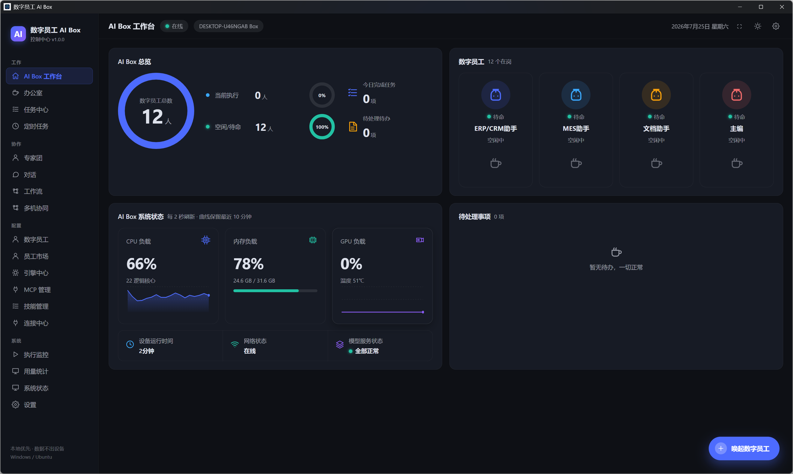
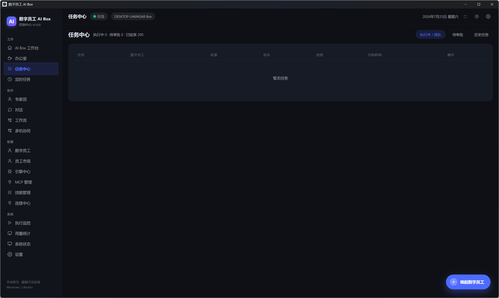
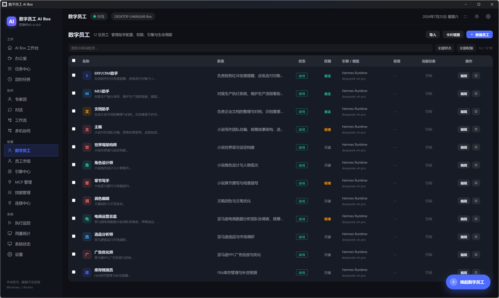

# OPC-Nexus 用户使用手册

> 本手册介绍 OPC-Nexus 桌面应用的界面布局与核心操作流程。

---

## 界面总览

### 工作台（Dashboard）

应用启动后的默认首页，展示全局概览信息：

- **顶部统计卡片** — 数字员工总数、运行中任务、系统资源占用
- **员工状态列表** — 各 Agent 当前生命周期状态（就绪/运行中/已停用）
- **系统监控面板** — CPU / 内存 / 磁盘实时使用率

---

### 任务中心（Tasks）

管理所有任务的执行状态与历史记录：

- **状态筛选** — 执行中 / 待审批 / 已结束
- **任务列表** — 显示任务名称、关联 Agent、状态、耗时
- **操作** — 取消运行中任务、审批等待中的任务、查看执行日志

---

### 数字员工（Agents）

管理所有 AI 数字员工的配置与生命周期：

- **员工卡片** — 头像、名称、角色、绑定引擎/模型
- **状态指示** — 就绪(绿) / 运行中(蓝) / 停用(灰) / 错误(红)
- **操作** — 启动/停止、编辑配置、克隆、删除

---

## 快速上手

### 1. 创建数字员工

1. 进入「数字员工」页面
2. 点击右上角「+ 创建员工」按钮
3. 在向导中填写：
   - 名称与角色描述
   - 选择执行引擎（LLM API / CLI / 模拟）
   - 配置模型供应商与 API Key
   - 设置权限级别
4. 点击「完成」创建

### 2. 下发任务

1. 进入「任务中心」或「对话」页面
2. 输入任务描述，选择目标 Agent
3. 点击发送，任务进入队列
4. 在任务中心追踪执行进度

### 3. 配置消息渠道

1. 进入「渠道」页面
2. 选择渠道类型（企业微信 / 飞书 / 微信）
3. 填写对应凭证（Corp ID、Secret 等）
4. 点击「连接测试」验证
5. 绑定到指定数字员工

### 4. 组建专家团

1. 进入「专家团」页面
2. 选择预设模板或自定义创建
3. 配置主 Agent（调度者）和成员 Agent
4. 设置协作模式与任务拆解策略
5. 启动专家团，下发复合任务

### 5. 工作流编排

1. 进入「工作流」页面
2. 拖拽节点构建 DAG 流程
3. 可用节点：LLM 调用、条件分支、循环、代码执行、Coze/Dify
4. 连接节点、配置参数
5. 保存并设置触发方式（手动/定时/Webhook）

---

## 导航说明

| 分组 | 页面 | 功能 |
|------|------|------|
| 总览 | 工作台 | 全局状态概览 |
| 执行 | 任务中心 | 任务管理与监控 |
| 执行 | 对话 | 与 Agent 实时对话 |
| 执行 | 定时任务 | Cron 调度配置 |
| 协作 | 专家团 | 多 Agent 协同 |
| 协作 | 工作流 | 可视化流程编排 |
| 协作 | 多机协同 | 局域网节点管理 |
| 配置 | 数字员工 | Agent 生命周期管理 |
| 配置 | 引擎中心 | 执行引擎安装/认证 |
| 配置 | 渠道 | 消息渠道接入 |
| 配置 | 供应商 | LLM 供应商管理 |
| 配置 | MCP | MCP Server 管理 |
| 配置 | 技能 | 技能市场与管理 |
| 系统 | 系统监控 | 资源实时采集 |
| 系统 | 用量统计 | Token/调用统计 |
| 系统 | 控制台 | 运行日志 |
| 系统 | 设置 | 全局配置 |

---

## 安全说明

- 所有 API Key 通过系统级加密存储（Electron safeStorage），不会以明文落盘
- 密钥永远不会传输到前端渲染进程
- 应用完全本地运行，数据不上传云端
- 局域网 Web 管理面板需要 Token 认证

---

## 常见问题

**Q: 启动后窗口白屏？**
A: 尝试 Ctrl+R 刷新页面，或检查控制台日志（系统 → 控制台）。

**Q: 引擎显示 NOT_INSTALLED？**
A: 进入「引擎中心」，按引导完成 Runtime 环境安装。

**Q: 渠道连接失败？**
A: 检查网络连通性，确认凭证正确，企业微信需确保 IP 白名单配置。

**Q: 如何备份数据？**
A: 进入「设置」页面，使用「数据备份」功能导出 SQLite 数据库文件。
