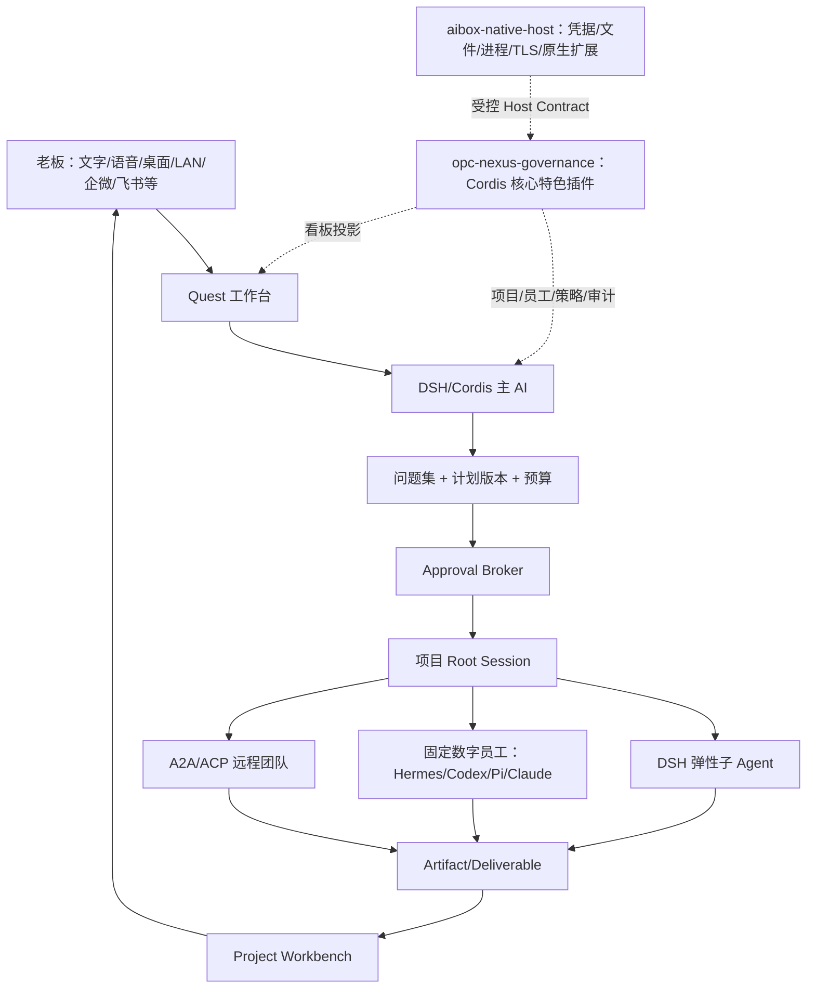

# OPC-Nexus v2.0.0：DSH/Cordis 项目制与 Quest 实施计划

> 状态：执行中（Quest 独立产品面、项目级 DSH 隔离和左下手机 Web 配对入口已建立；同一构建双入口、真实手机、正式安装与四场景产品级 E2E 尚未完成验收）
> 版本：`v2.0.0`
> 更新：2026-08-17
> 审计基线：DSH `0.1.0-rc.6`
> 适用范围：桌面 Electron、内置 DSH/Cordis runtime、Local CLI worker、LAN/手机 Web

## 1. 目标与产品判断

v2.0.0 的产品主轴从“固定数字员工列表”切换为“主控制台管理项目、每个项目弹出独立 Quest 工作窗口”。原主控制台仍是常规/default 桌面入口，承载 Projects、交付看板、资源目录、渠道和设置；它不是被 Quest 替换的旧页面。用户从具体项目通过 `openQuestWindow({ projectId })` 打开该项目的 Quest，DSH/Cordis 在该独立窗口中作为直接面对老板的主 AI、规划者和派工中枢。原 AiBox/Nexus 产品能力不再作为并列 Agent 内核，而是收敛为 Cordis 中的 `opc-nexus-governance` 核心特色插件：负责项目治理、员工目录、权限、审计、记忆归档、交付投影和渠道适配。Electron/Main 只保留无业务智能的 `aibox-native-host`，为插件提供凭据、文件、进程、网络、数据库和原生扩展的受控能力。

这不是把 DSH 当作一个外接引擎，而是把本项目迁移为 DSH/Cordis 的宿主插件组合。DSH Web profile 是每个项目 Quest 中的统一对话窗口；项目、固定员工、外部 ACP/A2A worker 和治理能力都通过版本化插件合同接入。原主控制台继续作为桌面管理入口，但其中的旧 Nexus/Secretary 模块只能保留为迁移兼容层，不能成为与 Cordis 并列的规划或执行内核。

固定数字员工仍然存在，但被建模为可复用岗位、流程节点和专家资源。每个项目可以同时拥有：

- 一个 DSH/Cordis root session；
- DSH 自动创建的弹性子 Agent 团队；
- 配置好的 Hermes、Codex、Pi、Claude 或其他 ACP/A2A worker；
- 固定数字员工和专家团；
- 共享工作区、版本化交付物、知识和长期记忆。

所有 Quest 请求都由 Cordis 规划和调度：复杂请求先澄清目标、给出有限选择题和计划，再在批准的权限、沙箱、模型、能力和插件边界内执行；简单请求仍可在同一个 DSH 对话中快速处理，但不切换为 Direct 执行模式。Session、Run、Job、Goal、子 Agent 和计划的执行事实以 DSH 为准；`opc-nexus-governance` 只将必要事实投影为项目看板、审批和审计记录。旧 Orchestrator/Task 表在迁移期仍负责写兼容投影，但不再拥有业务规划或执行权威。

这里的“主 AI”不是一个需要在 Nexus 中重新实现的秘书人格，而是一条明确的产品分层：

- **DSH/Cordis 是核心 AI 平面**：拥有面向老板的对话、上下文、规划/Quest、问题集、计划版本、root Session、child Session、Jobs/Goals、事件时间线和多 Agent 编排。它可以独立运行，也可以通过受控 Gateway 调用宿主能力。
- **`opc-nexus-governance` 是 Cordis 核心特色插件**：提供组织/项目模型、员工目录、权限/预算/沙箱策略、审计、记忆归档、项目看板、渠道、artifact admission，以及 Local CLI、ACP/A2A、MCP、Skill、Vision 等能力目录。
- **`aibox-native-host` 是薄特权边界，不是第二个内核**：持有 safeStorage、文件和进程访问、资源隔离、TLS/Origin、原生 DLL/SO/WASM 加载及数据库持久化；它不对话、不规划、不组队、不汇总任务结果。
- 治理插件只对 DSH 的事实做有界 projection，不 fork 或复制 DSH Web UI；桌面窗口和 LAN Web 都复用 DSH 官方工作台，并通过原生宿主获得独立租约和安全闸门。

### 架构决议与当前落地成熟度

- **最终架构决议**：原 AiBox/Nexus 项目整体不是 DSH/Cordis 旁边的第二套 Agent 产品，而是收敛为 DSH 的核心特色插件 `opc-nexus-governance`；Electron 仅作为 `aibox-native-host` 承载安全、持久化和操作系统能力。该结论已固化在 `src/main/services/opcNexusGovernancePlugin.ts` 的 `2.0.0` manifest、`src/main/index.ts` 的注册和 `tests/opcNexusGovernancePlugin.test.ts`。
- **当前属于迁移实现，不是最终插件封装**：`CapabilityRegistry`/`PluginHost` 已注册 manifest，但目前真正 attach 的治理 handler 只有受控的 `dsh-quest-governance` admission；manifest 中其余项目、员工、渠道、A2A 等能力多数仍是声明或宿主投影，不能据此宣称已形成可独立分发、动态装卸的完整 DSH 插件。
- **Quest 事实来源边界**：`DshQuestGovernanceService` 只接收、校验、批准和投影 Cordis 产生的 QuestionSet/Plan，不生成第二套问题或计划。Main 已把 `DshTypedQuestBridge` 接入 managed executor 的真实 rc.6 mux stream，稳定的 `question/requested` / `question/resolved` 帧可进入项目 governance，老板答案经 `/api/respond` 回写同一 DSH turn；普通聊天文本仍不会被猜测为计划。实现与真实 runtime 验证见 `src/main/services/dshTypedQuestBridge.ts`、`src/main/services/executor/dshManagedExecutor.ts` 和 `tests/dshManagedQuestTransportE2E.test.ts`。
- **协议成熟度边界**：ACP worker 已有执行适配；正式 A2A transport、互操作握手及跨主机无人值守恢复尚未完成。统一目录中的 A2A 项当前为 `DECLARATION_ONLY`，见 `tests/pluginCatalog.test.ts`。
- **Quest 默认能力包**：用户指定的 10 项社区能力已按精确 npm 版本或 Git commit 纳入 Quest 插件抽屉，默认启用 0 项。目录区分 profile 显式权限、Main 适配、独立运行和阻止/不兼容状态；聚合包、高权限包和 peer 不兼容包不提供安装入口。目录可见和兼容性 `verified` 均不等于运行时 `live`，Quest 禁止把未挂载条目标成“已加载”。实现与审计表见 `src/main/services/dshCommunityPluginService.ts`、`src/renderer/src/pages/QuestWorkbench.tsx` 和 `docs/QUEST-DEFAULT-PLUGIN-PACK.md`。
- **主控制台 + 独立 Quest 双入口**：`npm run dev`、`npm run start` 和不带 Quest 参数的打包应用保留原主控制台；项目操作通过类型安全 `window.aibox.openQuestWindow({ projectId })` 弹出绑定该项目 Cordis 根 Session 的独立 Quest 窗口。只有 `npm run dev:quest`、`npm run start:quest`、`--quest`、`--quest-only[=projectId]` 或 `--quest --quest-project=<projectId>` 才进入不创建主控制台、不挂载 Sidebar/Topbar 的 Quest-only 额外入口。官方 DSH Web UI 占据 Quest 工作区，Quest 壳仍保留项目选择、治理和插件抽屉。通用裸 DSH 窗口仅留在员工诊断入口。`QuestMode` 仅允许 `quest`；历史 `direct` 值只作为迁移输入并立即归一为 Cordis。源代码和 contract test 已按该语义调整，同一构建下“主控制台与项目 Quest 共存”的真实 Electron/打包验收仍待执行。实现与验证见 `scripts/run-quest-surface.cjs`、`src/main/services/questWindowManager.ts`、`src/main/services/questLaunch.ts`、`src/renderer/src/App.tsx`、`src/renderer/src/pages/Projects.tsx`、`src/renderer/src/pages/Quest.tsx`、`src/renderer/src/pages/QuestWorkbench.tsx`、`tests/questWindowManager.test.ts`、`tests/questLaunch.test.ts`、`tests/questRoute.test.ts` 和 `tests/ipcSecurityBoundary.test.ts`。
- **Quest 手机 Web 入口**：Quest 左下固定手机按钮打开项目配对抽屉，复用受控 DSH LAN Gateway，展示不含长期密钥的二维码 URL 和独立一次性验证码，并允许选择 `operator` / `viewer` 角色、刷新配对和紧急关闭。实现与组件合同见 `src/renderer/src/pages/QuestMobileAccess.tsx`、`src/renderer/src/pages/QuestWorkbench.tsx` 和 `tests/questMobileAccess.test.ts`；该完成度不替代真实手机、证书信任、断线续接和富媒体视觉 E2E。
- **Quest 桌面项目读写边界**：Quest 签发的 DSH desktop session 在 Main 内存中绑定当前 root upstream session；浏览器写入只允许该 root 及其已投影后代。跨 root、未投影 Session、`session.create/fork` 和全局 Workspace 变更在代理到 DSH 前拒绝。Session/Workspace/Subagent 读取按 root 树过滤，跨项目 history/models 在到达上游前拒绝；rc.6 SSE 和 scoped WebSocket 逐帧丢弃跨 root、未知或无归属事件，审批/问题响应只接受当前连接已交付且尚未消费的 `rpcId`。scope 不进入 URL、Cookie 或 Renderer。普通诊断型 DSH Desktop 保留无 scope 的原生透传能力。该声明只覆盖已识别并测试的 rc.6 HTTP/SSE/WebSocket 合同。实现与验证见 `src/main/services/dshSessionWriteCoordinator.ts`、`src/main/services/dshWebGateway.ts`、`src/main/services/dshEmbeddedWorkbench.ts`、`tests/dshSessionWriteCoordinator.test.ts`、`tests/dshScopedReadGateway.test.ts`、`tests/dshScopedWebSocketGateway.test.ts` 和 `tests/dshEmbeddedWorkbench.test.ts`。
- **默认自主执行与目录隔离**：新建/内置/市场员工及专家团默认 `autonomous`，旧 `standard` 数据一次性迁移。老板确认计划后，项目内文件读写、项目内删除、子 Agent 委派和长任务续跑不产生步骤审批；老板主要处理最终验收。每个项目必须通过 Main 目录选择器绑定真实工作目录，项目 Task/子 Task 强制继承该目录；DSH Runtime 以 `(agentId, project-scoped profileId)` 隔离，进程 cwd、Cordis root session、桌面 Quest 和手机 LAN 绑定同一项目目录。文件工具同时校验词法路径与 `realpath`，拒绝符号链接逃逸。发布/付款/安装、非 GET 外部请求、桌面控制和当前无法由 OS 沙箱证明边界的任意 Shell 仍是例外确认；未知外部 ACP 的自主权限请求直接拒绝而不循环打扰老板。待 native sandbox adapter 可证明目录边界后，才能取消 Shell 例外确认。

## 2. 架构边界



### 不可越过的边界

1. DSH/Cordis 负责规划、会话、长任务、子 Agent 编排和用户交互；`opc-nexus-governance` 只提供治理与项目能力，不充当默认秘书或调度内核。
2. DSH 是 Session/Run/Job/Goal/计划状态的唯一权威。迁移期 Nexus Orchestrator 仍是兼容 `TaskStatus` 投影的唯一写入者，但该投影不得反向覆盖 DSH 事实，也不得创建第二套业务计划。
3. Renderer 和手机 Web 永不接触凭据、宿主路径或通用 `ipcRenderer`；所有写操作走白名单和租约。
4. 插件是统一能力单元，但“发现、安装、启用、执行”是不同状态；未知包默认禁用，安装不等于可执行。
5. DLL/SO/原生扩展只通过受控 host adapter 声明和健康检查接入，禁止 Renderer 任意 `dlopen`；无法加载原生扩展时自动退回纯 Node/内置实现。

### 核心能力与治理能力归属

| 能力 | DSH/Cordis（核心 AI） | AiBox/Nexus（治理/扩展） |
|---|---|---|
| 对话、上下文、问题集、计划和 Quest | 权威写入与交互 | 只做入口、策略约束和审计关联 |
| root/child Session、Jobs、Goals、Subagent 树 | 权威生命周期与编排 | 受控同步、只读投影和恢复闸门 |
| 员工选择、团队拆分、结果汇总 | 业务决策 | 校验 manifest、预算、并发和运行资格 |
| 组织、项目、员工目录、渠道、项目记忆 | 通过插件使用 | `opc-nexus-governance` 插件维护领域数据 |
| 凭据、文件、进程、网络、原生扩展 | 通过 Host Contract 请求 | `aibox-native-host` 执行最小特权操作 |
| 兼容 TaskStatus、审批、审计、artifact admission | 提供事件/结果事实 | 治理插件写投影和审计，不反向编排 DSH |
| Plugin Catalog、Vision、Provider proxy、Local CLI、ACP/A2A/MCP/Skill adapter | 发现并编排能力 | 治理插件注册，原生宿主执行安全边界 |

DSH 临时子 Agent 不会因为出现在同步树中而自动晋升为持久数字员工；只有经过 Nexus 员工目录和批准流程的 manifest 才能成为固定团队成员。

## 3. 运行模式

| 模式 | 用途 | 生命周期 |
|---|---|---|
| Local CLI | Codex、Hermes、Pi、Claude 等本机 CLI 员工插件 | 由 DSH 派工，`aibox-native-host` 按批准边界隔离启动 |
| DSH/Cordis Managed | 持久 Web UI、长任务、Jobs、Goals、子 Agent | Supervisor 管理 runtime/session/run/checkpoint |
| DSH Standalone | 用户直接在项目 Quest/DSH 窗口工作；左下手机按钮提供 LAN 配对入口 | 仍受权限、租约、审计和 artifact 边界约束；真实手机 E2E 待验收 |

启动时执行环境诊断：优先使用已验证的内置 runtime；本机 CLI/Node/原生依赖满足版本和签名要求时才切换到外部环境。切换结果必须可见、可审计、可回退。

## 4. 功能分解

### P0：项目与 Quest 主路径

- [x] Project Workbench projection：一次查询返回项目、root/child session 树、固定/弹性/外部团队、active runs、交付物、风险、五列交付看板和近 30 日用量。项目中心呈现组合经营数据，Quest 治理抽屉呈现当前项目投影。实现：`src/main/services/projectWorkbench.ts`、`src/renderer/src/pages/Projects.tsx`、`src/renderer/src/pages/QuestWorkbench.tsx`；验证：`tests/projectWorkbench.test.ts`、`tests/questRoute.test.ts`。
- [x] Quest 独立窗口与执行设置采集：`aibox:openQuestWindow` 白名单、preload 封装、独立 Quest Renderer、项目根 Session 绑定和单一原生 View owner 已存在；主控制台项目入口已改为调用 `openQuestWindow({ projectId })`，不再站内替换主界面。治理抽屉提供模型、员工、并发、权限和沙箱偏好，插件抽屉提供受治理能力包，设置进入 Main 持久化和 project-scoped execution context。该完成项不表示权限/沙箱/插件已形成逐动作强制，也不替代下一条双入口真实运行验收。实现：`src/main/services/questWindowManager.ts`、`src/renderer/src/pages/Projects.tsx`、`src/renderer/src/pages/Quest.tsx`、`src/renderer/src/pages/QuestWorkbench.tsx`、`src/main/services/projectWorkbench.ts`、`src/main/services/executor/dshManagedExecutor.ts`；验证：`tests/questWindowManager.test.ts`、`tests/questRoute.test.ts`、`tests/ipcSecurityBoundary.test.ts`、`tests/projectWorkbench.test.ts`、`tests/dshManagedExecutor.test.ts`。
- [x] `chatWithAgent` 支持 project context；conversation/task 继承同一项目，跨项目续接失败关闭，DSH root 通过显式绑定或 run/task 关联进入项目投影。实现：`src/main/ipc.ts`、`src/main/services/desktopIngressService.ts`；验证：`tests/desktopControlPlane.test.ts`、`tests/projectWorkbench.test.ts`。
- [ ] **双入口同构建运行时验收**：源代码已将常规默认 route 恢复为 `dashboard`，项目入口已改用 `openQuestWindow({ projectId })`；但仍须用同一构建证明 `npm run dev` 保留原主控制台并与项目 Quest 共存，且只有 `npm run dev:quest` 才只开 Quest。生产预览、打包参数和 Quest-only 主实例收到普通二次启动请求时也必须保持该分流语义。旧“Quest 默认首屏/项目卡片站内跳转”视觉证据不得计入完成，需由 contract test 与真实 Electron CDP/打包验收共同证明后勾选。
- [x] Quest 仅保留 Cordis 规划调度模式。新类型不再接受 Direct；历史数据库或旧客户端的 `direct` 只作为迁移别名，读取、保存和执行上下文均归一为 `quest`/`cordis`。验证：`tests/projectWorkbench.test.ts`。
- [x] Quest-only 启动生命周期：`npm run dev:quest`、`npm run start:quest` 及应用参数 `--quest`、`--quest-only[=projectId]`、`--quest --quest-project=<projectId>` 进入同一单实例转发；服务初始化前的请求保留到窗口管理器就绪。首次加载、托盘恢复、系统激活和第二实例打开失败均被收敛为可重试结果，不产生未处理 rejection。项目 A 切换到 B 加载失败时自动恢复 A，不销毁唯一 Quest 窗口。验证：`tests/questLaunch.test.ts`、`tests/questWindowManager.test.ts`。
- [x] Quest desktop grant 已形成项目 root 读写边界：root/descendant 写入可获得 Main-only lease，跨项目、standalone Session 及浏览器侧 Session/Workspace 创建默认拒绝；Session/Workspace/Subagent HTTP 读取、rc.6 SSE 和 scoped WebSocket 只交付当前 root 树，审批/问题 `rpcId` 防伪且一次性消费。无 scope 的诊断窗口维持 DSH 原生独立能力。验证：`tests/dshSessionWriteCoordinator.test.ts`、`tests/dshScopedReadGateway.test.ts`、`tests/dshScopedWebSocketGateway.test.ts`、`tests/dshBrowserWriteGuard.test.ts`。
- [x] Quest-only 首次使用和失效恢复留在 Quest 壳内：无项目可直接创建，目标项目不存在或已归档可选择其他项目；Provider 创建/更新/测试只通过 Main/safeStorage 保存密钥，并支持环境/引擎重检、Cordis 员工修复和 DSH 连接重试。验证：`tests/questRuntimeSetup.test.ts`、`tests/questRoute.test.ts`、`tests/ipcSecurityBoundary.test.ts`。
- [x] 打包入口已声明：Windows Start Menu 安装/卸载 `Quest.lnk --quest-only`，Linux 提供 `Quest` Desktop Action。`tests/questPackagedLauncher.test.ts` 已验证配置合同；实际 clean-machine 安装和快捷方式启动仍属于发布 Gate，不能由该单测替代。
- [x] Managed preset 已实际授权 Ask User、Plan、Goal、Job 查询/控制及深度受限的 Subagent 工具；四个 preset 的真实 `session.create`/tool catalog smoke 合同已写入 `scripts/smoke-deepseek-harness-managed-web.cjs`，静态/契约验证见 `tests/prepareManagedHarness.test.ts`、`tests/managedHarnessWebSmoke.test.ts`。
- [x] **DSH rc.6 typed Quest event 生产桥接**：managed executor 的真实 mux stream 已接入 `DshTypedQuestBridge`；QuestionSet 投影、DSH source identity、project binding、策略 admission 和 `/api/respond` 回写已贯通。`npm run harness:managed:smoke:quest` 使用真实 rc.6 runtime 与模拟 Provider 验证 `ask_user_question` 往返；普通文本和未知帧保持 fail closed。
- [x] **老板决策 IPC 切换到 DSH governance**：新增显式 DSH answer/approve/reject/dispatch IPC；旧 planning IPC 遇到 DSH marker 或 durable binding 时强制转入 DSH governance，不允许降级到 Secretary 控制面。Main 校验 DSH source identity、plan version、project 和 principal，派工保持 project scope。验证：`tests/ipcSecurityBoundary.test.ts`、`tests/dshQuestGovernance.test.ts`。
- [ ] **Quest 设置端到端执行**：项目模型选择已进入 managed DSH `session.selectModel` 并支持模糊响应对账，项目身份、Cordis preset 和 worker allowlist 也已进入执行上下文；但权限、沙箱和插件选择尚未由生产策略 broker 对每个 runtime/tool 动作全部强制。需验证 UI 选择、Provider lease、工具 admission 和审计记录完全一致后再完成此项。

### P1：统一插件与能力

- [x] 统一 Plugin Catalog 已聚合 host/DSH/MCP/Skill/CLI/ACP/A2A 投影，`opc-nexus-governance` 作为内置 `2.0.0` 核心特色插件进入目录；敏感命令、路径和 Skill 正文不出 Main。实现：`src/main/services/pluginCatalog.ts`、`src/main/services/opcNexusGovernancePlugin.ts`；验证：`tests/pluginCatalog.test.ts`、`tests/opcNexusGovernancePlugin.test.ts`。
- [x] 生命周期 taxonomy 和 UI 筛选支持 `missing | installed | disabled | review | live | restart | broken`。实现：`src/shared/types.ts`、`src/renderer/src/pages/Plugins.tsx`；验证：`tests/pluginCatalog.test.ts`。
- [x] 公众号中可核验的社区包采用精确版本/commit 白名单，按 Agent 的 DSH Web profile 发放一次性确认后串行安装；安装前备份 profile metadata，安装后校验 package manifest 与 `dsh.bundle` patch，失败回滚并审计。不可核验条目保持“待确认/不可安装”。该项只证明受控安装机制，不证明目录中的包已挂载或已运行。实现：`src/main/services/dshCommunityPluginService.ts`；验证：`tests/dshCommunityPluginService.test.ts`。
- [x] **插件兼容性事实已校正**：`@linxin666/dsh-web-ui-all@0.1.19` 仅通过 rc.6 bundle composition 核验，因官方 Web UI 已内置且聚合权限过大继续 `blocked`；`dsh-chat-import@0.5.1` 需显式历史目录和 Session 写权限；`dsh-find-plugin@0.3.6` 的 rc.6 启动 smoke 已通过，但仍需宿主网络代理和供应链适配，搜索结果中的安装命令不可信。三项均不得仅凭目录/smoke 显示为 `live`，完整矩阵见 `docs/QUEST-DEFAULT-PLUGIN-PACK.md`。
- [ ] 社区插件的**更新和卸载**尚无对应 service/IPC/UI；当前只完成受控安装，不能把“安装/更新/卸载全生命周期”标记为完成。依赖冲突仍主要由 DSH/pnpm 安装命令失败与 metadata 回滚处理，没有独立的依赖求解验收。
- [x] 视觉主路径已提供 `vision.describe` PluginHost tool、`skill-vision-understanding`、Provider/model 设置、内容寻址 attachment、MIME/magic/hash/大小/像素边界和无密钥结果。实现：`src/main/services/visionService.ts`、`src/main/services/skillManager.ts`、`src/renderer/src/pages/Settings.tsx`；验证：`tests/visionService.test.ts`。
- [ ] attachment-based OCR 尚未接入统一视觉工具：旧任意路径 OCR 已被拒绝，但 `aibox:ocrRecognize` 当前仍是 fail-closed 占位；精确 OCR 与 `VisionAttachmentRef` 的生产链路待实现。
- [ ] `opc-nexus-governance` 的完整可装载插件宿主仍待收口：当前 PluginHost 是内置 Capability admission，不是通用原生/第三方代码加载器；正式 A2A handler 也尚未 attach。验证边界：`tests/pluginHost.test.ts`、`tests/pluginCatalog.test.ts`。
- [x] `DshPolicyBroker` 已在 Main 生产组合中构造并写审计，当前覆盖 typed Quest projection/owner response、PluginHost 权限解析和社区插件 Profile 安装边界；缺失身份、超时或解析失败均默认拒绝。实现：`src/main/index.ts`、`src/main/services/dshPolicyBroker.ts`、`src/main/services/dshPluginPolicy.ts`。
- [ ] `DshPolicyBroker` 尚未覆盖所有 DSH runtime/tool/native adapter 动作；在逐动作 admission 和真实 ApprovalBroker 适配完成前，不能把局部生产接线描述为全局最小权限闭环。

### P2：运行时、性能和媒体

- [x] Environment Diagnostics 覆盖内置 Node/Chromium、DSH runtime、系统 Node/npm/Python/Git、ffmpeg、浏览器、Codex/Hermes/Pi/Claude/OpenCode CLI 和受控原生声明，并记录本机环境到内置 runtime 的 fallback。实现：`src/main/services/environmentDiagnostics.ts`；验证：`tests/environmentDiagnostics.test.ts`。
- [ ] 原生扩展执行仍是**安全边界骨架**：`NativeAdapterHost` 已校验 DLL/SO/WASM/JS 的模式、操作白名单、payload 上限和 utility-process/worker-thread transport 类型，但 Main 尚未实例化真实 transport，也不会 `dlopen`。因此不能宣称已有可工作的 DLL/SO 加速。实现/边界测试：`src/main/services/nativeAdapterHost.ts`、`tests/nativeAdapterHost.test.ts`。
- [x] ArtifactRef 已统一 image/video/audio/Mermaid/chart/Markdown/file 的内容寻址、MIME/magic/hash/大小校验、短时 grant 和 `aibox-artifact:` Main 授权协议；Markdown renderer 仅接受 allowlist URL，并对媒体、柱状图和 Mermaid 提供安全渲染/源码降级。验证：`tests/artifactRef.test.ts`、`tests/artifactProtocol.test.ts`、`tests/markdownView.test.ts`。
- [x] 桌面 DSH 窗口和 LAN gateway 复用同一官方 DSH Web/runtime 与持久事件投影；桌面/LAN 使用各自 Main-only coordinator、principal 和 lease，关闭桌面窗口不停止 gateway/runtime。验证：`tests/dshWindowManager.test.ts`、`tests/dshLanGateway.test.ts`、`tests/dshSessionWriteCoordinator.test.ts`。
- [x] Quest 左下手机按钮、项目配对抽屉和组件合同已实现：自动选择非 loopback LAN 地址，复用 TLS Gateway，生成无长期密钥的二维码 URL 与独立一次性验证码，并支持 `operator` / `viewer`、刷新和关闭访问。实现：`src/renderer/src/pages/QuestMobileAccess.tsx`、`src/renderer/src/pages/QuestWorkbench.tsx`；验证：`tests/questMobileAccess.test.ts`。
- [ ] 手机 Web **运行时和视觉验收**尚未完成；在真实手机/LAN 浏览器完成证书信任、配对、窄屏、审批、断线续接和富媒体 E2E 前，不把组件合同或 Gateway 单测表述为手机端已交付。

### P3：长任务与恢复

- [x] 本机 SQLite 投影可在进程/数据库重开后恢复 Session、Run、checkpoint ref、command receipt、event cursor、Quest approval/dispatch 记录和子 session 树；managed executor 会先做完整 history reconciliation，再启动 observe/poll，且不重复 create/prompt。验证：`tests/dshManagedExecutor.test.ts`、`tests/dshDelegationSyncService.test.ts`、`tests/dshQuestGovernance.test.ts`、`tests/v2ScenarioAcceptance.test.ts`。
- [ ] 上述完成的是**持久事实恢复和显式 reattach**，不是所有等待审批/运行中工作在 OS crash 后自动续跑。ApprovalBroker 的内存 waiter、未形成 durable DSH turn 的瞬时状态，以及跨机器 runtime 接管仍需产品级恢复协议和故障注入 E2E。`DshPolicyBroker` 尚未进入生产动作链，因此重启后的高风险动作也还没有“恢复既有决策或重新决策并审计”的闭环。
- [x] 迁移期 Scheduler 重建后复用持久 `next_run_at`，不会重复派发同一到期点；父 session 取消采用最深子节点优先、串行确认并共享总 deadline。验证：`tests/scheduler.test.ts`、`tests/dshDelegationService.test.ts`。
- [x] 已明确区分持久 Session/Goal/child-session/Schedule 与 `@deepseek-ai/dsh-jobs-local`：后者是进程内 registry，重启丢失。当前 managed tool catalog 只暴露 `job_list/job_output/job_kill`，尚没有面向宿主 worker 的持久 Job producer contract，因此不能把 Jobs 存在等同于可恢复长任务。边界见 `runtime/deepseek-harness-managed/README.md`、`scripts/smoke-deepseek-harness-managed-web.cjs`。
- [ ] 正式跨主机 A2A 状态同步、无人值守 lease 转移、远端 worker 重连和长任务恢复尚未实现，不属于 v2.0.0 当前已验收能力。

## 5. 数据和 IPC 验收契约

- [x] `ProjectWorkbenchView` 可在一个查询中返回项目上下文、root session、session tree、team members、active runs、deliverables、recent events、风险、delivery board 和 usage。验证：`tests/projectWorkbench.test.ts`。
- [x] 只读 delegation 查询通过 `aibox:getDshDelegationTree` 与 `aibox:getDshChildResults` 白名单，并带 `projectId` 归属校验和 `maxNodes/maxDepth/maxResults/maxBytes` 上限；renderer projection 去除 workspace、upstream session ID、lease token 和原始敏感 payload。验证：`tests/dshControlIpc.test.ts`、`tests/dshDelegationService.test.ts`。
- [x] delegation tree 的父子、runtime、agent、organization、conversation/project 边界由 Main 校验；孤儿、循环、跨 runtime/agent/project 均诊断或拒绝，不静默建 root/Task。验证：`tests/dshDelegationService.test.ts`、`tests/projectWorkbench.test.ts`。
- [x] 本轮 v2 新增 Renderer API 均经 `src/main/ipc.ts` 白名单和 `src/preload/index.ts` 类型封装；共享 payload 位于 `src/shared/types.ts`。验证：`tests/ipcSecurityBoundary.test.ts` 与 `npm run typecheck`。该结论不等同于已经重写全部旧版 IPC。
- [x] Provider/Vision/DSH 配置只向 Renderer 返回 `configured/hasKey/hasSecret` 或 opaque ref，不返回明文凭据、宿主路径和 lease token。验证：`tests/providerCredentialProxy.test.ts`、`tests/visionService.test.ts`、`tests/dshControlIpc.test.ts`。
- [x] v2 新增 Quest、delegation、artifact、vision、plugin 和 LAN 输入均有字段白名单、限长/限量和项目/组织边界；分页查询采用有界 cursor/limit。旧版非 v2 API 不在这条完成声明内。
- [x] 旧 MCP/Skill API 和隐藏路由在迁移期保留兼容，主导航统一进入 Plugins 页面。实现：`src/renderer/src/App.tsx`、`src/renderer/src/pages/Plugins.tsx`。

## 6. 四类 OPC 场景验收剧本

每个场景都使用独立临时数据库、独立项目、独立工作区和模拟 Provider。验收不调用真实付费 API；worker 使用 deterministic fake adapter，事件顺序和失败点固定。

当前分层结果：

- [x] `tests/v2ScenarioAcceptance.test.ts` 已用四个独立 fixture 覆盖显式 DSH QuestionSet/Plan admission、老板批准、固定 worker + 弹性 child session、五阶段看板、Vision attachment、受控 ArtifactRef、手机 operator 审批策略、取消/失败 receipt、SQLite 重开和幂等 dispatch。
- [ ] 该测试的 QuestionSet/Plan、worker 结果和 Provider 均为 deterministic fixture；它证明治理/持久化契约，不证明真实 DSH rc.6 模型运行、typed Quest event transport、真实 ffmpeg/网络/发布平台或 UI 操作链。四场景产品级 E2E 仍待完成。

### 场景 A：小说创作 OPC

**输入**：创建“长篇科幻小说”项目，老板提出“完成世界观、人物小传、前三章和连贯性检查”。

**预期编排**：DSH 提出题材/受众/篇幅选择题；建立 root session；动态创建世界观、人物、章节、审校四个子 Agent；固定“编辑”数字员工做最终审校。

**验收点**：项目上下文贯穿所有 session；Markdown/图表交付物可预览；中途取消只取消未完成分支；版本化交付物可回滚；最终记忆写入需审批。

**当前结果**：治理场景已覆盖问题集、计划 hash 批准、固定/弹性团队、Markdown ArtifactRef、五列看板和数据库重开；版本化交付物回滚及最终记忆审批尚未进入该场景自动化。

### 场景 B：自媒体影视制作 OPC

**输入**：创建“短视频栏目”项目，老板提出“根据选题生成脚本、分镜、字幕和发布文案”。

**预期编排**：DSH 调度脚本、视觉分析、剪辑建议和平台运营 worker；视觉插件读取用户选择的图片附件；ffmpeg/图像处理在 utility worker 或受控原生 adapter。

**验收点**：图片/视频不经任意 URL 直接渲染；大文件有大小和 hash 限制；失败时保留 checkpoint；移动 Web 能查看进度和批准发布文案；浏览器断开不影响任务。

**当前结果**：已覆盖 mock Vision、video ArtifactRef、移动端 operator/viewer 边界、失败 checkpoint 与重开；真实 ffmpeg utility worker、浏览器断线下的持续运行和发布文案 UI 审批仍待 E2E。

### 场景 C：股票分析 OPC

**输入**：创建“周度行业研究”项目，老板提出“汇总公开数据、比较三家公司并生成风险报告”。

**预期编排**：DSH 先询问市场、时间范围和风险偏好；调度检索/表格/审校 worker；网络能力由插件权限显式授予。

**验收点**：网络插件和模型配置可见且可撤销；凭据不进 Renderer/日志；报告标注数据时间和不确定性；高风险外发动作必须等待老板审批；任务可在重启后恢复。

**当前结果**：已覆盖 chart ArtifactRef、老板批准、凭据隔离的 mock Provider、失败/取消投影和 SQLite 恢复；真实检索插件、数据时间/不确定性质量评估及高风险外发 E2E 尚未完成。

### 场景 D：闲鱼回收和营销 OPC

**输入**：创建“二手数码回收”项目，老板提出“识别图片中的设备、估价、生成商品文案并安排发布”。

**预期编排**：视觉 worker 描述图片，估价 worker 使用规则表，营销 worker 生成标题/详情；固定“客服”数字员工处理模板化回复；发布动作停在审批门。

**验收点**：图片 attachment 经过 MIME/hash/大小校验；视觉模型未配置时给出明确可操作提示；估价依据和模型结果分离；禁止未经批准自动发布/私信；项目 artifact 可导出。

**当前结果**：已覆盖 image attachment、Vision 绑定/失败关闭、审批计划和共同交付物；真实估价规则、发布/私信 adapter 的 deny-before-approval 及导出 UI E2E 尚未完成。

## 7. 自动化质量门

每个阶段完成后依次执行：

```text
npm run typecheck
npm test -- --run
npm run build
npm run harness:managed:verify
npm run harness:managed:probe
npm run harness:managed:smoke:web
git diff --check
```

场景验收还必须检查：

- IPC 白名单和 preload 类型一致；
- `git diff --check` 无空白错误；
- DSH/插件/视觉服务 focused tests；
- crash/restart、租约冲突、CSRF/Origin、敏感字段脱敏；
- 桌面和手机页面在窄屏下无横向溢出，媒体和 Mermaid 有降级状态。

## 8. 完成定义

只有同时满足以下条件才可标记 v2.0.0 验收完成：

1. [ ] 四个场景均通过真实 DSH Web/Quest 入口创建项目、经生产 transport 进入 governance、由 DSH governance IPC 完成回答/批准/派发，派发至少一个固定 worker 和一个弹性子 Agent，并看到共同交付物。当前仅直接调用服务合同的场景通过。
2. [ ] 至少一个真实场景经历 cancel/failure/process restart 并显式 reattach，状态、checkpoint、审批和审计链一致；不能用 `dsh-jobs-local` 内存 Job 代替。
3. [x] 插件统一目录能区分 MCP、Skill、DSH plugin、CLI、ACP 与 A2A declaration，未知插件不会自动执行。正式 A2A 执行不属于这条已完成声明。
4. [ ] 内置运行环境需在干净 Windows 10/11 和 Ubuntu 22.04+ 安装路径完成启动、fallback 和打包后验证；当前完成的是准备/探针/单机开发环境验证。
5. [ ] `typecheck`、全量测试、生产构建、managed Web smoke、四类产品 E2E 和桌面/手机视觉验收全部通过；常规启动保留原主控制台，旧 Nexus Secretary 不再作为其中的规划/执行内核。
6. [ ] Quest 设置形成真实执行约束：选择的模型与 Provider lease 一致，权限/沙箱/插件动作全部经过生产 `DshPolicyBroker`，项目身份和 receipt 不可被旧 Secretary IPC 绕过。

因此，**当前不得标记 v2.0.0 最终验收完成**。

## 9. 验收记录

### 双入口桌面验收口径

必须在同一构建分别验证以下两条路径，不能用其中一条的截图或单测替代另一条：

1. **常规主控制台**：`npm run dev` 启动后只有原主控制台作为默认窗口，Sidebar/Topbar 和项目中心可见，不带 `surface=quest`；从具体项目触发 `window.aibox.openQuestWindow({ projectId })` 后，主控制台保持打开，同时新增绑定该项目的 Quest 壳和官方 DSH Web UI。关闭 Quest 不关闭主控制台。
2. **额外 Quest-only**：`npm run dev:quest` 启动后不创建主控制台，只存在 Quest 壳和官方 DSH Web UI，Sidebar/Topbar 均不可见。无项目、无效项目与 Provider/DSH 失败仍在 Quest 壳内恢复。
3. `npm run start` / `npm run start:quest`、Windows 主快捷方式 / `Quest.lnk --quest-only`、Linux 主入口 / `Quest` Desktop Action 必须保持相同分流语义。

### 当前自动化结果（2026-08-17）

| 质量门 | 当前结果 | 可核验依据 |
|---|---|---|
| 版本/架构身份 | 通过 | `package.json` 为 `2.0.0`；`tests/opcNexusGovernancePlugin.test.ts` 验证 `opc-nexus-governance` manifest 不含 planner/secretary/session-owner |
| TypeScript | 已通过 | `npm run typecheck`，exit 0 |
| Managed runtime prepare/verify/probe | 已通过 | `harness:managed:verify` 与 `harness:managed:verify:electron` 均通过；DSH `0.1.0-rc.6`，32,995 文件 / 246.47 MiB，Node 24 与 Electron Node 22 闭包均可加载 |
| Quest/恢复/Provider/项目隔离 focused tests | 已通过 | `68/68`；覆盖 Quest-only 启动/窗口、无项目与失效项目恢复、Provider safeStorage 设置、环境重检、Cordis 修复、HTTP/SSE/WebSocket 项目读写隔离及审批/问题 `rpcId` 防伪、防重放 |
| Managed capability/executor focused tests | 已通过 | `tests/dshManagedExecutor.test.ts`、`tests/dshControlClient.test.ts`、`tests/dshQuestSessionBinding.test.ts` 及 managed capability contract 均通过 |
| 长任务/LAN focused tests | 已通过 | 最近记录 125 focused tests passed；覆盖 session/run/receipt/cursor、重启对账、取消传播、TLS/Cookie/CSRF/lease |
| 四类 OPC 服务契约 | 已通过 | `tests/v2ScenarioAcceptance.test.ts` 4/4 passed：小说、自媒体影视、股票分析、闲鱼回收营销；仍不是产品级 DSH E2E |
| Quest governance 生产桥接 | 已通过当前 rc.6 稳定帧范围 | `DshTypedQuestBridge` 已接 managed executor；真实 `ask_user_question` / `/api/respond` E2E 通过，未知/普通文本不猜测 |
| Quest 设置执行约束 | 部分完成 | UI、持久化、Cordis preset、project context 和 DSH model selection 已完成；权限/沙箱/插件尚未形成所有动作逐一强制闭环 |
| DSH Policy Broker | 生产局部接线 | typed Quest、PluginHost 和社区插件安装已接线并审计；全 runtime/tool/native action admission 待完成 |
| 全量单元测试 | 已通过 | 最近一次全量记录为 `1,492 passed / 2 skipped`；skip 为环境条件项，不替代产品 E2E |
| Managed Web 四 preset smoke | 已通过 | `npm run harness:managed:smoke:web` 真实启动 rc.6 Web runtime 并验证受控工具目录 |
| Managed Quest transport smoke | 已通过 | `npm run harness:managed:smoke:quest` 真实执行 typed owner question/answer 往返 |
| 生产构建/运行时闭包 | 已通过开发环境门禁 | `npm run build`、`harness:managed:verify`、`harness:managed:verify:electron`；正式安装包、clean-machine 与安装包内 `verify:packaged` 仍待发布验收 |
| Quest-only 桌面视觉 E2E | 已通过该分支 | 真实 Electron CDP 验证 Quest-only 只有 1 个 Quest 壳和 1 个官方 DSH Web UI 页面目标，Sidebar/Topbar 可见数均为 0、`Direct` 不存在、DSH 已连接；10 项插件仅证明治理目录可见，第三方运行时默认 `live` 数为 0；该记录不证明常规启动行为 |
| 常规主控制台 + 项目 Quest 弹窗 E2E | 待按新契约复测 | 必须验证 `npm run dev` 保留主控制台，并由项目 `openQuestWindow` 打开可共存的项目 Quest；旧“普通启动默认进入 Quest”记录作废 |
| Quest 安装入口合同 | 已通过配置/单测 | Windows Start Menu `Quest.lnk --quest-only` 和 Linux `Quest` Desktop Action 已声明，`tests/questPackagedLauncher.test.ts` 通过；真实安装后快捷方式启动待验收 |
| Quest 左下手机入口组件合同 | 已实现，运行时待验收 | 手机按钮、二维码/一次性验证码、角色、刷新和关闭流程已进入 Quest；这不替代真实手机/LAN 验证 |
| 手机视觉 E2E | 待执行 | 仍需在真实手机/LAN 浏览器验证证书信任、窄屏、配对/审批、断线续接和图片/视频/Mermaid/Markdown/图表 |

### 仍未完成的发布项

- Windows 10/11 与 Ubuntu 22.04+ clean-machine 安装、启动、fallback、升级/卸载、签名与安装包内 packaged smoke。
- 真实手机/LAN 浏览器的配对、窄屏、审批、断线续接及图片/视频/Mermaid/Markdown/图表视觉 E2E。
- Quest 的权限、沙箱、插件和 native adapter 对所有 DSH runtime/tool 动作的生产强制与统一审计。
- 正式 A2A transport、跨团队互信、跨主机重连和无人值守恢复。
- 等待审批、运行中工作、瞬时状态和副作用幂等的完整崩溃恢复 E2E。
- 四类 OPC 场景从真实 DSH Web/Quest 输入到共同交付物的产品级 E2E；现有 `4/4` 只证明确定性服务合同。
- Quest-only 当前是独立页面、窗口和启动生命周期，但仍复用完整 preload 与后台服务；独立 daemon/第二进程尚未实现。
- 常规主控制台、项目 `openQuestWindow` 与 Quest-only 的同一构建双入口 Electron/打包验收。

### 最终验收记录占位

- 验收时间：待填写
- Git revision / 安装包版本：待填写
- Windows 10/11：待填写
- Ubuntu 22.04+：待填写
- 四类 OPC 产品 E2E：待填写
- 全量测试 / build / managed smoke：待填写
- 已知限制确认：DSH rc.6 typed transport 与项目读写隔离只承诺已识别、已测试的 HTTP/SSE/WebSocket 合同；Quest Provider lease 与全动作策略强制、`dsh-jobs-local` 持久性、正式 A2A、跨主机无人值守恢复、clean-machine 安装、独立 daemon 和真实手机视觉 E2E 不得误标完成
