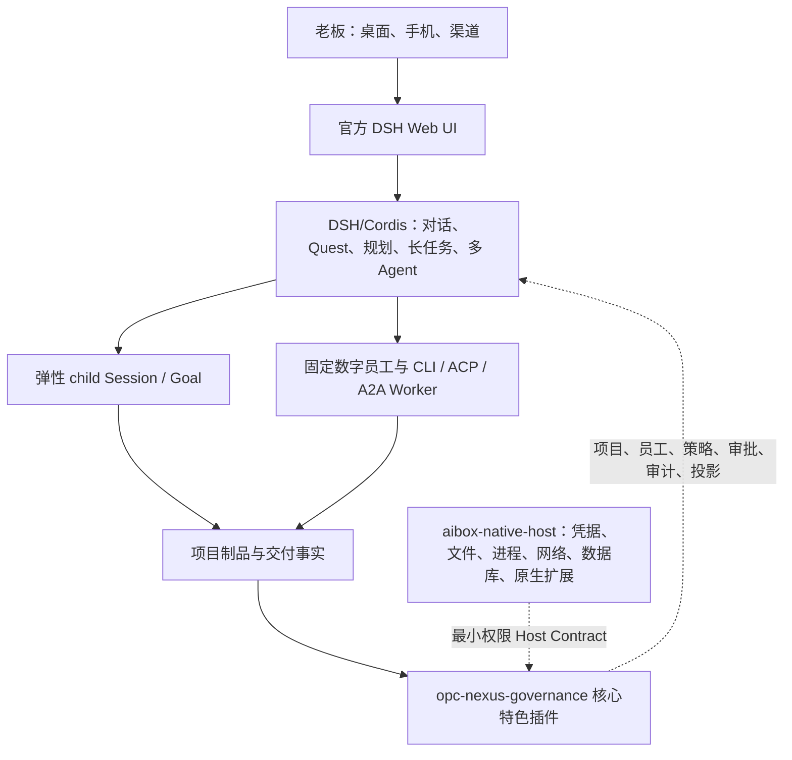
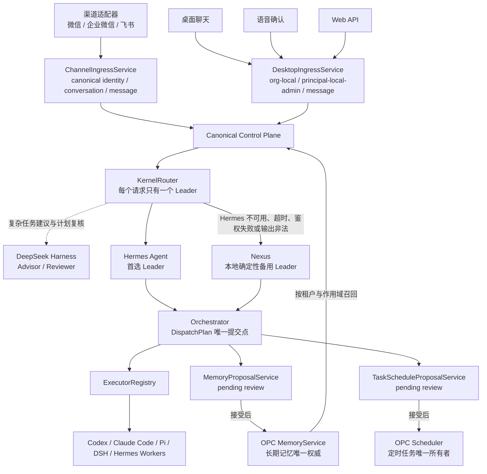

# 系统架构设计

> **v2.0.0 迁移说明（2026-08-17）**：本文后续章节记录 v1.x 兼容实现，不再代表目标产品权威边界。v2 以 DSH/Cordis 为唯一主 AI、规划与执行内核；原 OPC-Nexus 能力收敛为 `opc-nexus-governance` Cordis 核心特色插件，Electron Main 仅保留无业务智能的 `aibox-native-host` 特权边界。Hermes Leader、Nexus fallback、DSH Advisor、Nexus Scheduler 及一次性 DSH Worker 等描述只用于迁移期兼容，禁止据此新增第二套规划、Session、Job 或子 Agent 状态源。目标架构与验收以 `docs/adr/ADR-DSH-003-DSH-AS-OWNER.md` 和 `docs/V2.0.0-DSH-CORDIS-PROJECT-QUEST-IMPLEMENTATION-PLAN.md` 为准。

## 0. v2.0.0 权威运行模型



当前所有权规则：

1. DSH/Cordis 是唯一面向老板的主 AI，也是 QuestionSet、Plan、root/child Session、Goal 和多 Agent 编排的唯一业务 owner。
2. `opc-nexus-governance` 是 DSH/Cordis 的核心特色插件，不是并列内核。它只维护组织/项目/员工目录、权限预算、审批审计、记忆归档、渠道和兼容看板投影。
3. `aibox-native-host` 是 Electron Main 中的薄特权边界，不理解业务目标，不生成计划，不组队。
4. Hermes、Codex、Pi、Claude、ACP/A2A、MCP 与 Skill 都是 Cordis 可选择的能力或 worker adapter。
5. 官方 DSH Web UI 是桌面与 LAN/手机的统一会话界面；本项目不复制或 fork 另一套 DSH 对话页。旧 Chat 与 Secretary 仅作为隐藏迁移兼容入口。
6. `@deepseek-ai/dsh-jobs-local` 的 Job 状态只在当前进程内有效。当前可持久恢复的是 Session、Goal 与 child-session 事实，不能把进程内 Job 宣称为跨重启无人值守任务。

以下章节用于说明仍存在的 v1 兼容表、服务和状态机约束。任何新增功能都必须先服从本节所有权，再决定是否复用这些兼容实现。

## 1. v1 兼容分层

```
┌─────────────────────────────────────────────────────────────┐
│  Renderer（React SPA）                                       │
│  pages / components / store / wizard                         │
├─────────────────────────────────────────────────────────────┤
│  Preload（contextBridge）                                    │
│  window.aibox.* 类型安全封装                                  │
├─────────────────────────────────────────────────────────────┤
│  Main（Electron 主进程）                                     │
│  ipc.ts（白名单） → services/（业务逻辑）                     │
├─────────────────────────────────────────────────────────────┤
│  Shared（纯类型层）                                          │
│  types.ts — 领域模型，无 Node/Electron 依赖                   │
└─────────────────────────────────────────────────────────────┘
```

**依赖方向**: renderer → preload → main → shared（单向，shared 不依赖任何层）

## 2. 四层状态模型

系统采用严格分层的状态模型，四层状态互不混用：

### 2.1 Agent 生命周期（AgentLifecycle）

```
DISABLED → STARTING → READY → STOPPING
                ↘ ERROR ↗
```

### 2.2 任务状态机（TaskStatus）

```
QUEUED → RUNNING → COMPLETED / FAILED / CANCELLED / INTERRUPTED
              ↕
    WAITING_APPROVAL / PAUSED
```

### 2.3 引擎状态（EngineStatus）

```
NOT_INSTALLED → INSTALLING → AUTH_REQUIRED → HEALTHY / DEGRADED / ERROR
                    ↕
              SETUP_REQUIRED
```

### 2.4 渠道状态（ChannelStatus）

```
UNCONFIGURED → CONNECTING → ONLINE / RECONNECTING / AUTH_EXPIRED / DISABLED / ERROR
```

### 2.5 首页派生状态（DerivedAgentStatus）

由编排器计算，互斥优先级：`error > running > paused > starting > idle`

## 3. 核心服务模块

| 服务 | 文件 | 职责 |
|------|------|------|
| Orchestrator | `orchestrator.ts` | DispatchPlan 校验与提交、Agent/Task 状态机、FIFO 调度；任务状态的唯一写入者 |
| ChannelIngressService | `channelIngressService.ts` | 渠道身份、会话、消息归一化与幂等入站 |
| DesktopIngressService | `desktopIngressService.ts` | 桌面会话、本地管理员身份、消息归一化与幂等入站 |
| ChannelControlPlane | `channelControlPlane.ts` | canonical memory 召回、控制核规划、计划持久化与 Orchestrator 提交 |
| DesktopControlPlane | `desktopControlPlane.ts` | 将桌面聊天接入与渠道相同的 canonical 控制路径 |
| KernelRouter | `kernel/kernelRouter.ts` | Hermes 主控制核、确定性 Nexus 备用控制核与 DSH 顾问/复核器的单 Leader 路由 |
| MemoryService | `memoryService.ts` | OPC-Nexus 持有的分域长期记忆、版本、召回与遗忘 |
| MemoryProposalService | `memoryProposalService.ts` | 控制核记忆建议的持久化、审核、接受/拒绝与启动恢复 |
| TaskScheduleProposalService | `taskScheduleProposalService.ts` | 控制核定时任务建议的持久化、审核及 Scheduler 提交 |
| Database | `database.ts` | sql.js 持久化、Schema 迁移、审计日志 |
| ExecutorRegistry | `executor/index.ts` | 执行器选择与路由 |
| EngineManager | `engineManager.ts` | 引擎检测/安装/认证/配置 |
| ProviderManager | `providerManager.ts` | 多供应商 CRUD、密钥管理、模型路由 |
| ChannelManager | `channelManager.ts` | 消息渠道生命周期 |
| WorkflowEngine | `workflowEngine.ts` | DAG 工作流调度与执行 |
| TeamEngine | `teamEngine.ts` | 专家团流水线执行 |
| CollabManager | `collabManager.ts` | 多机协同（Git + MCP） |
| McpManager | `mcpManager.ts` | MCP 服务器进程管理与工具调用 |
| SkillManager | `skillManager.ts` | 可复用技能模板管理 |
| Scheduler | `scheduler.ts` | 定时任务扫描与派发 |
| ApprovalBroker | `approvalBroker.ts` | 人工审批挂起/唤醒 |
| ResourceMonitor | `resourceMonitor.ts` | CPU/内存/GPU/磁盘采集与告警 |
| BrowserManager | `browserManager.ts` | Playwright 浏览器自动化 |
| WebServer | `webServer.ts` | 局域网 REST API 管理服务 |
| ApiBridge | `apiBridge.ts` | OpenAI 兼容 API 反向代理 |

## 4. 控制面与执行器架构



### 4.1 Canonical 入站

- 渠道、桌面、语音与 Web API 请求都先落为 canonical organization、principal、conversation 与 message，再进入同一个 `dispatchCanonical()` 路径；语音和 Web API 复用 `DesktopIngressService`，不再直接调用旧的任务创建路径。
- 渠道命令、审批回复和任务控制按 canonical conversation 限定作用域，不能跨会话操作其他发送者的任务。
- 渠道命令与审批先把固定目标和回复写成 durable claim，再执行幂等状态转换并将 receipt 标为完成；进程崩溃后的重投按原目标对账，不会重新查询“当前最新任务/审批”。微信仅在 canonical 派单或控制动作已经耐久化后提交 seen id 与上游 cursor，失败时保留原 cursor 并退避重试。
- 渠道消息在适配器提供稳定上游 message key 时，按 organization、channel、external identity、conversation、direction 与 message key 组成去重作用域；缺少稳定 key 的渠道只能提供 at-least-once 语义。桌面与语音为一次用户确认复用稳定 UUID，Web 客户端需在重投时复用 `Idempotency-Key`。消息收据、DispatchPlan 和 Task 的唯一约束共同提供重投幂等性。
- `dispatch_plans`、`kernel_attempts` 和 `kernel_sessions` 保存计划、组件尝试及原生会话锚点；它们是恢复证据，不赋予控制核直接写 Task 状态的权限。

### 4.2 控制核职责

1. `KernelRouter` 对同一 conversation 串行规划，并确保每个请求只有一个 Leader。
2. Hermes 是首选 Leader。它只返回结构化 DispatchPlan，不直接创建任务、写记忆、创建定时任务或执行渠道副作用。
3. DSH 仅在复杂任务上作为可选 Advisor/Reviewer；成功建议由 Router 传给 Leader，确定性 Nexus 不依赖该建议派单。已参与规划的 DSH reviewer 若拒绝、超时、掉线或返回非法结果，均 fail-closed 到人工审批而不是自动执行；预检阶段本就不就绪的 DSH 不参与该次计划。DSH 无派单权，但可经 `AcpExecutor` 作为普通 Worker 执行已提交任务。
4. Nexus 是无 Provider 依赖的本地确定性回退：优先选择当前入口绑定的员工，否则按角色/能力稳定匹配；高风险指令自动要求审批。它没有长期记忆。
5. Orchestrator 是 DispatchPlan、Task 创建和状态转换的唯一提交点；控制核、Advisor、Worker 和入口适配器都不能绕过它。

### 4.3 Worker 边界

| Worker | 执行适配器 | 会话边界 |
|------|------|------|
| Codex CLI | `CliExecutor` | 支持保存 thread id，并在后续任务中 `exec resume` |
| Claude Code | `CliExecutor` | 支持保存 session id，并在后续任务中 `--resume` |
| Pi Agent CLI | `PiAgentExecutor` | 使用 OPC 管理的独立 profile 与显式 Provider 配置 |
| DeepSeek Harness | `AcpExecutor` | 每次任务创建新的 ACP session；当前不恢复上一次任务 |
| Hermes Agent | `HermesAgentExecutor` | 使用 OPC 管理的员工 profile；原生 session 仅作续接缓存 |

控制核身份与 Worker 身份互相独立：Hermes 可以同时实现首选控制核和 Hermes Worker，DSH 可以同时实现 Advisor/Reviewer 和 DSH Worker，但两种角色不会共享派单权限。

canonical DispatchPlan 会固定 `(workerAgentId, workerEngineId)`。Orchestrator 提交前重新核验员工、候选引擎与组织边界，并将批准引擎写入 Task；ExecutorRegistry 对 canonical Task 禁止静默 fallback 或模拟执行，批准引擎不可用时如实失败。只有不来自 canonical 控制面的旧式内部任务才保留主/辅执行引擎回退。

Android 手机操作员是更严格的专用 Worker：当前仅允许 `eng-hermes-cli`，由 `HermesAgentExecutor` 注入任务级 Mobile Gateway 地址和短期 Token，并加载受管 `android_*` 工具插件。DSH rc.6 的 ACP 入口拒绝非空 `mcpServers`，OPC 的 DSH sidecar 也不启用 Shell，因此 DSH Worker 当前不能操控手机。即使 Hermes 未就绪，手机任务也不会回退到 DSH 或其他执行器；旧数据库或任务级 override 若形成错误组合，会以明确配置错误失败。已绑定但离线的手机不会被误判为执行失败：任务保持 `QUEUED` 并显示“手机离线，等待连接”，收到 `device_connected` 后由 Orchestrator 自动唤醒。

### 4.4 记忆所有权与提案

- OPC-Nexus 数据库是身份、会话、长期记忆、定时任务、审批和审计的唯一事实源。`MemoryService` 按 organization 以及 principal、channel、conversation、agent、project 作用域隔离数据，并提供版本化的 recall/remember/update/forget。
- Hermes controller 按 `(organization, principal, conversation)` 使用独立 `HERMES_HOME`，Hermes Worker 使用员工级独立 profile。普通与 Android Hermes Worker 都通过同一个员工 → 引擎 → 默认 Provider 解析得到原子化的 Provider/model/key/base URL 绑定；Provider/model 被显式固定为 OPC 管理的 `opcnexus` Provider，密钥只注入子进程环境，从而避免用户全局 Hermes/OpenRouter 配置引起的 401/403 串线。缺少完整绑定时任务 fail-closed，不继承用户全局 Hermes 配置。
- Hermes 原生 session、profile memory 与 `kernel_sessions` 锚点只作为可丢弃的连续对话缓存。每次规划仍显式接收 `MemoryService` 召回的 canonical memory；删除或升级 Hermes profile 不会改变 OPC 的长期记忆事实。
- DSH 上游具备 JSONL 历史、checkpoint、SQLite/FTS 会话索引等持久化基础组件，但这些不等于跨会话用户长期记忆。当前集成没有长期记忆或跨任务 resume：`AcpExecutor` 每次调用 `session/new`，为任务建立独立 session root，并在进程结束后清理；没有接入 session list/resume/fork/delete 或跨会话语义召回。
- 控制核只能在 DispatchPlan 中返回 `memoryProposals`。计划成功提交后，`MemoryProposalService` 以 `(request_id, proposal_index)` 幂等捕获为 `pending`；用户可在审核队列接受或拒绝。接受操作在同一事务中通过 `MemoryService` 创建 canonical memory 并标记 `accepted`，拒绝只标记 `rejected`。启动恢复会补捕获已提交计划中遗漏的提案。
- 仅 conversation 作用域可通过显式本地设置启用策略自动接受；默认仍需人工审核。未经接受的提案不会参与长期记忆召回。

### 4.5 定时任务提案

- Hermes/Nexus 只能在 DispatchPlan 中返回 `taskScheduleProposals`，操作类型限定为 `create_task_schedule`。提案不能自行指定员工或经营报表类型，最终员工固定为该计划已经选择并提交的 Worker。
- KernelRouter 会校验标题、任务内容和 cron：支持 0.5-168 小时间隔、每日、每周和每月任务。控制核不能直接写 `schedules`。
- DispatchPlan 成功提交后，`TaskScheduleProposalService` 以 `(request_id, proposal_index)` 幂等捕获为 `pending`；启动恢复会补捕获已提交计划中遗漏的提案。
- 接受时再次校验 organization、员工和 project 归属，并通过 `Scheduler.createWithCommit()` 在同一事务中创建 `automationKind='task'` 的 schedule、记录审计并将提案标为 `accepted`；拒绝只标为 `rejected`。重复接受返回同一 schedule，不会创建第二份计划。
- Scheduler 是定时任务的唯一所有者，负责 cron 校验、`next_run_at` 计算、到期扫描和任务创建。Hermes 的原生定时能力不参与 OPC 调度，控制核升级或替换不会丢失已接受的计划。

## 5. 安全基线

### 5.1 进程隔离

- `contextIsolation: true` + `nodeIntegration: false`（不可关闭）
- Renderer 无法访问 Node.js API
- 外部链接一律 `shell.openExternal`，禁止 BrowserWindow 内导航

### 5.2 IPC 白名单

- 所有 Renderer→Main 通信必须通过 `ipc.ts` 中 `ipcMain.handle` 显式注册
- Channel 命名规范: `aibox:<动作>`
- Preload 只暴露类型安全函数封装，禁止暴露 `ipcRenderer` 本体

### 5.3 密钥管理（safeStorage）

- 密钥绝不进入 Renderer 进程或 localStorage
- 存储路径: `safeStorage.encryptString()` → base64 → SQLite settings 表（key 前缀 `secret:`）
- Renderer 仅可调用各业务域的专用凭据方法；不暴露可选择任意命名空间的通用密钥接口
- 每次密钥操作写入 AuditLog

### 5.4 工作目录安全

- 工作目录必须通过 `pickDirectory` 对话框由用户选择
- 单实例锁防止 SQLite 争用

## 6. 数据持久化

- **引擎**: sql.js（SQLite WASM），零原生编译
- **存储路径**: `userData/aibox-data/aibox.db`
- **持久化策略**: 变更后防抖导出
- **Schema 版本**: 38（真正空库按 v0 初始化；非空库缺失版本、版本非法或高于当前版本时拒绝打开）
- **一致性**: 每次连接启用 SQLite 外键，迁移提交前执行 `foreign_key_check`
- **数据保留**: 资源样本 7 天、任务明细 90 天、审计日志 365 天；canonical 入站 Task/Message/Plan 的身份收据永久保留，90 天后只清空任务载荷

### Schema 可靠性演进

- v36 建立 canonical Task/Message/DispatchPlan 外键语义、`input_message_id` exactly-once 约束和迁移时外键校验；无法唯一重建的旧数据会中止迁移，而不是猜测关联。
- v37 将 project、agent、channel 纳入 organization 边界，使 `dispatch_plans.channel_id` 可为空以支持桌面入口，补齐本地管理员 principal，并加入 durable memory proposal 审核队列。
- v38 加入 durable task schedule proposal 审核队列；控制核输出与最终 `schedules` 记录分离，只有 OPC Scheduler 能把已接受提案转成可运行计划。
- 数据保留不会删除 canonical 入站任务的幂等身份。过期任务只清空标题、内容、结果、错误与 session 等载荷，避免同一上游消息在清理后被再次执行。

### 核心数据表

| 表名 | 用途 |
|------|------|
| agents | 数字员工配置 |
| tasks | 任务记录 |
| task_events | 任务执行事件（审计） |
| engines | 引擎配置 |
| channels | 渠道配置 |
| organizations / principals / channel_identities | canonical 租户与渠道身份 |
| conversations / messages | canonical 会话和消息 |
| dispatch_plans / kernel_attempts / kernel_sessions | 控制核计划、尝试和原生会话锚点 |
| memory_items / memory_scopes / memory_versions / memory_terms | 分域长期记忆及版本索引 |
| memory_proposals | 控制核记忆提案及 pending/accepted/rejected 审核状态 |
| task_schedule_proposals | 控制核定时任务提案、审核状态及最终 schedule 引用 |
| schedules | 定时任务 |
| approvals | 审批记录 |
| audit_logs | 操作审计日志 |
| settings | 键值设置（含密钥引用） |
| providers | 模型供应商 |
| mcp_servers | MCP 服务器配置 |
| skills / agent_skills | 技能及绑定 |
| workflows | 工作流定义 |
| workflow_runs | 工作流执行历史 |
| teams / team_runs | 专家团及执行记录 |
| collab_workspaces / collab_tasks / collab_agents | 多机协同 |
| task_messages | 单次任务内部的执行消息 |
| usage_records | Token 用量统计 |
| resource_samples | 资源监控采样 |
| prompt_templates | Prompt 模板 |

## 7. 实时通信机制

| 通道 | 方向 | 用途 |
|------|------|------|
| `aibox:snapshot` | Main → Renderer | 全量状态快照推送 |
| `aibox:taskOutput` | Main → Renderer | 任务输出流式推送 |
| `aibox:resources` | Main → Renderer | 资源监控实时数据 |
| `aibox:wfNodeEvent` | Main → Renderer | 工作流节点执行状态 |

## 8. 权限模型

四级权限模式（`PermissionMode`）：

| 模式 | 说明 |
|------|------|
| `readonly` | 只读，不可写入任何文件 |
| `standard` | 写入需审批 |
| `trusted` | 全信任，无需审批 |
| `autonomous` | 完全自主，无需任何审批 |

能力开关（`AgentCapabilities`）独立于权限模式：

| 能力 | 说明 |
|------|------|
| `network` | HTTP/HTTPS 网络请求 |
| `shell` | 系统命令执行 |
| `install` | 软件包安装 |
| `browser` | 浏览器自动化（Playwright/CDP） |
| `computer` | 桌面操控（Computer Use） |

## 9. 当前运行时验证边界

以下结果记录于 2026-08-15。它们描述当前开发机的真实运行证据，不代替目标部署机器上的引擎检测与 Provider 鉴权。

| Runtime | 当前证据 | 仍需注意 |
|------|------|------|
| Hermes Agent v0.19.0 | **PASS**：真实首轮 `-z + --usage-file` 和第二轮 `chat -Q -q --resume` 使用同一原生 session 成功 | 证明原生续接可用，不代表 Hermes profile 是 canonical 长期记忆；生产仍依赖 OPC Provider 与密钥可用 |
| DeepSeek Harness v0.1.0-rc.6 | **PASS**：内置 sidecar 完成 Provider 校验和真实 ACP 模型任务 | 它不是 PATH 中的 `dsh` CLI；当前 ACP 不支持 resume 或非空 `mcpServers`，进程结束会删除任务 session root，也不能作为 Android 手机操作员 |
| Pi Agent v0.84.2 | **PASS**：认证检查、真实任务和两轮 session 续接成功 | 目标机器仍需安装 Pi CLI，并由 OPC 管理的 profile 注入匹配 Provider |
| Claude Code v2.1.220 | **部分通过**：CLI 已安装，参数协议修复和单元测试通过 | 本轮没有重新执行在线真实模型 smoke，不能仅凭安装状态宣称端到端可用 |
| Codex CLI | 执行适配与 thread resume 路径已接入 | 本轮未重新执行独立在线 smoke；应由目标机器的 EngineManager 探测确认鉴权和最小任务 |

验证分三层解释：单元测试证明参数构造、状态映射、解析和脱敏；`npm run harness:verify` 证明已准备的 DSH sidecar 依赖、原生模块与 ACP `initialize/session/new` 能工作；只有带实际 Provider 凭据的最小模型任务才能证明该 Runtime 当下端到端可用。
